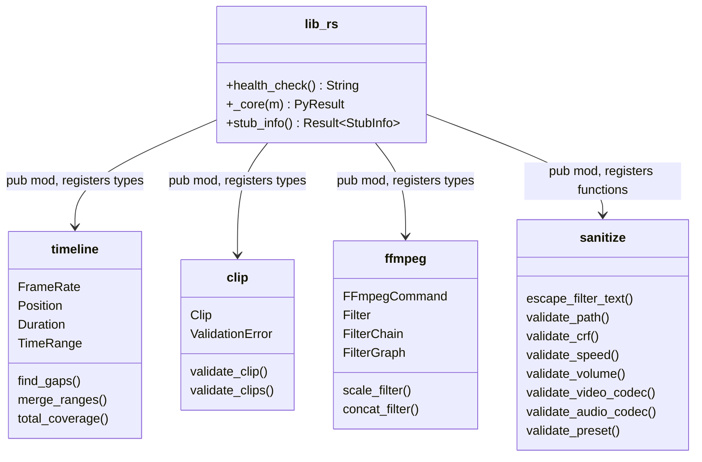

# C4 Code Level: Crate Root (lib.rs)

## Overview
- **Name**: stoat_ferret_core Crate Root
- **Description**: Crate entry point that defines the PyO3 Python module and registers all types and functions
- **Location**: `rust/stoat_ferret_core/src/`
- **Language**: Rust
- **Purpose**: Serves as the crate root, declaring public modules, defining custom Python exceptions, the `_core` PyO3 module, the health check function, and the stub info gatherer

## Code Elements

### Functions/Methods

- `health_check() -> String`
  - Description: Returns `"stoat_ferret_core OK"` to verify the Rust module is loaded correctly from Python
  - Location: `rust/stoat_ferret_core/src/lib.rs:43`
  - Dependencies: None

- `_core(m: &Bound<PyModule>) -> PyResult<()>`
  - Description: PyO3 module definition that registers all classes, functions, and exceptions into the Python module
  - Location: `rust/stoat_ferret_core/src/lib.rs:49`
  - Registers:
    - Timeline types: `FrameRate`, `Position`, `Duration`, `TimeRange`
    - Timeline functions: `find_gaps`, `merge_ranges`, `total_coverage`
    - Clip types: `Clip`, `ClipValidationError`
    - Clip functions: `validate_clip`, `validate_clips`
    - FFmpeg types: `FFmpegCommand`, `Filter`, `FilterChain`, `FilterGraph`
    - FFmpeg functions: `scale_filter`, `concat_filter`
    - Sanitization functions: `escape_filter_text`, `validate_path`, `validate_crf`, `validate_speed`, `validate_volume`, `validate_video_codec`, `validate_audio_codec`, `validate_preset`
    - Exception types: `ValidationError`, `CommandError`, `SanitizationError`
  - Dependencies: All submodules

- `stub_info() -> pyo3_stub_gen::Result<pyo3_stub_gen::StubInfo>`
  - Description: Locates `pyproject.toml` at the project root (navigating up from `CARGO_MANIFEST_DIR`) and creates stub generation info
  - Location: `rust/stoat_ferret_core/src/lib.rs:105`
  - Dependencies: `pyo3_stub_gen::StubInfo`, `std::path::Path`

### Custom Exception Types

- `ValidationError` (Python exception)
  - Description: Custom Python exception for validation failures, created via `pyo3::create_exception!`
  - Location: `rust/stoat_ferret_core/src/lib.rs:22`
  - Base class: `pyo3::exceptions::PyException`

- `CommandError` (Python exception)
  - Description: Custom Python exception for FFmpeg command building failures
  - Location: `rust/stoat_ferret_core/src/lib.rs:27`
  - Base class: `pyo3::exceptions::PyException`

- `SanitizationError` (Python exception)
  - Description: Custom Python exception for input sanitization failures
  - Location: `rust/stoat_ferret_core/src/lib.rs:32`
  - Base class: `pyo3::exceptions::PyException`

### Module Declarations

- `pub mod clip` - Video clip representation and validation
- `pub mod ffmpeg` - FFmpeg command building and filter graphs
- `pub mod sanitize` - Input sanitization and validation
- `pub mod timeline` - Frame-accurate timeline mathematics

## Dependencies

### Internal Dependencies
- `crate::clip` - Clip types and validation functions
- `crate::ffmpeg` - FFmpegCommand and filter types
- `crate::sanitize` - Sanitization functions
- `crate::timeline` - Timeline types and range operations

### External Dependencies
- `pyo3` - Python module definition (`pymodule`, `pyfunction`, `create_exception!`, `PyModule`, `Bound`)
- `pyo3_stub_gen` - Stub info gathering (`StubInfo`, `Result`, `gen_stub_pyfunction`)

## Relationships

