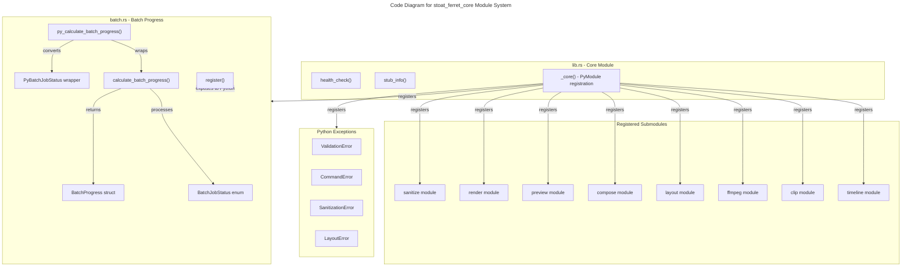

# C4 Code Level: Stoat Ferret Core Module System

## Overview
- **Name**: stoat_ferret_core Rust Module System
- **Description**: PyO3-exposed Rust module providing video editing primitives including timeline calculations, clip validation, FFmpeg command building, batch progress aggregation, and composition utilities.
- **Location**: rust/stoat_ferret_core/src
- **Language**: Rust
- **Purpose**: Foundation layer exposing high-performance Rust computation to Python video editor, handling frame-accurate timing, filter graphs, and batch render tracking.
- **Parent Component**: [Rust Core Engine](./c4-component-rust-core-engine.md)

## Code Elements

### Functions/Methods (lib.rs)

- `fn health_check() -> String`
  - Description: Verifies Rust module is loaded correctly, returns operational status string
  - Location: lib.rs:60
  - Dependencies: None (pure function)

- `fn stub_info() -> pyo3_stub_gen::Result<pyo3_stub_gen::StubInfo>`
  - Description: Gathers stub generation info from project root pyproject.toml for type stub generation
  - Location: lib.rs:158
  - Dependencies: std::path::Path, pyo3_stub_gen

- `fn _core(m: &Bound<PyModule>) -> PyResult<()>`
  - Description: PyO3 module initialization; registers all types and functions with Python module
  - Location: lib.rs:66
  - Dependencies: All submodules (timeline, clip, ffmpeg, layout, compose, batch, preview, render, sanitize)

### Functions/Methods (batch.rs)

- `fn calculate_batch_progress(jobs: &[BatchJobStatus]) -> BatchProgress`
  - Description: Computes aggregated batch render progress as mean of individual job progress values
  - Location: batch.rs:191
  - Dependencies: BatchJobStatus enum

- `fn py_calculate_batch_progress(jobs: Vec<PyBatchJobStatus>) -> BatchProgress`
  - Description: PyO3 wrapper for calculate_batch_progress; converts Python job statuses to Rust enum
  - Location: batch.rs:236
  - Dependencies: BatchJobStatus, BatchProgress

- `fn register(m: &Bound<PyModule>) -> PyResult<()>`
  - Description: Registers batch module types and functions with Python module
  - Location: batch.rs:242
  - Dependencies: PyModule, BatchProgress, PyBatchJobStatus

### Structs/Enums

**lib.rs Custom Exceptions** (PyO3 exceptions):
- `ValidationError` - Domain validation error exception
- `CommandError` - FFmpeg command building error exception
- `SanitizationError` - Input sanitization error exception
- `LayoutError` - Layout positioning error exception

**batch.rs - BatchJobStatus** (Rust enum)
```rust
pub enum BatchJobStatus {
    Pending,
    InProgress(f64),      // progress in [0.0, 1.0]
    Completed,
    Failed,
}
```
- Location: batch.rs:31
- Purpose: Represents state of individual render job in batch
- Methods: `progress() -> f64` (returns 0.0 for Pending/Failed, p for InProgress, 1.0 for Completed)

**batch.rs - BatchProgress** (PyO3 struct)
```rust
#[pyclass]
pub struct BatchProgress {
    pub total_jobs: usize,
    pub completed_jobs: usize,
    pub failed_jobs: usize,
    pub overall_progress: f64,
}
```
- Location: batch.rs:66
- Purpose: Aggregated batch progress snapshot
- PyMethods: `py_new()`, `__repr__()`

**batch.rs - PyBatchJobStatus** (PyO3 wrapper)
```rust
#[pyclass(name = "BatchJobStatus")]
pub struct PyBatchJobStatus {
    pub(crate) inner: BatchJobStatus,
}
```
- Location: batch.rs:120
- Purpose: PyO3-compatible wrapper for Rust BatchJobStatus enum
- PyMethods: `py_pending()`, `py_in_progress(progress: f64)`, `py_completed()`, `py_failed()`, `py_progress()`

## Dependencies

### Internal Dependencies

- **timeline module** - Frame-accurate position and duration types (FrameRate, Position, Duration, TimeRange)
- **clip module** - Video clip representation and validation (Clip, ValidationError, py_validate_clip, py_validate_clips)
- **ffmpeg module** - FFmpeg command building (FFmpegCommand, Filter, FilterChain, FilterGraph, DrawtextBuilder, SpeedControl, VolumeBuilder, AfadeBuilder, AmixBuilder, TransitionType, etc.)
- **layout module** - Layout positioning (LayoutPosition, LayoutPreset)
- **compose module** - Overlay/scale filters and composition timeline (overlay, timeline, graph submodules)
- **batch module** - Batch progress tracking (BatchProgress, PyBatchJobStatus, calculate_batch_progress)
- **preview module** - Preview filter graph simplification
- **render module** - Render plan building and validation
- **sanitize module** - Input validation (py_escape_filter_text, py_validate_path, py_validate_volume, py_validate_video_codec, py_validate_audio_codec, py_validate_preset)

### External Dependencies

- **pyo3** (0.21+) - Python bindings framework
- **pyo3_stub_gen** - Type stub generation for Python type hints
- **proptest** - Property-based testing (dev dependency, batch module tests)

## Relationships


```mermaid
---
title: Code Diagram for stoat_ferret_core Module System
---
graph TB
    subgraph LibModule["lib.rs - Core Module"]
        HealthCheck["health_check()"]
        StubInfo["stub_info()"]
        CoreInit["_core() - PyModule registration"]
    end

    subgraph BatchModule["batch.rs - Batch Progress"]
        JobStatus["BatchJobStatus enum"]
        BatchProg["BatchProgress struct"]
        PyJobStatus["PyBatchJobStatus wrapper"]
        CalcProgress["calculate_batch_progress()"]
        PyCalcProgress["py_calculate_batch_progress()"]
        BatchReg["register()"]
    end

    subgraph SubModules["Registered Submodules"]
        Timeline["timeline module"]
        Clip["clip module"]
        FFmpeg["ffmpeg module"]
        Layout["layout module"]
        Compose["compose module"]
        Preview["preview module"]
        Render["render module"]
        Sanitize["sanitize module"]
    end

    subgraph PyExceptions["Python Exceptions"]
        ValidationErr["ValidationError"]
        CommandErr["CommandError"]
        SanitizationErr["SanitizationError"]
        LayoutErr["LayoutError"]
    end

    CoreInit -->|registers| Timeline
    CoreInit -->|registers| Clip
    CoreInit -->|registers| FFmpeg
    CoreInit -->|registers| Layout
    CoreInit -->|registers| Compose
    CoreInit -->|registers| BatchModule
    CoreInit -->|registers| Preview
    CoreInit -->|registers| Render
    CoreInit -->|registers| Sanitize
    CoreInit -->|registers| PyExceptions

    CalcProgress -->|processes| JobStatus
    CalcProgress -->|returns| BatchProg
    PyCalcProgress -->|wraps| CalcProgress
    PyCalcProgress -->|converts| PyJobStatus
    BatchReg -->|exposes to Python| BatchModule
```

## Notes

- **PyO3 Integration**: All public types/functions use `#[pyfunction]` and `#[pyclass]` macros to expose Rust code to Python. The `_core` module is the entry point for the compiled extension module.
- **Stub Generation**: Uses `pyo3_stub_gen` for generating `.pyi` type stubs. Custom `stub_info()` function navigates from rust/stoat_ferret_core/ to project root to locate pyproject.toml.
- **Exception Hierarchy**: Four custom Python exceptions are created for different error domains (validation, command, sanitization, layout) to enable Python-side error handling.
- **Batch Progress Algorithm**: Mean of individual job progress values; empty job list returns zero progress. Progress is clamped to [0.0, 1.0] for InProgress status.
- **Testing**: Both unit tests and property-based tests (proptest) ensure progress calculation invariants and prevent panics on arbitrary job lists.
