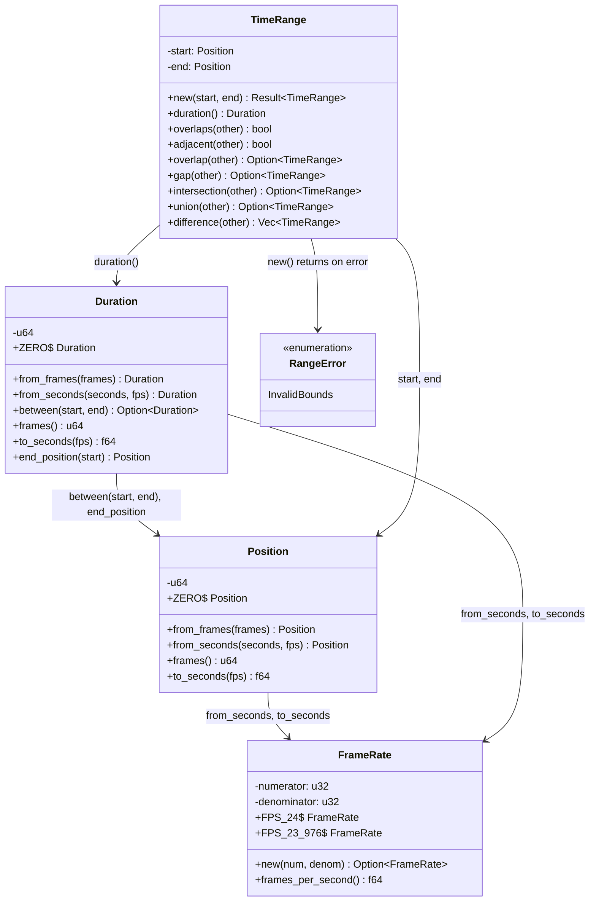

# C4 Code Level: Timeline Module

## Overview
- **Name**: Timeline Mathematics Module
- **Description**: Frame-accurate timeline types and arithmetic for video editing
- **Location**: `rust/stoat_ferret_core/src/timeline/`
- **Language**: Rust
- **Purpose**: Provides types for precise timeline calculations using integer frame counts to avoid floating-point precision issues: frame rates, positions, durations, and time ranges with set operations

## Code Elements

### Classes/Modules

- `FrameRate`
  - Description: Rational representation of frame rates (numerator/denominator) for exact arithmetic
  - Location: `rust/stoat_ferret_core/src/timeline/framerate.rs:32`
  - Fields (private): `numerator: u32`, `denominator: u32`
  - Constants:
    - `FPS_23_976` (24000/1001), `FPS_24` (24/1), `FPS_25` (25/1)
    - `FPS_29_97` (30000/1001), `FPS_30` (30/1), `FPS_50` (50/1)
    - `FPS_59_94` (60000/1001), `FPS_60` (60/1)
  - Rust Methods:
    - `new(numerator: u32, denominator: u32) -> Option<Self>`
    - `frames_per_second(&self) -> f64`
    - `numerator(&self) -> u32`
    - `denominator(&self) -> u32`
  - PyO3 Methods:
    - `py_new(numerator, denominator) -> PyResult<Self>` - raises ValueError on zero denom
    - `fps(&self) -> f64` (`#[getter]`)
    - `py_numerator(&self) -> u32` (`#[getter]`)
    - `py_denominator(&self) -> u32` (`#[getter]`)
    - `fps_23_976()` through `fps_60()` (`#[staticmethod]` for each constant)
    - `__repr__(&self) -> String`
  - Trait Implementations: `Debug`, `Clone`, `Copy`, `PartialEq`, `Eq`, `Hash`

- `Position`
  - Description: A point in time on the timeline represented as a frame count (u64)
  - Location: `rust/stoat_ferret_core/src/timeline/position.rs:36`
  - Fields (private): `Position(u64)` (newtype)
  - Constants: `ZERO` (frame 0)
  - Rust Methods:
    - `from_frames(frames: u64) -> Self`
    - `from_seconds(seconds: f64, fps: FrameRate) -> Self`
    - `frames(&self) -> u64`
    - `to_seconds(&self, fps: FrameRate) -> f64`
  - PyO3 Methods:
    - `py_new(frames: u64) -> Self` - Python constructor
    - `py_frames(&self) -> u64` (`#[getter]`)
    - `from_secs(seconds, fps) -> Self` (`#[staticmethod]`)
    - `as_secs(&self, fps) -> f64`
    - `zero() -> Self` (`#[staticmethod]`)
    - `__repr__`, `__eq__`, `__lt__`, `__le__`, `__gt__`, `__ge__`, `__hash__`
  - Trait Implementations: `Debug`, `Clone`, `Copy`, `PartialEq`, `Eq`, `PartialOrd`, `Ord`, `Hash`, `Default`

- `Duration`
  - Description: A span of time on the timeline represented as a frame count (u64)
  - Location: `rust/stoat_ferret_core/src/timeline/duration.rs:38`
  - Fields (private): `Duration(u64)` (newtype)
  - Constants: `ZERO` (0 frames)
  - Rust Methods:
    - `from_frames(frames: u64) -> Self`
    - `from_seconds(seconds: f64, fps: FrameRate) -> Self`
    - `between(start: Position, end: Position) -> Option<Self>`
    - `frames(&self) -> u64`
    - `to_seconds(&self, fps: FrameRate) -> f64`
    - `end_position(&self, start: Position) -> Position`
  - PyO3 Methods:
    - `py_new(frames: u64) -> Self`
    - `py_frames(&self) -> u64` (`#[getter]`)
    - `from_secs(seconds, fps) -> Self` (`#[staticmethod]`)
    - `as_secs(&self, fps) -> f64`
    - `between_positions(start, end) -> PyResult<Self>` (`#[staticmethod]`)
    - `end_pos(&self, start) -> Position`
    - `zero() -> Self` (`#[staticmethod]`)
    - `__repr__`, `__eq__`, `__lt__`, `__le__`, `__gt__`, `__ge__`, `__hash__`
  - Trait Implementations: `Debug`, `Clone`, `Copy`, `PartialEq`, `Eq`, `PartialOrd`, `Ord`, `Hash`, `Default`

- `TimeRange`
  - Description: A contiguous half-open interval [start, end) with overlap detection and set operations
  - Location: `rust/stoat_ferret_core/src/timeline/range.rs:54`
  - Fields (private): `start: Position`, `end: Position`
  - Rust Methods:
    - `new(start: Position, end: Position) -> Result<Self, RangeError>`
    - `start(&self) -> Position`
    - `end(&self) -> Position`
    - `duration(&self) -> Duration`
    - `overlaps(&self, other: &TimeRange) -> bool`
    - `adjacent(&self, other: &TimeRange) -> bool`
    - `overlap(&self, other: &TimeRange) -> Option<TimeRange>`
    - `gap(&self, other: &TimeRange) -> Option<TimeRange>`
    - `intersection(&self, other: &TimeRange) -> Option<TimeRange>`
    - `union(&self, other: &TimeRange) -> Option<TimeRange>`
    - `difference(&self, other: &TimeRange) -> Vec<TimeRange>`
  - PyO3 Methods: All Rust methods mirrored with `py_` prefix
  - Trait Implementations: `Debug`, `Clone`, `Copy`, `PartialEq`, `Eq`

- `RangeError`
  - Description: Error type for invalid time range bounds
  - Location: `rust/stoat_ferret_core/src/timeline/range.rs:14`
  - Variants: `InvalidBounds` - end not greater than start
  - Trait Implementations: `Display`, `Error`, `Debug`, `Clone`, `Copy`, `PartialEq`, `Eq`

### Functions/Methods

- `find_gaps(ranges: &[TimeRange]) -> Vec<TimeRange>`
  - Description: Finds gaps between sorted/merged ranges. O(n log n)
  - Location: `rust/stoat_ferret_core/src/timeline/range.rs:443`
  - Dependencies: `TimeRange`

- `merge_ranges(ranges: &[TimeRange]) -> Vec<TimeRange>`
  - Description: Merges overlapping and adjacent ranges into non-overlapping set. O(n log n)
  - Location: `rust/stoat_ferret_core/src/timeline/range.rs:490`
  - Dependencies: `TimeRange`

- `total_coverage(ranges: &[TimeRange]) -> Duration`
  - Description: Calculates total duration covered, merging overlaps to avoid double-counting. O(n log n)
  - Location: `rust/stoat_ferret_core/src/timeline/range.rs:531`
  - Dependencies: `merge_ranges`, `Duration`

- `py_find_gaps(ranges: Vec<TimeRange>) -> Vec<TimeRange>`
  - Description: Python-exposed wrapper (exposed as `find_gaps`)
  - Location: `rust/stoat_ferret_core/src/timeline/range.rs:552`

- `py_merge_ranges(ranges: Vec<TimeRange>) -> Vec<TimeRange>`
  - Description: Python-exposed wrapper (exposed as `merge_ranges`)
  - Location: `rust/stoat_ferret_core/src/timeline/range.rs:569`

- `py_total_coverage(ranges: Vec<TimeRange>) -> Duration`
  - Description: Python-exposed wrapper (exposed as `total_coverage`)
  - Location: `rust/stoat_ferret_core/src/timeline/range.rs:586`

## Dependencies

### Internal Dependencies
- Internal cross-references within the module: `Position` <-> `Duration` <-> `FrameRate` <-> `TimeRange`

### External Dependencies
- `pyo3` - Python bindings (`pyclass`, `pymethods`, `pyfunction`, `PyResult`)
- `pyo3_stub_gen` - Stub generation annotations
- `proptest` (test-only) - Property-based testing for round-trip and symmetry invariants

## Relationships

