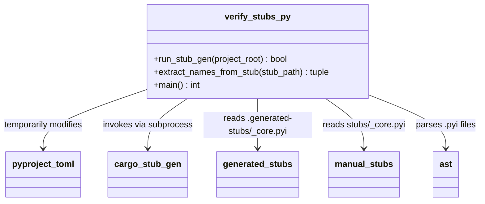

# C4 Code Level: Scripts

## Overview
- **Name**: Project Scripts
- **Description**: Utility scripts for verifying Python type stubs match Rust-generated stubs
- **Location**: `scripts/`
- **Language**: Python
- **Purpose**: CI-enforced drift detection that ensures manually maintained Python type stubs include all types defined in the Rust PyO3 bindings

## Code Elements

### Functions/Methods

- `run_stub_gen(project_root: Path) -> bool`
  - Description: Runs `cargo run --bin stub_gen` to generate stubs from Rust, temporarily modifying `pyproject.toml` to output to `.generated-stubs/` instead of `src/`, then restoring the original
  - Location: `scripts/verify_stubs.py:31`
  - Dependencies: `subprocess`, `shutil`, `pathlib.Path`

- `extract_names_from_stub(stub_path: Path) -> tuple[set[str], set[str]]`
  - Description: Parses a `.pyi` file using `ast` module to extract top-level class and function names; falls back to regex if AST parsing fails
  - Location: `scripts/verify_stubs.py:68`
  - Dependencies: `ast`, `re`, `pathlib.Path`

- `main() -> int`
  - Description: Entry point that orchestrates the full verification flow: creates `.generated-stubs/` dir, runs stub generation, extracts names from both generated and manual stubs, compares them, and reports missing types. Returns 0 on success, 1 on failure.
  - Location: `scripts/verify_stubs.py:99`
  - Dependencies: `run_stub_gen`, `extract_names_from_stub`

## Dependencies

### Internal Dependencies
- `stubs/stoat_ferret_core/_core.pyi` - The manual stubs being verified
- `.generated-stubs/stoat_ferret_core/_core.pyi` - The auto-generated stubs for comparison
- `rust/stoat_ferret_core/` - Cargo workspace where `stub_gen` binary is built

### External Dependencies
- `ast` (stdlib) - Python AST parsing for extracting class/function definitions
- `re` (stdlib) - Regex fallback for stub name extraction
- `subprocess` (stdlib) - Running `cargo run --bin stub_gen`
- `shutil` (stdlib) - Backup/restore of `pyproject.toml`
- `pathlib` (stdlib) - Path manipulation
- `sys` (stdlib) - Exit codes
- `cargo` (external tool) - Rust build system, must be installed

## Relationships

