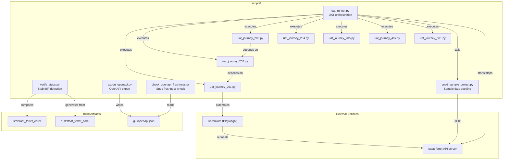

# C4 Code Level: Project Scripts

## Overview
- **Name**: Utility and UAT Scripts
- **Description**: Collection of utility scripts for stub verification, OpenAPI export, sample data seeding, and user acceptance testing orchestration.
- **Location**: `scripts/`
- **Language**: Python
- **Purpose**: Provides development and testing tooling including: Rust stub drift detection, OpenAPI spec export and freshness checks, sample project seeding against a running server, and a full UAT runner harness with Playwright-based browser journey tests.
- **Parent Component**: [Application Services](./c4-component-application-services.md)

## Code Elements

### Functions/Methods

#### `verify_stubs.py`

```python
def run_stub_gen(project_root: Path) -> bool
```
Runs `cargo run --bin stub_gen` with a modified `pyproject.toml` to output generated stubs to `.generated-stubs/`. Restores original config in a `finally` block.

```python
def extract_names_from_stub(stub_path: Path) -> tuple[set[str], set[str]]
```
Extracts class and function names from a `.pyi` file using AST parsing (with regex fallback).

```python
def main() -> int
```
Compares generated vs manual stub names, reports missing types. Exit 0 if all types match, 1 if drift detected.

#### `export_openapi.py`

```python
def export_openapi(output_path: Path | None = None) -> dict
```
Boots FastAPI app with `create_app(gui_static_path="/nonexistent")` to exclude environment-dependent routes, exports OpenAPI spec to `gui/openapi.json`.

#### `check_openapi_freshness.py`

```python
def start_server() -> subprocess.Popen[bytes]
```
Starts FastAPI server on port 18765 with deterministic config overrides.

```python
def wait_for_ready(timeout: float = 20) -> bool
```
Polls `/health/live` until the server responds.

```python
def fetch_live_spec() -> dict[str, object]
```
Fetches `/openapi.json` from the running server.

```python
def normalize(spec: dict[str, object]) -> str
```
Normalizes spec to sorted JSON for diffing.

```python
def find_enum_fields(spec: dict[str, object]) -> list[str]
```
Recursively walks JSON structure to find enum definitions.

```python
def main() -> int
```
Full freshness check: boot server, fetch live spec, diff against committed `gui/openapi.json`. Exit 0 on match, 1 on mismatch.

#### `seed_sample_project.py`

```python
def parse_args() -> argparse.Namespace
```
CLI argument parsing: `base_url`, `--videos-dir`, `--force`.

```python
def find_existing_project(client: httpx.Client) -> str | None
```
Searches for existing "Running Montage" project.

```python
def scan_and_wait(client: httpx.Client, videos_dir: str) -> None
```
Submits video scan job and polls until completion (60s timeout).

```python
def resolve_video_ids(client: httpx.Client, filenames: list[str]) -> list[str]
```
Maps sample video filenames to database IDs.

```python
def seed_project(client: httpx.Client, video_ids: list[str]) -> SeedResult
```
Creates full sample project: project settings (1280x720@30fps), 4 clips, video track, 5 effects, 1 transition, and queues a render job (BL-239).

```python
def verify_project(client: httpx.Client, result: SeedResult) -> None
```
Asserts created project matches expected settings and clip count.

#### `uat_runner.py`

```python
def run_build_steps() -> None
```
Full build pipeline: maturin develop, pip install, npm ci, npm build.

```python
def start_server(output_dir: Path) -> tuple[subprocess.Popen[str], list[Any]]
```
Starts uvicorn server with stdout/stderr redirected to log files.

```python
def wait_for_healthy(timeout: float = 60.0) -> None
```
Polls `/health/ready` until server responds 200.

```python
def teardown_server(proc: subprocess.Popen[str], log_handles: list[Any] | None) -> None
```
Graceful shutdown: SIGTERM, wait grace period, SIGKILL fallback. Windows-aware.

```python
def execute_journeys(journeys: list[int], output_dir: Path, headed: bool) -> list[JourneyResult]
```
Runs journeys with dependency-aware fail-fast behavior.

```python
def take_screenshot(page, output_dir, journey_name, step_number, description, *, failed=False) -> Path
```
Captures Playwright screenshot with structured naming: `{journey_name}/{NN}_{description}.png`.

```python
def generate_json_report(reports, output_dir, mode, duration_seconds) -> Path
```
Generates `uat-report.json` with structured test results.

```python
def generate_markdown_report(reports, output_dir, mode, duration_seconds) -> Path
```
Generates `uat-report.md` with human-readable results table.

### Classes/Modules

#### `SeedResult` (`seed_sample_project.py`)
```python
@dataclass
class SeedResult:
    project_id: str
    video_ids: list[str]
    clip_ids: list[str]
    effects_applied: int
    transitions_applied: int
    job_id: str  # render job ID (BL-239)
```

#### `JourneyResult` (`uat_runner.py`)
```python
class JourneyResult(NamedTuple):
    journey_id: int
    status: str  # "passed", "failed", "skipped"
    message: str
```

#### `JourneyReport` (`uat_runner.py`)
```python
@dataclass
class JourneyReport:
    journey_id: int
    name: str
    status: str
    message: str
    steps_total: int = 0
    steps_passed: int = 0
    steps_failed: int = 0
    console_errors: list[str]
    issues: list[str]
```

#### `ConsoleErrorCollector` (`uat_runner.py`)
Attaches to a Playwright page to capture console errors, filtering out benign patterns (e.g., favicon 404s).

#### UAT Journey Scripts (10 scripts)

| Script | ID | Name | Dependencies |
|--------|----|------|-------------|
| `uat_journey_201.py` | 201 | scan-library | None |
| `uat_journey_202.py` | 202 | project-clip | 201 |
| `uat_journey_203.py` | 203 | effects-timeline | 202 |
| `uat_journey_204.py` | 204 | export-render | None |
| `uat_journey_205.py` | 205 | preview-playback | None |
| `uat_journey_401.py` | 401 | preview-playback-full | 205 |
| `uat_journey_402.py` | 402 | proxy-management | 201 |
| `uat_journey_403.py` | 403 | theater-mode | None |
| `uat_journey_404.py` | 404 | timeline-sync | None |
| `uat_journey_501.py` | 501 | render-page-navigation | None |

All journey scripts use Playwright `sync_api` and follow a common pattern: structured screenshot capture, console error collection, and `journey_result.json` output.

## Dependencies

### Internal Dependencies
| Module | Relationship |
|--------|-------------|
| `stoat_ferret.api.app.create_app` | Used by `export_openapi.py` and `check_openapi_freshness.py` |
| `src/stoat_ferret_core/_core.pyi` | Compared by `verify_stubs.py` |
| `.generated-stubs/` | Generated output compared by `verify_stubs.py` |

### External Dependencies
| Package | Purpose |
|---------|---------|
| `httpx` | HTTP client for seeding and health checks |
| `playwright` | Browser automation for UAT journeys |
| `subprocess` (stdlib) | Server lifecycle and cargo commands |
| `ast` (stdlib) | Stub file parsing in `verify_stubs.py` |
| `argparse` (stdlib) | CLI argument parsing |
| `difflib` (stdlib) | OpenAPI spec diffing |

## Relationships


```mermaid
graph TD
    subgraph "scripts/"
        VERIFY["verify_stubs.py<br/>Stub drift detection"]
        EXPORT["export_openapi.py<br/>OpenAPI export"]
        CHECK["check_openapi_freshness.py<br/>Spec freshness check"]
        SEED["seed_sample_project.py<br/>Sample data seeding"]
        UAT["uat_runner.py<br/>UAT orchestration"]
        J201["uat_journey_201.py"]
        J202["uat_journey_202.py"]
        J203["uat_journey_203.py"]
        J204["uat_journey_204.py"]
        J205["uat_journey_205.py"]
        J4XX["uat_journey_40x.py"]
        J501["uat_journey_501.py"]
    end

    UAT -->|"executes"| J201
    UAT -->|"executes"| J202
    UAT -->|"executes"| J203
    UAT -->|"executes"| J204
    UAT -->|"executes"| J205
    UAT -->|"executes"| J4XX
    UAT -->|"executes"| J501
    UAT -->|"calls"| SEED

    J202 -.->|"depends on"| J201
    J203 -.->|"depends on"| J202

    subgraph "External Services"
        SERVER["stoat-ferret API server"]
        BROWSER["Chromium (Playwright)"]
    end

    SEED -->|"HTTP"| SERVER
    UAT -->|"starts/stops"| SERVER
    J201 -->|"automates"| BROWSER
    BROWSER -->|"requests"| SERVER

    subgraph "Build Artifacts"
        STUBS["src/stoat_ferret_core/"]
        OPENAPI["gui/openapi.json"]
        RUST["rust/stoat_ferret_core/"]
    end

    VERIFY -->|"compares"| STUBS
    VERIFY -->|"generates from"| RUST
    EXPORT -->|"writes"| OPENAPI
    CHECK -->|"reads"| OPENAPI
```
