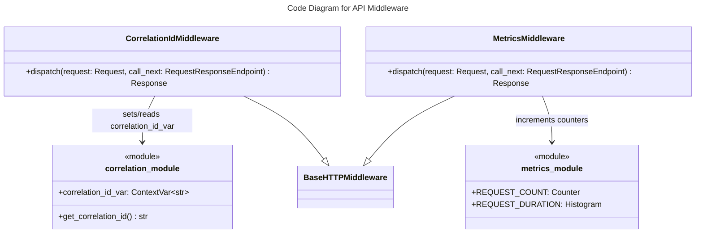

# C4 Code Level: API Middleware

## Overview
- **Name**: API Middleware
- **Description**: HTTP middleware for request tracing and Prometheus metrics collection
- **Location**: `src/stoat_ferret/api/middleware/`
- **Language**: Python
- **Purpose**: Add correlation IDs and collect HTTP request metrics for all API requests

## Code Elements

### Functions/Methods

- `get_correlation_id() -> str`
  - Description: Get current correlation ID from context variable
  - Location: `src/stoat_ferret/api/middleware/correlation.py:52`
  - Dependencies: `correlation_id_var` (ContextVar)

### Classes/Modules

- `CorrelationIdMiddleware`
  - Description: Starlette middleware that adds correlation IDs to requests for distributed tracing
  - Location: `src/stoat_ferret/api/middleware/correlation.py:18`
  - Methods:
    - `async dispatch(request: Request, call_next: RequestResponseEndpoint) -> Response` - Extract or generate correlation ID, store in context, add to response headers
  - Dependencies: `BaseHTTPMiddleware` (starlette), `uuid`, `ContextVar`

- `MetricsMiddleware`
  - Description: Starlette middleware that records Prometheus metrics for HTTP requests
  - Location: `src/stoat_ferret/api/middleware/metrics.py:28`
  - Methods:
    - `async dispatch(request: Request, call_next: RequestResponseEndpoint) -> Response` - Record request count and duration metrics
  - Dependencies: `BaseHTTPMiddleware` (starlette), `prometheus_client` (Counter, Histogram)

### Module-Level Variables

- `correlation_id_var: ContextVar[str]` - Context variable storing the current request's correlation ID
  - Location: `src/stoat_ferret/api/middleware/correlation.py:15`

- `REQUEST_COUNT: Counter` - Prometheus counter for total HTTP requests by method/path/status
  - Location: `src/stoat_ferret/api/middleware/metrics.py:15`

- `REQUEST_DURATION: Histogram` - Prometheus histogram for HTTP request duration by method/path
  - Location: `src/stoat_ferret/api/middleware/metrics.py:21`

## Dependencies

### Internal Dependencies
- None (leaf module)

### External Dependencies
- `starlette` - BaseHTTPMiddleware, Request, Response
- `prometheus_client` - Counter, Histogram
- `uuid` - UUID generation
- `contextvars` - ContextVar for request-scoped correlation IDs

## Relationships

