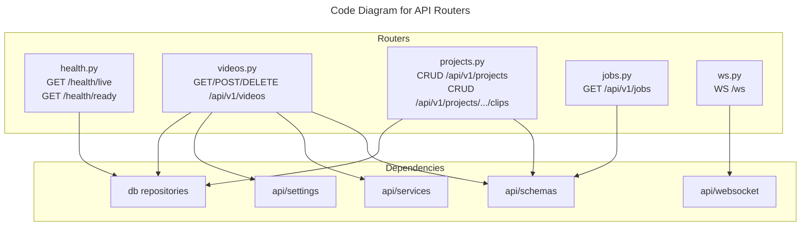

# C4 Code Level: API Routers

## Overview
- **Name**: API Routers
- **Description**: FastAPI route handlers for health, videos, projects, clips, jobs, and WebSocket endpoints
- **Location**: `src/stoat_ferret/api/routers/`
- **Language**: Python
- **Purpose**: Define all REST API and WebSocket endpoints, map HTTP requests to business logic

## Code Elements

### Functions/Methods

#### health.py

- `async liveness() -> dict[str, str]`
  - Description: Liveness probe - returns 200 if the server is running
  - Location: `src/stoat_ferret/api/routers/health.py:17`
  - Dependencies: None

- `async readiness(request: Request) -> JSONResponse`
  - Description: Readiness probe - checks database and FFmpeg availability
  - Location: `src/stoat_ferret/api/routers/health.py:30`
  - Dependencies: `_check_database`, `_check_ffmpeg`

- `async _check_database(request: Request) -> dict[str, Any]`
  - Description: Check database connectivity with latency measurement
  - Location: `src/stoat_ferret/api/routers/health.py:63`
  - Dependencies: `app.state.db`

- `_check_ffmpeg() -> dict[str, Any]`
  - Description: Check FFmpeg availability by running ffmpeg -version
  - Location: `src/stoat_ferret/api/routers/health.py:85`
  - Dependencies: `subprocess`, `shutil`

#### videos.py

- `async get_repository(request: Request) -> AsyncVideoRepository`
  - Description: FastAPI dependency - get video repository from app state
  - Location: `src/stoat_ferret/api/routers/videos.py:34`
  - Dependencies: `AsyncVideoRepository`, `AsyncSQLiteVideoRepository`

- `async list_videos(repo: RepoDep, limit: int, offset: int) -> VideoListResponse`
  - Description: List videos with pagination (GET /api/v1/videos)
  - Location: `src/stoat_ferret/api/routers/videos.py:57`
  - Dependencies: `AsyncVideoRepository`

- `async search_videos(repo: RepoDep, q: str, limit: int) -> VideoSearchResponse`
  - Description: Search videos by filename or path (GET /api/v1/videos/search)
  - Location: `src/stoat_ferret/api/routers/videos.py:84`
  - Dependencies: `AsyncVideoRepository`

- `async get_thumbnail(video_id: str, repo: RepoDep) -> FileResponse`
  - Description: Get thumbnail image for a video (GET /api/v1/videos/{id}/thumbnail)
  - Location: `src/stoat_ferret/api/routers/videos.py:109`
  - Dependencies: `AsyncVideoRepository`, `FileResponse`

- `async get_video(video_id: str, repo: RepoDep) -> VideoResponse`
  - Description: Get video by ID (GET /api/v1/videos/{id})
  - Location: `src/stoat_ferret/api/routers/videos.py:142`
  - Dependencies: `AsyncVideoRepository`

- `async scan_videos(scan_request: ScanRequest, request: Request) -> JobSubmitResponse`
  - Description: Submit directory scan as async job (POST /api/v1/videos/scan)
  - Location: `src/stoat_ferret/api/routers/videos.py:168`
  - Dependencies: `validate_scan_path`, `get_settings`, `job_queue`

- `async delete_video(video_id: str, repo: RepoDep, delete_file: bool) -> Response`
  - Description: Delete video from library (DELETE /api/v1/videos/{id})
  - Location: `src/stoat_ferret/api/routers/videos.py:211`
  - Dependencies: `AsyncVideoRepository`

#### projects.py

- `async get_project_repository(request: Request) -> AsyncProjectRepository`
  - Description: FastAPI dependency - get project repository from app state
  - Location: `src/stoat_ferret/api/routers/projects.py:32`
  - Dependencies: `AsyncProjectRepository`, `AsyncSQLiteProjectRepository`

- `async get_clip_repository(request: Request) -> AsyncClipRepository`
  - Description: FastAPI dependency - get clip repository from app state
  - Location: `src/stoat_ferret/api/routers/projects.py:50`
  - Dependencies: `AsyncClipRepository`, `AsyncSQLiteClipRepository`

- `async get_video_repository(request: Request) -> AsyncVideoRepository`
  - Description: FastAPI dependency - get video repository from app state
  - Location: `src/stoat_ferret/api/routers/projects.py:68`
  - Dependencies: `AsyncVideoRepository`, `AsyncSQLiteVideoRepository`

- `async list_projects(repo: ProjectRepoDep, limit: int, offset: int) -> ProjectListResponse`
  - Description: List all projects (GET /api/v1/projects)
  - Location: `src/stoat_ferret/api/routers/projects.py:95`
  - Dependencies: `AsyncProjectRepository`

- `async create_project(request: ProjectCreate, repo: ProjectRepoDep) -> ProjectResponse`
  - Description: Create a new project (POST /api/v1/projects)
  - Location: `src/stoat_ferret/api/routers/projects.py:118`
  - Dependencies: `AsyncProjectRepository`, `Project`

- `async get_project(project_id: str, repo: ProjectRepoDep) -> ProjectResponse`
  - Description: Get project by ID (GET /api/v1/projects/{id})
  - Location: `src/stoat_ferret/api/routers/projects.py:146`
  - Dependencies: `AsyncProjectRepository`

- `async delete_project(project_id: str, repo: ProjectRepoDep) -> Response`
  - Description: Delete project (DELETE /api/v1/projects/{id})
  - Location: `src/stoat_ferret/api/routers/projects.py:172`
  - Dependencies: `AsyncProjectRepository`

- `async list_clips(project_id: str, project_repo: ProjectRepoDep, clip_repo: ClipRepoDep) -> ClipListResponse`
  - Description: List clips in project (GET /api/v1/projects/{id}/clips)
  - Location: `src/stoat_ferret/api/routers/projects.py:198`
  - Dependencies: `AsyncProjectRepository`, `AsyncClipRepository`

- `async add_clip(project_id: str, request: ClipCreate, ...) -> ClipResponse`
  - Description: Add clip to project with Rust validation (POST /api/v1/projects/{id}/clips)
  - Location: `src/stoat_ferret/api/routers/projects.py:233`
  - Dependencies: `AsyncProjectRepository`, `AsyncClipRepository`, `AsyncVideoRepository`, `Clip.validate`

- `async update_clip(project_id: str, clip_id: str, request: ClipUpdate, ...) -> ClipResponse`
  - Description: Update clip with Rust validation (PATCH /api/v1/projects/{id}/clips/{clip_id})
  - Location: `src/stoat_ferret/api/routers/projects.py:299`
  - Dependencies: `AsyncProjectRepository`, `AsyncClipRepository`, `AsyncVideoRepository`, `Clip.validate`

- `async delete_clip(project_id: str, clip_id: str, clip_repo: ClipRepoDep) -> Response`
  - Description: Delete clip (DELETE /api/v1/projects/{id}/clips/{clip_id})
  - Location: `src/stoat_ferret/api/routers/projects.py:371`
  - Dependencies: `AsyncClipRepository`

#### jobs.py

- `async get_job_status(job_id: str, request: Request) -> JobStatusResponse`
  - Description: Get status of a submitted job (GET /api/v1/jobs/{id})
  - Location: `src/stoat_ferret/api/routers/jobs.py:13`
  - Dependencies: `job_queue`

#### ws.py

- `async _heartbeat_loop(ws: WebSocket, interval: float) -> None`
  - Description: Send periodic heartbeat messages over WebSocket
  - Location: `src/stoat_ferret/api/routers/ws.py:18`
  - Dependencies: `build_event`, `EventType`

- `async websocket_endpoint(websocket: WebSocket) -> None`
  - Description: Handle WebSocket connections at /ws with heartbeat
  - Location: `src/stoat_ferret/api/routers/ws.py:30`
  - Dependencies: `ConnectionManager`, `build_event`, `EventType`

## Dependencies

### Internal Dependencies
- `stoat_ferret.api.schemas` - Request/response Pydantic models
- `stoat_ferret.api.services.scan` - Scan path validation, job type constant
- `stoat_ferret.api.settings` - Application settings
- `stoat_ferret.api.websocket` - ConnectionManager, EventType, build_event
- `stoat_ferret.db` - Repository protocols and implementations, models
- `stoat_ferret.ffmpeg.probe` - Used indirectly via scan service

### External Dependencies
- `fastapi` - APIRouter, Request, Response, HTTPException, Depends, Query
- `starlette` - WebSocket, WebSocketDisconnect
- `structlog` - Structured logging

## Relationships

