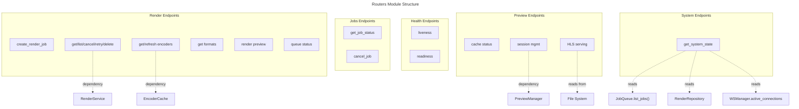

# C4 Code Level: API Routers

## Overview

- **Name**: HTTP Route Handlers for Core Domain Operations
- **Description**: FastAPI routers providing REST endpoints for health checks, render jobs, preview sessions, and job queue operations.
- **Location**: `src/stoat_ferret/api/routers/`
- **Language**: Python
- **Purpose**: Exposes domain business logic via HTTP endpoints with dependency injection and error handling.
- **Parent Component**: [API Gateway](./c4-component-api-gateway.md)

## Code Elements

### Health Router (health.py)

#### Functions
- `async liveness() -> dict[str, str]` - Simple liveness probe
- `async readiness(request: Request) -> JSONResponse` - Full dependency health checks
- `async _check_database(request: Request) -> dict[str, Any]` - Database connectivity check
- `async _check_ffmpeg() -> dict[str, Any]` - FFmpeg availability check
- `async _check_preview(request: Request) -> dict[str, Any]` - Preview cache status
- `async _check_proxy(request: Request) -> dict[str, Any]` - Proxy directory health
- `async _check_render(request: Request) -> dict[str, Any]` - Render queue health

### Jobs Router (jobs.py)

#### Functions
- `async get_job_status(job_id: str, request: Request) -> JobStatusResponse` - Get job status
- `async cancel_job(job_id: str, request: Request) -> JobStatusResponse` - Cancel job

### Render Router (render.py)

#### Dependency Injection Functions
- `async get_encoder_cache_repository(request: Request) -> AsyncEncoderCacheRepository`
- `async get_render_repository(request: Request) -> AsyncRenderRepository`
- `async get_render_service(request: Request) -> RenderService`
- `async get_render_queue(request: Request) -> RenderQueue`

#### Endpoints
- `async create_render_job(body: CreateRenderRequest, render_service: RenderServiceDep) -> RenderJobResponse`
- `async get_encoders(encoder_repo: EncoderCacheDep) -> EncoderListResponse`
- `async refresh_encoders(encoder_repo: EncoderCacheDep) -> EncoderListResponse`
- `async get_output_formats() -> FormatListResponse`
- `def render_preview(body: RenderPreviewRequest) -> RenderPreviewResponse`
- `async get_queue_status(queue: RenderQueueDep, repo: RenderRepoDep) -> QueueStatusResponse`
- `async get_render_job(job_id: str, repo: RenderRepoDep) -> RenderJobResponse`
- `async list_render_jobs(repo: RenderRepoDep, limit: int, offset: int, status_filter: str) -> RenderListResponse`
- `async cancel_render_job(job_id: str, repo: RenderRepoDep, render_service: RenderServiceDep) -> RenderJobResponse`
- `async retry_render_job(job_id: str, repo: RenderRepoDep) -> RenderJobResponse`
- `async delete_render_job(job_id: str, repo: RenderRepoDep) -> RenderJobResponse`

### Preview Router (preview.py)

#### Endpoints
- `async get_cache_status(request: Request) -> PreviewCacheStatusResponse`
- `async clear_cache(request: Request) -> PreviewCacheClearResponse`
- `async start_preview(project_id: str, request: Request, body: PreviewStartRequest) -> PreviewStartResponse`
- `async get_preview_status(session_id: str, request: Request) -> PreviewStatusResponse`
- `async seek_preview(session_id: str, body: PreviewSeekRequest, request: Request) -> PreviewSeekResponse`
- `async stop_preview(session_id: str, request: Request) -> PreviewStopResponse`
- `async get_manifest(session_id: str, request: Request) -> Response`
- `async get_segment(session_id: str, index: int, request: Request) -> Response`

### System Router (system.py)

Exposes `GET /api/v1/system/state` — a best-effort aggregate snapshot of in-memory job queue, render repository, and WebSocket connection manager state (BL-275).

#### Functions

- `async get_system_state(request: Request) -> SystemState`
  - Description: Return aggregate in-memory system state. Performs a single-pass scan over the job queue (`job_queue.list_jobs()`), `render_repository` (async SQLite reads for RUNNING/QUEUED render jobs, INV-SNAP-1), and WebSocket connection manager. Missing or transiently-broken subsystems are reported as empty collections (NFR-003); snapshot is best-effort. Wraps `_build_system_state()` in a Prometheus histogram timer.
  - Location: system.py:47
  - Route: `GET /api/v1/system/state`
  - Response: `SystemState` schema (active_jobs, active_connections, uptime_seconds, timestamp)

- `async _build_system_state(request: Request) -> SystemState`
  - Description: Inner implementation of `get_system_state()`. Reads `app.state.job_queue.list_jobs()`, `app.state.render_repository.list_by_status(RenderStatus.RUNNING)` and `list_by_status(RenderStatus.QUEUED)`, and `app.state.ws_manager.active_connections`. Each subsystem is accessed via `getattr` with `None` default; exceptions are caught and logged as warnings rather than raised (NFR-003 graceful partial state).
  - Location: system.py:69

- `_compute_uptime_seconds(app_state: object) -> float`
  - Description: Return seconds elapsed since `app.state._startup_timestamp` (ISO8601 string set by lifespan after all subsystems are ready). Returns `0.0` before the startup gate opens.
  - Location: system.py:26

#### render_repository Integration

`get_system_state()` reads `app.state.render_repository` (an `AsyncRenderRepository`) to include active render jobs in the system state snapshot. Only RUNNING and QUEUED render jobs are fetched (not historical completed/failed jobs). Each render job is surfaced as a `JobSummary` with `job_type="render"`. The render repository is accessed via `getattr(app_state, "render_repository", None)` so the endpoint degrades gracefully when the render subsystem is unavailable (NFR-003).

## Dependencies

### Internal Dependencies
- stoat_ferret.api.schemas (job, render, preview, system_state)
- stoat_ferret.api.settings
- stoat_ferret.db modules (models, repositories)
- stoat_ferret.jobs.queue (AsyncJobQueue, JobSnapshot)
- stoat_ferret.render (encoder_cache, models, queue, service, repository)
- stoat_ferret.preview (manager, cache)
- stoat_ferret_core (Rust FFI)

### External Dependencies
- fastapi: APIRouter, HTTPException, Request, Response, Query, Depends, status
- structlog: logging
- datetime, pathlib, shutil, subprocess, asyncio

## Relationships

```mermaid
---
title: Routers Module Structure
---
flowchart TB
    subgraph HE["Health Endpoints"]
        LV["liveness"]
        RD["readiness"]
    end

    subgraph JE["Jobs Endpoints"]
        GJ["get_job_status"]
        CJ["cancel_job"]
    end

    subgraph RE["Render Endpoints"]
        CRJ["create_render_job"]
        CRUD["get/list/cancel/retry/delete"]
        ENC["get/refresh encoders"]
        FMT["get formats"]
        PRV["render preview"]
        QS["queue status"]
    end

    subgraph PE["Preview Endpoints"]
        CST["cache status"]
        SESS["session mgmt"]
        HLS["HLS serving"]
    end

    subgraph SE["System Endpoints"]
        SST["get_system_state"]
    end

    CRUD -.->|dependency| RenderService["RenderService"]
    ENC -.->|dependency| EncoderCache["EncoderCache"]
    SESS -.->|dependency| PreviewMgr["PreviewManager"]
    HLS -.->|reads from| FileSystem["File System"]
    SST -.->|reads| JobQueue["JobQueue.list_jobs()"]
    SST -.->|reads| RenderRepo["RenderRepository"]
    SST -.->|reads| WSManager["WSManager.active_connections"]
```

## Notes

- Uses asyncio.Lock for encoder refresh and state transition concurrency control
- FFmpeg detection runs in thread pool to avoid event loop blocking
- Health checks return 503 for critical failures, 200 for degraded states
- Follows JSON:API error response patterns
- `get_system_state()` (system.py) integrates `render_repository` to include RUNNING/QUEUED render jobs in the system snapshot alongside generic job-queue jobs; both are surfaced as `JobSummary` entries with distinct `job_type` values (`"render"` vs the registered job type string)
- System state endpoint uses best-effort reads (NFR-003): each subsystem (job_queue, render_repository, ws_manager) is accessed via `getattr` with a `None` fallback; exceptions are caught and logged as warnings, never propagated as HTTP 500
