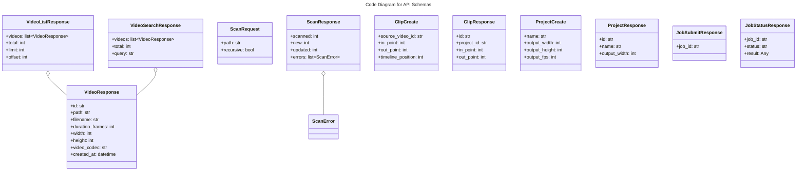

# C4 Code Level: API Schemas

## Overview
- **Name**: API Schemas
- **Description**: Pydantic models for API request validation and response serialization
- **Location**: `src/stoat_ferret/api/schemas/`
- **Language**: Python
- **Purpose**: Define typed request/response schemas for all REST API endpoints

## Code Elements

### Classes/Modules

#### video.py

- `VideoResponse(BaseModel)`
  - Description: API response format for a single video with full metadata
  - Location: `src/stoat_ferret/api/schemas/video.py:10`
  - Fields: id, path, filename, duration_frames, frame_rate_numerator, frame_rate_denominator, width, height, video_codec, audio_codec, file_size, thumbnail_path, created_at, updated_at
  - Dependencies: `pydantic.BaseModel`, `pydantic.ConfigDict`

- `VideoListResponse(BaseModel)`
  - Description: Paginated video list response with metadata
  - Location: `src/stoat_ferret/api/schemas/video.py:34`
  - Fields: videos (list[VideoResponse]), total, limit, offset
  - Dependencies: `pydantic.BaseModel`

- `VideoSearchResponse(BaseModel)`
  - Description: Search results response with query echo
  - Location: `src/stoat_ferret/api/schemas/video.py:46`
  - Fields: videos (list[VideoResponse]), total, query
  - Dependencies: `pydantic.BaseModel`

- `ScanRequest(BaseModel)`
  - Description: Directory scan request parameters
  - Location: `src/stoat_ferret/api/schemas/video.py:57`
  - Fields: path (str), recursive (bool, default True)
  - Dependencies: `pydantic.BaseModel`

- `ScanError(BaseModel)`
  - Description: Scan error for an individual file
  - Location: `src/stoat_ferret/api/schemas/video.py:67`
  - Fields: path (str), error (str)
  - Dependencies: `pydantic.BaseModel`

- `ScanResponse(BaseModel)`
  - Description: Scan results summary with counts and errors
  - Location: `src/stoat_ferret/api/schemas/video.py:77`
  - Fields: scanned, new, updated, skipped (int), errors (list[ScanError])
  - Dependencies: `pydantic.BaseModel`

#### clip.py

- `ClipCreate(BaseModel)`
  - Description: Create clip request with validated frame positions
  - Location: `src/stoat_ferret/api/schemas/clip.py:10`
  - Fields: source_video_id (str), in_point (int, ge=0), out_point (int, ge=0), timeline_position (int, ge=0)
  - Dependencies: `pydantic.BaseModel`, `pydantic.Field`

- `ClipUpdate(BaseModel)`
  - Description: Partial update clip request
  - Location: `src/stoat_ferret/api/schemas/clip.py:19`
  - Fields: in_point (int|None), out_point (int|None), timeline_position (int|None)
  - Dependencies: `pydantic.BaseModel`, `pydantic.Field`

- `ClipResponse(BaseModel)`
  - Description: Clip response with all fields
  - Location: `src/stoat_ferret/api/schemas/clip.py:27`
  - Fields: id, project_id, source_video_id, in_point, out_point, timeline_position, created_at, updated_at
  - Dependencies: `pydantic.BaseModel`, `pydantic.ConfigDict`

- `ClipListResponse(BaseModel)`
  - Description: List of clips with count
  - Location: `src/stoat_ferret/api/schemas/clip.py:42`
  - Fields: clips (list[ClipResponse]), total
  - Dependencies: `pydantic.BaseModel`

#### project.py

- `ProjectCreate(BaseModel)`
  - Description: Create project request with output format settings
  - Location: `src/stoat_ferret/api/schemas/project.py:10`
  - Fields: name (str, min_length=1), output_width (int, default 1920), output_height (int, default 1080), output_fps (int, default 30)
  - Dependencies: `pydantic.BaseModel`, `pydantic.Field`

- `ProjectResponse(BaseModel)`
  - Description: Project response with all fields
  - Location: `src/stoat_ferret/api/schemas/project.py:19`
  - Fields: id, name, output_width, output_height, output_fps, created_at, updated_at
  - Dependencies: `pydantic.BaseModel`, `pydantic.ConfigDict`

- `ProjectListResponse(BaseModel)`
  - Description: List of projects with count
  - Location: `src/stoat_ferret/api/schemas/project.py:33`
  - Fields: projects (list[ProjectResponse]), total
  - Dependencies: `pydantic.BaseModel`

#### job.py

- `JobSubmitResponse(BaseModel)`
  - Description: Response returned when a job is submitted
  - Location: `src/stoat_ferret/api/schemas/job.py:10`
  - Fields: job_id (str)
  - Dependencies: `pydantic.BaseModel`

- `JobStatusResponse(BaseModel)`
  - Description: Job status query response with progress and result
  - Location: `src/stoat_ferret/api/schemas/job.py:19`
  - Fields: job_id (str), status (str), progress (float|None), result (Any), error (str|None)
  - Dependencies: `pydantic.BaseModel`

## Dependencies

### Internal Dependencies
- None (leaf module - schemas depend on nothing else in the project)

### External Dependencies
- `pydantic` - BaseModel, ConfigDict, Field
- `datetime` - datetime type annotations

## Relationships

