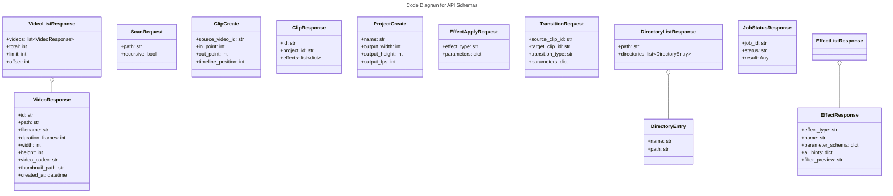

# C4 Code Level: API Schemas

## Overview
- **Name**: API Schemas
- **Description**: Pydantic models for API request validation and response serialization
- **Location**: `src/stoat_ferret/api/schemas/`
- **Language**: Python (Pydantic v2)
- **Purpose**: Define typed request/response schemas for all REST API endpoints
- **Parent Component**: TBD

## Code Elements

### Classes/Modules

#### video.py

- `VideoResponse(BaseModel)`
  - Description: API response format for a single video with full metadata
  - Location: `src/stoat_ferret/api/schemas/video.py:10`
  - Fields: id, path, filename, duration_frames, frame_rate_numerator, frame_rate_denominator, width, height, video_codec, audio_codec, file_size, thumbnail_path, created_at, updated_at
  - Dependencies: `pydantic.BaseModel`, `pydantic.ConfigDict`

- `VideoListResponse(BaseModel)`
  - Description: Paginated video list response with metadata
  - Location: `src/stoat_ferret/api/schemas/video.py:34`
  - Fields: videos (list[VideoResponse]), total, limit, offset

- `VideoSearchResponse(BaseModel)`
  - Description: Search results response with query echo
  - Location: `src/stoat_ferret/api/schemas/video.py:46`
  - Fields: videos (list[VideoResponse]), total, query

- `ScanRequest(BaseModel)`
  - Description: Directory scan request parameters
  - Location: `src/stoat_ferret/api/schemas/video.py:57`
  - Fields: path (str), recursive (bool, default True)

- `ScanError(BaseModel)`
  - Description: Scan error for an individual file
  - Location: `src/stoat_ferret/api/schemas/video.py:67`
  - Fields: path (str), error (str)

- `ScanResponse(BaseModel)`
  - Description: Scan results summary with counts and errors
  - Location: `src/stoat_ferret/api/schemas/video.py:77`
  - Fields: scanned, new, updated, skipped (int), errors (list[ScanError])

#### clip.py

- `ClipCreate(BaseModel)`
  - Description: Create clip request with validated frame positions
  - Location: `src/stoat_ferret/api/schemas/clip.py:11`
  - Fields: source_video_id (str), in_point (int, ge=0), out_point (int, ge=0), timeline_position (int, ge=0)

- `ClipUpdate(BaseModel)`
  - Description: Partial update clip request (all optional)
  - Location: `src/stoat_ferret/api/schemas/clip.py:20`
  - Fields: in_point (int|None), out_point (int|None), timeline_position (int|None)

- `ClipResponse(BaseModel)`
  - Description: Clip response with all fields including effects list
  - Location: `src/stoat_ferret/api/schemas/clip.py:28`
  - Fields: id, project_id, source_video_id, in_point, out_point, timeline_position, effects (list[dict]|None), created_at, updated_at

- `ClipListResponse(BaseModel)`
  - Description: List of clips with count
  - Location: `src/stoat_ferret/api/schemas/clip.py:44`
  - Fields: clips (list[ClipResponse]), total

#### project.py

- `ProjectCreate(BaseModel)`
  - Description: Create project request with output format settings
  - Location: `src/stoat_ferret/api/schemas/project.py:10`
  - Fields: name (str, min_length=1), output_width (int, default 1920), output_height (int, default 1080), output_fps (int, default 30, le=120)

- `ProjectResponse(BaseModel)`
  - Description: Project response with all fields
  - Location: `src/stoat_ferret/api/schemas/project.py:19`
  - Fields: id, name, output_width, output_height, output_fps, created_at, updated_at

- `ProjectListResponse(BaseModel)`
  - Description: List of projects with count
  - Location: `src/stoat_ferret/api/schemas/project.py:33`
  - Fields: projects (list[ProjectResponse]), total

#### job.py

- `JobSubmitResponse(BaseModel)`
  - Description: Response returned when a job is submitted
  - Location: `src/stoat_ferret/api/schemas/job.py:10`
  - Fields: job_id (str)

- `JobStatusResponse(BaseModel)`
  - Description: Job status query response with progress and result
  - Location: `src/stoat_ferret/api/schemas/job.py:19`
  - Fields: job_id (str), status (str), progress (float|None), result (Any), error (str|None)

#### effect.py

- `EffectResponse(BaseModel)`
  - Description: Response for a single effect with metadata, parameter schema, AI hints, and filter preview
  - Location: `src/stoat_ferret/api/schemas/effect.py:10`
  - Fields: effect_type (str), name (str), description (str), parameter_schema (dict), ai_hints (dict), filter_preview (str)

- `EffectListResponse(BaseModel)`
  - Description: Response for the effect list endpoint
  - Location: `src/stoat_ferret/api/schemas/effect.py:25`
  - Fields: effects (list[EffectResponse]), total (int)

- `EffectApplyRequest(BaseModel)`
  - Description: Request for applying an effect to a clip
  - Location: `src/stoat_ferret/api/schemas/effect.py:32`
  - Fields: effect_type (str), parameters (dict)

- `EffectApplyResponse(BaseModel)`
  - Description: Response for a successfully applied effect
  - Location: `src/stoat_ferret/api/schemas/effect.py:39`
  - Fields: effect_type (str), parameters (dict), filter_string (str)

- `EffectPreviewRequest(BaseModel)`
  - Description: Request for previewing an effect's filter string
  - Location: `src/stoat_ferret/api/schemas/effect.py:47`
  - Fields: effect_type (str), parameters (dict)

- `EffectPreviewResponse(BaseModel)`
  - Description: Response for an effect filter string preview
  - Location: `src/stoat_ferret/api/schemas/effect.py:54`
  - Fields: effect_type (str), filter_string (str)

- `EffectUpdateRequest(BaseModel)`
  - Description: Request for updating an effect at a specific index
  - Location: `src/stoat_ferret/api/schemas/effect.py:61`
  - Fields: parameters (dict)

- `EffectDeleteResponse(BaseModel)`
  - Description: Response for a deleted effect
  - Location: `src/stoat_ferret/api/schemas/effect.py:67`
  - Fields: index (int), deleted_effect_type (str)

- `TransitionRequest(BaseModel)`
  - Description: Request for applying a transition between two clips
  - Location: `src/stoat_ferret/api/schemas/effect.py:74`
  - Fields: source_clip_id (str), target_clip_id (str), transition_type (str), parameters (dict)

- `TransitionResponse(BaseModel)`
  - Description: Response for a successfully applied transition
  - Location: `src/stoat_ferret/api/schemas/effect.py:83`
  - Fields: source_clip_id (str), target_clip_id (str), transition_type (str), parameters (dict), filter_string (str)

#### filesystem.py

- `DirectoryEntry(BaseModel)`
  - Description: A single directory entry with display name and full path
  - Location: `src/stoat_ferret/api/schemas/filesystem.py:8`
  - Fields: name (str), path (str)

- `DirectoryListResponse(BaseModel)`
  - Description: Response for a directory listing request
  - Location: `src/stoat_ferret/api/schemas/filesystem.py:18`
  - Fields: path (str), directories (list[DirectoryEntry])

## Dependencies

### Internal Dependencies
- None (leaf module -- schemas depend on nothing else in the project)

### External Dependencies
- `pydantic` -- BaseModel, ConfigDict, Field
- `datetime` -- datetime type annotations
- `typing` -- Any

## Relationships

