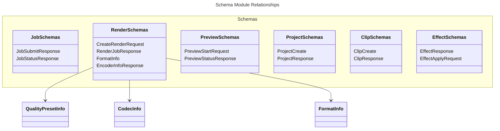

# C4 Code Level: API Schemas

## Overview

- **Name**: Pydantic Request/Response Models for HTTP APIs
- **Description**: Data validation schemas for render, preview, jobs, projects, clips, and effects domains.
- **Location**: `src/stoat_ferret/api/schemas/`
- **Language**: Python
- **Purpose**: Type-safe request/response contracts with input validation for FastAPI endpoints.
- **Parent Component**: [API Gateway](./c4-component-api-gateway.md)

## Code Elements

### Job Schemas (job.py)

#### Classes
- `JobSubmitResponse(BaseModel)`
  - **Fields**: job_id: str
  - **Purpose**: Response when job is submitted

- `JobStatusResponse(BaseModel)`
  - **Fields**: job_id: str, status: str, progress: float | None, result: Any | None, error: str | None
  - **Purpose**: Job status query response

### Render Schemas (render.py)

#### Request Models
- `CreateRenderRequest(BaseModel)`
  - **Fields**: project_id, output_format, quality_preset, encoder, render_plan
  - **encoder**: `str | None` — Video encoder name (e.g. libx264, libvpx-vp9). When omitted the format default is used.

- `RenderPreviewRequest(BaseModel)`
  - **Fields**: output_format, quality_preset, encoder

#### Response Models
- `RenderJobResponse(BaseModel)`
  - **Fields**: id, project_id, status, output_path, output_format, quality_preset, progress, error_message, retry_count, created_at, updated_at, completed_at

- `RenderListResponse(BaseModel)`
  - **Fields**: items: list[RenderJobResponse], total, limit, offset

- `RenderPreviewResponse(BaseModel)`
  - **Fields**: command: str

- `QueueStatusResponse(BaseModel)`
  - **Fields**: active_count, pending_count, max_concurrent, max_queue_depth, disk_available_bytes, disk_total_bytes, completed_today, failed_today

#### Encoder/Format Models
- `EncoderInfoResponse(BaseModel)`
  - **Fields**: name, codec, is_hardware, encoder_type, description, detected_at

- `EncoderListResponse(BaseModel)`
  - **Fields**: encoders: list[EncoderInfoResponse], cached: bool

- `QualityPresetInfo(BaseModel)`
  - **Fields**: preset: str, video_bitrate_kbps: int

- `CodecInfo(BaseModel)`
  - **Fields**: name: str, quality_presets: list[QualityPresetInfo]

- `FormatInfo(BaseModel)`
  - **Fields**: format, extension, mime_type, codecs, supports_hw_accel, supports_two_pass, supports_alpha

- `FormatListResponse(BaseModel)`
  - **Fields**: formats: list[FormatInfo]

### Preview Schemas (preview.py)

#### Request Models
- `PreviewStartRequest(BaseModel)`
  - **Fields**: quality: str = "medium"

- `PreviewSeekRequest(BaseModel)`
  - **Fields**: position: float (validated ge=0.0)

#### Response Models
- `PreviewStartResponse(BaseModel)`
  - **Fields**: session_id: str

- `PreviewStatusResponse(BaseModel)`
  - **Fields**: session_id, status, manifest_url | None, error_message | None

- `PreviewSeekResponse(BaseModel)`
  - **Fields**: session_id, status

- `PreviewStopResponse(BaseModel)`
  - **Fields**: session_id, stopped: bool = True

- `PreviewCacheStatusResponse(BaseModel)`
  - **Fields**: active_sessions, used_bytes, max_bytes, usage_percent, sessions: list[str]

- `PreviewCacheClearResponse(BaseModel)`
  - **Fields**: cleared_sessions, freed_bytes

### Project Schemas (project.py)

#### Request Models
- `ProjectCreate(BaseModel)`
  - **Fields**: name (min_length=1), output_width (ge=1), output_height (ge=1), output_fps (ge=1, le=120)

#### Response Models
- `ProjectResponse(BaseModel)`
  - **Fields**: id, name, output_width, output_height, output_fps, created_at, updated_at
  - **Config**: from_attributes=True

- `ProjectListResponse(BaseModel)`
  - **Fields**: projects: list[ProjectResponse], total: int

### Clip Schemas (clip.py)

#### Request Models
- `ClipCreate(BaseModel)`
  - **Fields**: source_video_id, in_point (ge=0), out_point (ge=0), timeline_position (ge=0)

- `ClipUpdate(BaseModel)`
  - **Fields**: in_point (optional, ge=0), out_point (optional, ge=0), timeline_position (optional, ge=0)

#### Response Models
- `ClipResponse(BaseModel)`
  - **Fields**: id, project_id, source_video_id, in_point, out_point, timeline_position, effects, created_at, updated_at
  - **Config**: from_attributes=True

- `ClipListResponse(BaseModel)`
  - **Fields**: clips: list[ClipResponse], total: int

### Effect Schemas (effect.py)

#### Request Models
- `EffectApplyRequest(BaseModel)`
  - **Fields**: effect_type: str, parameters: dict[str, Any]

- `EffectPreviewRequest(BaseModel)`
  - **Fields**: effect_type: str, parameters: dict[str, Any]

- `EffectUpdateRequest(BaseModel)`
  - **Fields**: parameters: dict[str, Any]

- `EffectThumbnailRequest(BaseModel)`
  - **Fields**: effect_type, video_path, parameters

- `TransitionRequest(BaseModel)`
  - **Fields**: source_clip_id, target_clip_id, transition_type, parameters

#### Response Models
- `EffectResponse(BaseModel)`
  - **Fields**: effect_type, name, description, parameter_schema, ai_hints, filter_preview

- `EffectListResponse(BaseModel)`
  - **Fields**: effects: list[EffectResponse], total: int

- `EffectApplyResponse(BaseModel)`
  - **Fields**: effect_type, parameters, filter_string

- `EffectPreviewResponse(BaseModel)`
  - **Fields**: effect_type, filter_string

- `EffectDeleteResponse(BaseModel)`
  - **Fields**: index: int, deleted_effect_type: str

- `EffectTransitionResponse(BaseModel)`
  - **Fields**: id, source_clip_id, target_clip_id, transition_type, parameters, filter_string

### Video Schemas (`video.py`)

**VideoResponse** (`video.py:14`):
Fields: `id: str`, `path: str`, `filename: str`, `duration_frames: int`, `frame_rate_numerator: int`, `frame_rate_denominator: int`, `width: int`, `height: int`, `video_codec: str`, `audio_codec: str | None`, `file_size: int`, `thumbnail_path: str | None`, `created_at: datetime`, `updated_at: datetime`, `subtitle_count: int = 0`, `data_count: int = 0`, `subtitle_streams: list[dict[str, Any]] = []`. ORM mode enabled (`ConfigDict(from_attributes=True)`). The `subtitle_count` and `data_count` fields were added in v074 PR #510.

**VideoListResponse** (`video.py:41`): `videos: list[VideoResponse]`, `total: int`, `limit: int`, `offset: int`

**VideoSearchResponse** (`video.py:53`): `videos: list[VideoResponse]`, `total: int`, `query: str`

**ScanRequest** (`video.py:64`): `path: str`, `recursive: bool = True`. Extra fields forbidden (`extra="forbid"`).

**ScanError** (`video.py:76`): `path: str`, `error: str`

**ScanResponse** (`video.py:86`): `scanned: int`, `new: int`, `updated: int`, `skipped: int`, `errors: list[ScanError]`

### Asset Schemas (`schemas/assets.py`)

Added in v090 PR #680 (BL-515 — User Asset Library).

**AssetRead** (`assets.py:13`): Full asset representation returned by the API. Fields: `id: str`, `original_filename: str`, `content_hash: str` (SHA-256 hex), `mime_type: str`, `kind: Literal["image","audio","subtitle","font","lut"]`, `size_bytes: int`, `deleted_at: str | None` (ISO 8601 UTC of soft deletion), `created_at: str`, `updated_at: str`. ORM mode enabled (`ConfigDict(from_attributes=True)`). Note: `file_path` is intentionally excluded from the public schema.

**AssetListResponse** (`assets.py:34`): Paginated list wrapper. Fields: `items: list[AssetRead]`, `offset: int`, `limit: int`, `total: int`.

## Dependencies

### Internal Dependencies
- None (pure data models)

### External Dependencies
- pydantic: BaseModel, Field, ConfigDict
- datetime: datetime
- typing: Any

## Relationships

```mermaid
---
title: Schema Module Relationships
---
classDiagram
    namespace Schemas {
        class JobSchemas {
            JobSubmitResponse
            JobStatusResponse
        }
        class RenderSchemas {
            CreateRenderRequest
            RenderJobResponse
            FormatInfo
            EncoderInfoResponse
        }
        class PreviewSchemas {
            PreviewStartRequest
            PreviewStatusResponse
        }
        class ProjectSchemas {
            ProjectCreate
            ProjectResponse
        }
        class ClipSchemas {
            ClipCreate
            ClipResponse
        }
        class EffectSchemas {
            EffectResponse
            EffectApplyRequest
        }
    }

    RenderSchemas --> QualityPresetInfo
    RenderSchemas --> CodecInfo
    RenderSchemas --> FormatInfo
```

## Notes

- All schemas use Pydantic for runtime validation and serialization
- from_attributes=True enables ORM mode for database model conversion
- Field constraints (ge, le, min_length) provide input validation at API boundary
- Schemas serve as contracts between routers and external clients
- Effect schemas use dict[str, Any] for flexible parameter passing
