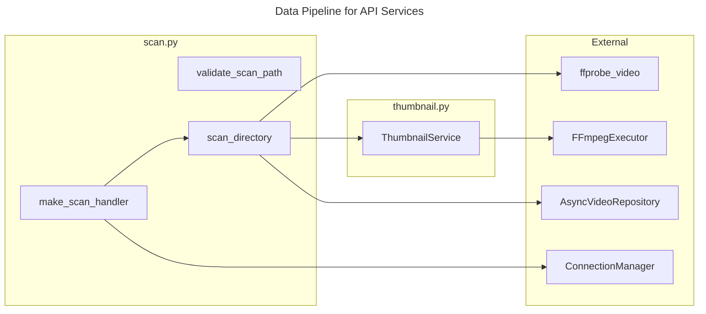

# C4 Code Level: API Services

## Overview
- **Name**: API Services
- **Description**: Business logic services for directory scanning and thumbnail generation
- **Location**: `src/stoat_ferret/api/services/`
- **Language**: Python
- **Purpose**: Encapsulate domain logic for video scanning and thumbnail creation, decoupled from HTTP routing
- **Parent Component**: TBD

## Code Elements

### Functions/Methods

#### scan.py

- `validate_scan_path(path: str, allowed_roots: list[str]) -> str | None`
  - Description: Validate that a scan path falls under an allowed root directory. Returns error message or None.
  - Location: `src/stoat_ferret/api/services/scan.py:29`
  - Dependencies: `pathlib.Path`

- `make_scan_handler(repository: AsyncVideoRepository, thumbnail_service: ThumbnailService | None = None, ws_manager: ConnectionManager | None = None, queue: AsyncJobQueue | None = None) -> Callable[[str, dict[str, Any]], Awaitable[Any]]`
  - Description: Factory that creates a job queue handler bound to a repository. Supports WebSocket broadcasting of SCAN_STARTED/SCAN_COMPLETED events, progress callbacks, and cancellation.
  - Location: `src/stoat_ferret/api/services/scan.py:57`
  - Dependencies: `AsyncVideoRepository`, `ThumbnailService`, `ConnectionManager`, `AsyncJobQueue`

- `async scan_directory(path: str, recursive: bool, repository: AsyncVideoRepository, thumbnail_service: ThumbnailService | None = None, *, progress_callback: Callable[[float], None] | None = None, cancel_event: asyncio.Event | None = None) -> ScanResponse`
  - Description: Scan a directory for video files, extract metadata via ffprobe, and store/update in repository. Supports progress reporting and cooperative cancellation.
  - Location: `src/stoat_ferret/api/services/scan.py:121`
  - Dependencies: `AsyncVideoRepository`, `ThumbnailService`, `ffprobe_video`, `Video`, `ScanResponse`

### Classes/Modules

#### thumbnail.py

- `ThumbnailService`
  - Description: Generate video thumbnails using FFmpeg executor pattern. Extracts frame at 5-second mark, scales to configured width.
  - Location: `src/stoat_ferret/api/services/thumbnail.py:14`
  - Methods:
    - `__init__(executor: FFmpegExecutor, thumbnail_dir: str | Path, *, width: int = 320) -> None`
    - `generate(video_path: str, video_id: str) -> str | None` -- Generate a JPEG thumbnail
    - `get_thumbnail_path(video_id: str) -> str | None` -- Check if a thumbnail file exists
  - Dependencies: `FFmpegExecutor`, `structlog`

### Module-Level Constants

- `VIDEO_EXTENSIONS: set[str]` -- Supported video file extensions: `.mp4`, `.mkv`, `.avi`, `.mov`, `.webm`, `.m4v`
  - Location: `src/stoat_ferret/api/services/scan.py:26`

- `SCAN_JOB_TYPE: str = "scan"` -- Job type identifier for scan operations
  - Location: `src/stoat_ferret/api/services/scan.py:54`

## Dependencies

### Internal Dependencies
- `stoat_ferret.api.schemas.video` -- ScanError, ScanResponse schemas
- `stoat_ferret.api.websocket.events` -- EventType, build_event
- `stoat_ferret.api.websocket.manager` -- ConnectionManager (TYPE_CHECKING)
- `stoat_ferret.db.async_repository` -- AsyncVideoRepository protocol
- `stoat_ferret.db.models` -- Video dataclass
- `stoat_ferret.ffmpeg.probe` -- ffprobe_video function
- `stoat_ferret.ffmpeg.executor` -- FFmpegExecutor protocol
- `stoat_ferret.jobs.queue` -- AsyncJobQueue (TYPE_CHECKING)

### External Dependencies
- `structlog` -- Structured logging
- `pathlib` -- Path manipulation
- `asyncio` -- Event for cancellation

## Relationships

