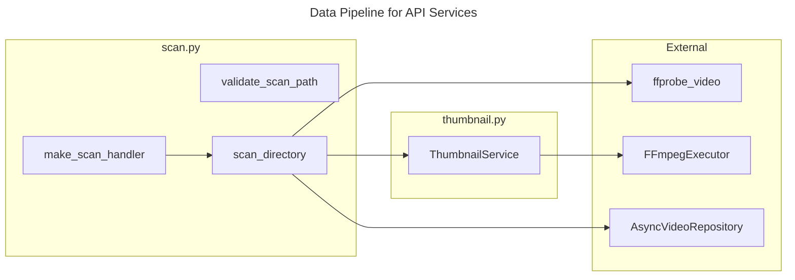

# C4 Code Level: API Services

## Overview
- **Name**: API Services
- **Description**: Business logic services for directory scanning and thumbnail generation
- **Location**: `src/stoat_ferret/api/services/`
- **Language**: Python
- **Purpose**: Encapsulate domain logic for video scanning and thumbnail creation, decoupled from HTTP routing

## Code Elements

### Functions/Methods

#### scan.py

- `validate_scan_path(path: str, allowed_roots: list[str]) -> str | None`
  - Description: Validate that a scan path falls under an allowed root directory
  - Location: `src/stoat_ferret/api/services/scan.py:25`
  - Dependencies: `pathlib.Path`

- `make_scan_handler(repository: AsyncVideoRepository, thumbnail_service: ThumbnailService | None) -> Callable[[str, dict[str, Any]], Awaitable[Any]]`
  - Description: Factory that creates a job queue handler bound to a repository and optional thumbnail service
  - Location: `src/stoat_ferret/api/services/scan.py:53`
  - Dependencies: `AsyncVideoRepository`, `ThumbnailService`

- `async scan_directory(path: str, recursive: bool, repository: AsyncVideoRepository, thumbnail_service: ThumbnailService | None) -> ScanResponse`
  - Description: Scan a directory for video files, extract metadata via ffprobe, and store/update in repository
  - Location: `src/stoat_ferret/api/services/scan.py:88`
  - Dependencies: `AsyncVideoRepository`, `ThumbnailService`, `ffprobe_video`, `Video`, `ScanResponse`

### Classes/Modules

#### thumbnail.py

- `ThumbnailService`
  - Description: Generate video thumbnails using FFmpeg, extracting a frame at the 5-second mark
  - Location: `src/stoat_ferret/api/services/thumbnail.py:14`
  - Methods:
    - `__init__(executor: FFmpegExecutor, thumbnail_dir: str | Path, *, width: int = 320) -> None`
    - `generate(video_path: str, video_id: str) -> str | None` - Generate a JPEG thumbnail for a video
    - `get_thumbnail_path(video_id: str) -> str | None` - Check if a thumbnail file exists
  - Dependencies: `FFmpegExecutor`, `structlog`

### Module-Level Constants

- `VIDEO_EXTENSIONS: set[str]` - Supported video file extensions: `.mp4`, `.mkv`, `.avi`, `.mov`, `.webm`, `.m4v`
  - Location: `src/stoat_ferret/api/services/scan.py:22`

- `SCAN_JOB_TYPE: str = "scan"` - Job type identifier for scan operations
  - Location: `src/stoat_ferret/api/services/scan.py:50`

## Dependencies

### Internal Dependencies
- `stoat_ferret.api.schemas.video` - ScanError, ScanResponse schemas
- `stoat_ferret.db.async_repository` - AsyncVideoRepository protocol
- `stoat_ferret.db.models` - Video dataclass
- `stoat_ferret.ffmpeg.probe` - ffprobe_video function
- `stoat_ferret.ffmpeg.executor` - FFmpegExecutor protocol

### External Dependencies
- `structlog` - Structured logging
- `pathlib` - Path manipulation

## Relationships

