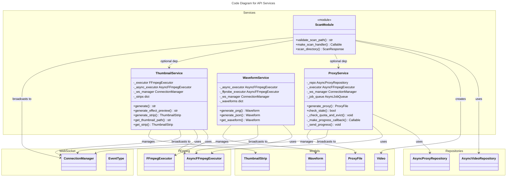

# C4 Code Level: API Services

## Overview

- **Name**: API Services Layer
- **Description**: Business logic services for video processing, file scanning, thumbnail/strip generation, and waveform analysis.
- **Location**: `src/stoat_ferret/api/services/`
- **Language**: Python
- **Purpose**: Encapsulates domain logic for proxy generation, directory scanning, thumbnail/sprite sheet generation, and waveform visualization. Manages FFmpeg orchestration, progress reporting, storage quotas, and WebSocket event broadcasting.
- **Parent Component**: [Application Services](./c4-component-application-services.md)

## Code Elements

### Functions/Methods

#### proxy_service.py

- `select_proxy_quality(source_width: int, source_height: int) -> tuple[ProxyQuality, int, int]`
  - Description: Select proxy quality level and target resolution based on source dimensions using threshold mapping.
  - Location: proxy_service.py:58
  - Dependencies: ProxyQuality enum

- `build_ffmpeg_args(source_path: str, output_path: str, target_width: int, target_height: int) -> list[str]`
  - Description: Construct FFmpeg command arguments for proxy transcoding with H.264 and AAC encoding.
  - Location: proxy_service.py:76
  - Dependencies: None (pure)

- `compute_file_checksum(file_path: str, chunk_size: int = 8192) -> str`
  - Description: Compute SHA-256 hash for source file staleness verification.
  - Location: proxy_service.py:115
  - Dependencies: hashlib

- `make_proxy_handler(proxy_service: ProxyService) -> Any`
  - Description: Factory creating async job handler for proxy generation jobs.
  - Location: proxy_service.py:501
  - Dependencies: ProxyService

- `_remove_file_if_exists(path: str) -> None`
  - Description: Safe file removal ignoring errors (cleanup utility).
  - Location: proxy_service.py:546
  - Dependencies: os

- `_run_in_thread(fn: Any, *args: Any) -> Any`
  - Description: Run blocking function in thread pool via asyncio.to_thread.
  - Location: proxy_service.py:559
  - Dependencies: asyncio

#### scan.py

- `validate_scan_path(path: str, allowed_roots: list[str]) -> str | None`
  - Description: Validate scan path falls within allowed root directories (security constraint).
  - Location: scan.py:33
  - Dependencies: pathlib.Path

- `make_scan_handler(repository: AsyncVideoRepository, thumbnail_service: ThumbnailService | None = None, ws_manager: ConnectionManager | None = None, queue: AsyncJobQueue | None = None, proxy_service: ProxyService | None = None) -> Callable[[str, dict[str, Any]], Awaitable[Any]]`
  - Description: Factory creating async job handler for directory scans with optional thumbnail/proxy generation.
  - Location: scan.py:61
  - Dependencies: AsyncVideoRepository, ThumbnailService, ConnectionManager, AsyncJobQueue

- `scan_directory(path: str, recursive: bool, repository: AsyncVideoRepository, thumbnail_service: ThumbnailService | None = None, *, progress_callback: Callable[[float], Awaitable[None]] | None = None, cancel_event: asyncio.Event | None = None) -> ScanResponse`
  - Description: Walk directory for video files, extract metadata via ffprobe, update repository, optionally generate thumbnails.
  - Location: scan.py:276
  - Dependencies: AsyncVideoRepository, ffprobe_video, Video, ScanResponse

- `_auto_queue_proxies(*, result: ScanResponse, repository: AsyncVideoRepository, proxy_service: ProxyService, queue: AsyncJobQueue, scan_path: str) -> None`
  - Description: Auto-queue proxy generation for new videos and detect stale proxies via checksums.
  - Location: scan.py:160
  - Dependencies: ProxyService, AsyncJobQueue

#### thumbnail.py

- `calculate_strip_dimensions(duration_seconds: float, interval: float, columns: int) -> tuple[int, int]`
  - Description: Calculate frame count and row count for sprite sheet grid.
  - Location: thumbnail.py:35
  - Dependencies: math

- `build_strip_ffmpeg_args(video_path: str, output_path: str, *, interval: float, frame_width: int, frame_height: int, columns: int, rows: int) -> list[str]`
  - Description: Build FFmpeg filter chain for sprite sheet (fps+scale+tile filters).
  - Location: thumbnail.py:55
  - Dependencies: None (pure)

- `extract_frame_args(video_path: str, output_path: str, *, timestamp: float = 0, width: int = 320, height: int = -1, quality: int = 5) -> list[str]`
  - Description: Build FFmpeg arguments for single-frame extraction at timestamp with scaling.
  - Location: thumbnail.py:96
  - Dependencies: None (pure)

#### waveform.py

- `escape_path_for_amovie(path: str) -> str`
  - Description: Escape file path for FFmpeg amovie filter parameter (Windows backslash handling).
  - Location: waveform.py:31
  - Dependencies: None (pure)

- `build_png_ffmpeg_args(video_path: str, output_path: str, *, width: int = 1800, height: int = 140, channels: int = 1) -> list[str]`
  - Description: Build FFmpeg arguments for PNG waveform via showwavespic filter.
  - Location: waveform.py:46
  - Dependencies: None (pure)

- `build_json_ffmpeg_args(video_path: str) -> list[str]`
  - Description: Build ffprobe arguments for JSON waveform data using astats filter (10 samples/sec).
  - Location: waveform.py:81
  - Dependencies: None (pure)

- `parse_astats_output(raw_output: str) -> list[dict[str, str]]`
  - Description: Parse ffprobe JSON extracting Peak_level and RMS_level per frame and channel.
  - Location: waveform.py:114
  - Dependencies: json

### Classes/Modules

#### ProxyService (proxy_service.py:132)

Orchestrates proxy file generation with quota management and staleness detection.

- `__init__(...) -> None` (proxy_service.py:140)
- `async generate_proxy(...) -> ProxyFile` (proxy_service.py:170)
- `async check_stale(proxy_id: str, source_path: str) -> bool` (proxy_service.py:358)
- `async _check_quota_and_evict() -> None` (proxy_service.py:388)
- `_make_progress_callback(...) -> Any` (proxy_service.py:413)
- `async _send_progress(...) -> None` (proxy_service.py:465)

#### ThumbnailService (thumbnail.py:137)

Generates video thumbnails (single frames) and sprite sheet strips (NxM grid).

- `__init__(...) -> None` (thumbnail.py:152)
- `generate(video_path: str, video_id: str) -> str | None` (thumbnail.py:170)
- `async generate_effect_preview(video_path: str, effect_filter: str, *, timestamp: float = 0, width: int = 320, quality: int = 3) -> str | None` (thumbnail.py:223)
- `get_thumbnail_path(video_id: str) -> str | None` (thumbnail.py:297)
- `get_strip(video_id: str) -> ThumbnailStrip | None` (thumbnail.py:311)
- `async generate_strip(...) -> ThumbnailStrip` (thumbnail.py:322)
- `_make_strip_progress_callback(...) -> Any` (thumbnail.py:465)
- `async _send_strip_progress(...) -> None` (thumbnail.py:511)

#### WaveformService (waveform.py:169)

Generates audio waveform visualizations as PNG images and JSON amplitude data.

- `__init__(...) -> None` (waveform.py:182)
- `get_waveform(video_id: str, fmt: WaveformFormat) -> Waveform | None` (waveform.py:196)
- `async generate_png(...) -> Waveform` (waveform.py:208)
- `async generate_json(...) -> Waveform` (waveform.py:327)
- `_make_progress_callback(...) -> Any` (waveform.py:452)
- `async _send_progress(...) -> None` (waveform.py:498)

## Dependencies

### Internal Dependencies

- `stoat_ferret.db.models`: ProxyFile, ProxyQuality, ProxyStatus, Video, ThumbnailStrip, ThumbnailStripStatus, Waveform, WaveformFormat, WaveformStatus
- `stoat_ferret.db.proxy_repository`: AsyncProxyRepository
- `stoat_ferret.db.async_repository`: AsyncVideoRepository
- `stoat_ferret.api.websocket.events`: EventType, build_event
- `stoat_ferret.api.websocket.manager`: ConnectionManager
- `stoat_ferret.api.schemas.video`: ScanResponse, ScanError
- `stoat_ferret.api.settings`: get_settings
- `stoat_ferret.ffmpeg.async_executor`: AsyncFFmpegExecutor, ProgressInfo
- `stoat_ferret.ffmpeg.executor`: FFmpegExecutor
- `stoat_ferret.ffmpeg.probe`: ffprobe_video
- `stoat_ferret.jobs.queue`: AsyncJobQueue
- `stoat_ferret.preview.metrics`: proxy_evictions_total, proxy_files_total, proxy_generation_seconds, proxy_storage_bytes

### External Dependencies

- **structlog**: Structured logging throughout all services
- **pathlib**: Path operations and file system checks
- **asyncio**: Async/await, threading, locking, event management
- **hashlib**: SHA-256 checksums for source verification
- **os**: File operations, directory management
- **json**: Waveform data serialization
- **math**: Geometric calculations for sprite sheets
- **uuid**: Random ID generation for effect previews
- **time**: Performance measurement and timing
- **datetime**: Timestamp creation and timezone handling
- **shutil**: Process utilities (which() for FFmpeg availability)

## Relationships

```mermaid
---
title: Code Diagram for API Services
---
classDiagram
    namespace Services {
        class ProxyService {
            -_repo AsyncProxyRepository
            -_executor AsyncFFmpegExecutor
            -_ws_manager ConnectionManager
            -_job_queue AsyncJobQueue
            +generate_proxy() ProxyFile
            +check_stale() bool
            -_check_quota_and_evict() void
            -_make_progress_callback() Callable
            -_send_progress() void
        }
        
        class ThumbnailService {
            -_executor FFmpegExecutor
            -_async_executor AsyncFFmpegExecutor
            -_ws_manager ConnectionManager
            -_strips dict
            +generate() str
            +generate_effect_preview() str
            +generate_strip() ThumbnailStrip
            +get_thumbnail_path() str
            +get_strip() ThumbnailStrip
        }
        
        class WaveformService {
            -_async_executor AsyncFFmpegExecutor
            -_ffprobe_executor AsyncFFmpegExecutor
            -_ws_manager ConnectionManager
            -_waveforms dict
            +generate_png() Waveform
            +generate_json() Waveform
            +get_waveform() Waveform
        }
        
        class ScanModule {
            <<module>>
            +validate_scan_path() str
            +make_scan_handler() Callable
            +scan_directory() ScanResponse
        }
    }
    
    namespace Models {
        class ProxyFile
        class ThumbnailStrip
        class Waveform
        class Video
    }
    
    namespace Repositories {
        class AsyncProxyRepository
        class AsyncVideoRepository
    }
    
    namespace WebSocket {
        class ConnectionManager
        class EventType
    }
    
    namespace FFmpeg {
        class AsyncFFmpegExecutor
        class FFmpegExecutor
    }
    
    ProxyService --> AsyncProxyRepository : uses
    ProxyService --> AsyncFFmpegExecutor : uses
    ProxyService --> ConnectionManager : broadcasts to
    ProxyService --> ProxyFile : manages
    
    ThumbnailService --> FFmpegExecutor : uses
    ThumbnailService --> AsyncFFmpegExecutor : uses
    ThumbnailService --> ConnectionManager : broadcasts to
    ThumbnailService --> ThumbnailStrip : manages
    
    WaveformService --> AsyncFFmpegExecutor : uses
    WaveformService --> ConnectionManager : broadcasts to
    WaveformService --> Waveform : manages
    
    ScanModule --> AsyncVideoRepository : uses
    ScanModule --> Video : creates
    ScanModule --> ProxyService : optional dep
    ScanModule --> ThumbnailService : optional dep
    ScanModule --> ConnectionManager : broadcasts to
```

## Notes

- **Progress throttling**: Services implement throttled progress callbacks (500ms + 5% delta minimum) to prevent WebSocket flooding
- **Async/sync mixing**: ThumbnailService mixes sync (generate) and async (generate_strip) FFmpeg operations
- **Job queue integration**: ProxyService and ScanModule use factory pattern for background job handlers
- **Staleness detection**: ProxyService uses SHA-256 checksums to detect modified source videos
- **Storage quota**: ProxyService implements LRU eviction at 80% threshold to manage proxy storage
- **WebSocket broadcasting**: Services emit real-time progress and completion events for reactive UI updates
- **Quality selection**: ProxyService selects quality based on source resolution (1080p+ = HIGH, 720p+ = MEDIUM, <720p = LOW/passthrough)
