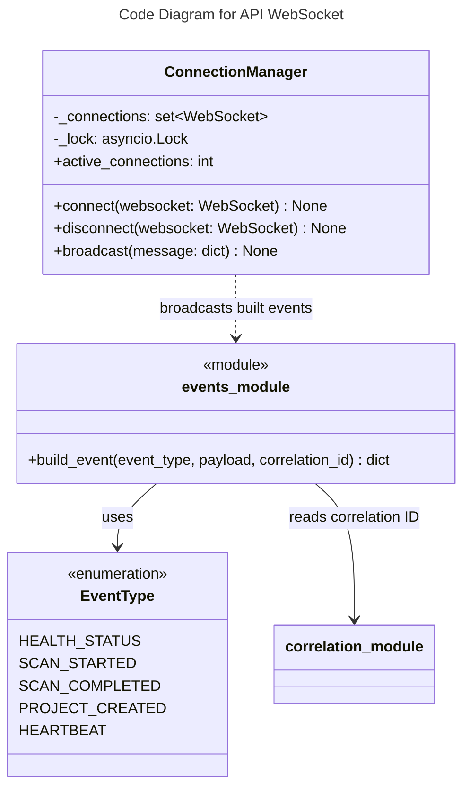

# C4 Code Level: API WebSocket

## Overview
- **Name**: API WebSocket
- **Description**: WebSocket connection management and event broadcasting for real-time updates
- **Location**: `src/stoat_ferret/api/websocket/`
- **Language**: Python
- **Purpose**: Manage WebSocket connections and broadcast typed events to connected clients

## Code Elements

### Functions/Methods

#### events.py

- `build_event(event_type: EventType, payload: dict[str, Any] | None, correlation_id: str | None) -> dict[str, Any]`
  - Description: Build a standardized WebSocket event message with type, payload, correlation ID, and timestamp
  - Location: `src/stoat_ferret/api/websocket/events.py:22`
  - Dependencies: `get_correlation_id` (middleware), `EventType`

### Classes/Modules

#### events.py

- `EventType(str, Enum)`
  - Description: Enumeration of WebSocket event types
  - Location: `src/stoat_ferret/api/websocket/events.py:12`
  - Values: HEALTH_STATUS, SCAN_STARTED, SCAN_COMPLETED, PROJECT_CREATED, HEARTBEAT
  - Dependencies: `enum.Enum`

#### manager.py

- `ConnectionManager`
  - Description: Manages active WebSocket connections with O(1) add/remove and broadcast with dead connection cleanup
  - Location: `src/stoat_ferret/api/websocket/manager.py:14`
  - Methods:
    - `__init__() -> None` - Initialize with empty connection set and asyncio lock
    - `active_connections -> int` (property) - Return count of active connections
    - `async connect(websocket: WebSocket) -> None` - Accept and register a WebSocket connection
    - `disconnect(websocket: WebSocket) -> None` - Remove a connection from tracking
    - `async broadcast(message: dict[str, Any]) -> None` - Send message to all connected clients, removing dead connections
  - Dependencies: `asyncio.Lock`, `starlette.WebSocket`, `structlog`

## Dependencies

### Internal Dependencies
- `stoat_ferret.api.middleware.correlation` - `get_correlation_id` for event correlation

### External Dependencies
- `starlette` - WebSocket, WebSocketState
- `asyncio` - Lock for concurrent broadcast safety
- `structlog` - Structured logging

## Relationships

