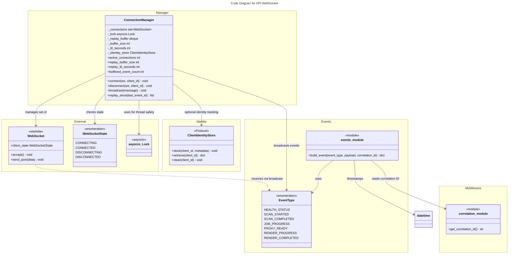

# C4 Code Level: API WebSocket

## Overview

- **Name**: API WebSocket Layer
- **Description**: WebSocket connection management and real-time event broadcasting infrastructure.
- **Location**: `src/stoat_ferret/api/websocket/`
- **Language**: Python
- **Purpose**: Provide typed event definitions and connection lifecycle management for real-time client updates. Handles WebSocket connection registry, message broadcast to all connected clients, and automatic cleanup of dead connections.
- **Parent Component**: [API Gateway](./c4-component-api-gateway.md)

## Code Elements

### Functions/Methods

#### events.py

- `build_event(event_type: EventType, payload: dict[str, Any] | None = None, correlation_id: str | None = None) -> dict[str, Any]`
  - Description: Build standardized WebSocket event message with type, payload, correlation ID, and ISO timestamp.
  - Location: events.py:41
  - Dependencies: get_correlation_id, datetime, EventType

### Classes/Modules

#### EventType (events.py:12)

String enumeration defining all WebSocket event types broadcast by the system.

**Enumeration Values:**
- HEALTH_STATUS = "health_status"
- SCAN_STARTED = "scan_started"
- SCAN_COMPLETED = "scan_completed"
- PROJECT_CREATED = "project_created"
- HEARTBEAT = "heartbeat"
- TIMELINE_UPDATED = "timeline_updated"
- LAYOUT_APPLIED = "layout_applied"
- AUDIO_MIX_CHANGED = "audio_mix_changed"
- TRANSITION_APPLIED = "transition_applied"
- JOB_PROGRESS = "job_progress"
- PREVIEW_GENERATING = "preview.generating"
- PREVIEW_READY = "preview.ready"
- PREVIEW_SEEKING = "preview.seeking"
- PREVIEW_ERROR = "preview.error"
- AI_ACTION = "ai_action"
- RENDER_PROGRESS = "render_progress"
- RENDER_STARTED = "render_started"
- RENDER_COMPLETED = "render_completed"
- RENDER_FAILED = "render_failed"
- RENDER_CANCELLED = "render_cancelled"
- RENDER_QUEUED = "render_queued"
- RENDER_FRAME_AVAILABLE = "render_frame_available"
- RENDER_QUEUE_STATUS = "render_queue_status"
- PROXY_READY = "proxy.ready"

**Usage**: Used as event_type parameter in build_event() to specify message category.

#### ConnectionManager (manager.py:23)

Manages active WebSocket connections and broadcasts messages to all connected clients. Uses set for O(1) add/remove operations. Automatically removes dead connections during broadcast. Maintains a bounded replay buffer of recent broadcasts for reconnecting clients (Last-Event-ID handshake). When a `ClientIdentityStore` is provided, stores and clears identity entries on connect/disconnect.

**Constructor:**

- `__init__(*, buffer_size: int | None = None, ttl_seconds: int | None = None, client_identity_store: ClientIdentityStore | None = None) -> None`
  - Initialize the manager with a bounded replay buffer.
  - `buffer_size`: Maximum events in replay buffer (defaults to `settings.ws_replay_buffer_size`; 0 disables replay).
  - `ttl_seconds`: Maximum age of replayable events at reconnect time (defaults to `settings.ws_replay_ttl_seconds`).
  - `client_identity_store`: Optional identity store for tracking connected clients by token. When provided, `connect()` calls `store()` and `disconnect()` calls `clear()` for any `client_id` that is not None.
  - Location: `src/stoat_ferret/api/websocket/manager.py:36`

**Attributes:**
- `_connections: set[WebSocket]` — Active WebSocket connections
- `_lock: asyncio.Lock` — Prevents concurrent modification during broadcast
- `_replay_buffer: deque[dict[str, Any]]` — Bounded buffer of recent broadcasts for Last-Event-ID replay
- `_buffer_size: int` — Configured maximum replay buffer capacity
- `_ttl_seconds: int` — Configured replay event TTL in seconds
- `_identity_store: ClientIdentityStore | None` — Optional identity store for per-connection tracking

**Properties:**
- `@property active_connections() -> int` — Return count of currently connected clients (manager.py:67)
- `@property replay_buffer_size() -> int` — Return configured maximum replay buffer size (manager.py:72)
- `@property replay_ttl_seconds() -> int` — Return configured replay event TTL in seconds (manager.py:77)
- `@property buffered_event_count() -> int` — Return current number of buffered events; used by tests and metrics (manager.py:82)

**Methods:**
- `async connect(websocket: WebSocket, *, client_id: str | None = None) -> None` — Accept connection and add to registry. When `client_id` is provided and an identity store is configured, calls `store(client_id, {})`. Location: manager.py:86
- `disconnect(websocket: WebSocket, *, client_id: str | None = None) -> None` — Remove connection from registry. When `client_id` is provided and an identity store is configured, calls `clear(client_id)`. Location: manager.py:105
- `async broadcast(message: dict[str, Any]) -> None` — Send JSON message to all connected clients, removing dead connections automatically, then append to replay buffer. Location: manager.py:122
- `replay_since(last_event_id: str | None) -> list[dict[str, Any]]` — Return buffered events for a reconnecting client, filtered by TTL and Last-Event-ID position. Location: manager.py:157

**Dependencies:**
- Internal: `stoat_ferret.api.websocket.identity.ClientIdentityStore` (identity store protocol)
- External: starlette.websockets (WebSocket, WebSocketState), asyncio.Lock, collections.deque, structlog

## Dependencies

### Internal Dependencies

- `stoat_ferret.api.middleware.correlation`: get_correlation_id (reads context var for event tracking)
- `stoat_ferret.api.websocket.identity`: ClientIdentityStore (protocol for per-connection identity tracking)

### External Dependencies

- **starlette.websockets**: WebSocket (connection protocol), WebSocketState (connection state enum)
- **asyncio**: Lock (thread-safe broadcast access)
- **collections**: deque (bounded replay buffer)
- **datetime**: datetime, timedelta, timezone (ISO timestamp generation, TTL calculation)
- **enum**: Enum (EventType base class)
- **structlog**: Structured logging for connection and broadcast events

## Relationships

```mermaid
---
title: Code Diagram for API WebSocket
---
classDiagram
    namespace Events {
        class EventType {
            <<enumeration>>
            HEALTH_STATUS
            SCAN_STARTED
            SCAN_COMPLETED
            JOB_PROGRESS
            PROXY_READY
            RENDER_PROGRESS
            RENDER_COMPLETED
        }
        
        class events_module {
            <<module>>
            +build_event(event_type, payload, correlation_id) dict
        }
    }
    
    namespace Manager {
        class ConnectionManager {
            -_connections set~WebSocket~
            -_lock asyncio.Lock
            -_replay_buffer deque
            -_buffer_size int
            -_ttl_seconds int
            -_identity_store ClientIdentityStore
            +active_connections int
            +replay_buffer_size int
            +replay_ttl_seconds int
            +buffered_event_count int
            +connect(ws, client_id) void
            +disconnect(ws, client_id) void
            +broadcast(message) void
            +replay_since(last_event_id) list
        }
    }
    
    namespace External {
        class WebSocket {
            <<starlette>>
            +accept() void
            +send_json(data) void
            +client_state WebSocketState
        }
        
        class WebSocketState {
            <<enumeration>>
            CONNECTING
            CONNECTED
            DISCONNECTING
            DISCONNECTED
        }
        
        class asyncio_Lock {
            <<asyncio>>
        }
    }
    
    namespace Middleware {
        class correlation_module {
            <<module>>
            +get_correlation_id() str
        }
    }

    namespace Identity {
        class ClientIdentityStore {
            <<Protocol>>
            +store(client_id, metadata) void
            +retrieve(client_id) dict
            +clear(client_id) void
        }
    }

    events_module --> EventType : uses
    events_module --> correlation_module : reads correlation ID
    events_module --> datetime : timestamps

    ConnectionManager --> asyncio_Lock : uses for thread safety
    ConnectionManager --> WebSocket : manages set of
    ConnectionManager --> WebSocketState : checks state
    ConnectionManager --> EventType : broadcasts events
    ConnectionManager --> ClientIdentityStore : optional identity tracking

    WebSocket ..> EventType : receives via broadcast
```

## Notes

- **Thread-safe broadcasting**: ConnectionManager uses asyncio.Lock to ensure thread-safe concurrent access during broadcast operations
- **Dead connection cleanup**: Broadcast automatically removes connections in non-CONNECTED state, filtering failures transparently
- **Event schema**: All events follow the same structure: type, payload, correlation_id, timestamp - enabling consistent client-side handling
- **Correlation tracking**: build_event() reads correlation_id from context var for request tracing across async boundaries
- **Non-blocking**: disconnect() is synchronous (simple set removal); connect() and broadcast() are async for I/O safety
- **Event types**: 24 distinct event types covering scanning, rendering, proxies, timeline edits, and health monitoring
- **Scalability**: Using set for O(1) connection add/remove enables efficient management of many concurrent connections
- **Replay buffer**: Bounded deque retains recent broadcasts; reconnecting clients send Last-Event-ID header to catch up on missed events (BL-274, FR-001..FR-005). Buffer size and TTL are configurable via settings (`ws_replay_buffer_size`, `ws_replay_ttl_seconds`).
- **Client identity**: When `client_identity_store` is provided to the constructor (set by create_app()), connect() stores an identity entry and disconnect() clears it. The `client_id` parameter to connect/disconnect is optional — connections without a client_id proceed normally without identity tracking. See [c4-code-websocket-identity.md](./c4-code-websocket-identity.md) for the identity primitive details.
