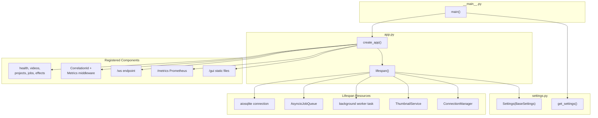

# C4 Code Level: API Application

## Overview
- **Name**: API Application
- **Description**: FastAPI application factory, settings, and entry point for the stoat-and-ferret video editor API.
- **Location**: `src/stoat_ferret/api/`
- **Language**: Python (async/await)
- **Purpose**: Configure and wire together all API components including routers, middleware, lifespan management, WebSocket support, Prometheus metrics, and static file serving.
- **Parent Component**: [API Gateway](./c4-component-api-gateway.md)

## Code Elements

### Functions/Methods

#### app.py

- `async lifespan(app: FastAPI) -> AsyncGenerator[None, None]`
  - Description: Manages application lifespan -- configures structured logging on startup, opens database and creates schema, creates ConnectionManager, starts job worker on startup; cancels worker, closes database on shutdown. Skips DB setup when dependencies are injected (test mode via `_deps_injected` flag).
  - Location: `src/stoat_ferret/api/app.py:41`
  - Dependencies: `aiosqlite`, `get_settings`, `configure_logging`, `create_tables_async`, `AsyncSQLiteVideoRepository`, `ThumbnailService`, `RealFFmpegExecutor`, `AsyncioJobQueue`, `ConnectionManager`, `SCAN_JOB_TYPE`, `make_scan_handler`

- `create_app(*, video_repository: AsyncVideoRepository | None = None, project_repository: AsyncProjectRepository | None = None, clip_repository: AsyncClipRepository | None = None, job_queue: AsyncioJobQueue | None = None, ws_manager: ConnectionManager | None = None, effect_registry: EffectRegistry | None = None, gui_static_path: str | Path | None = None) -> FastAPI`
  - Description: Application factory -- creates and configures FastAPI app with 5 routers (health, videos, projects, jobs, effects), WebSocket route, 2 middleware layers (correlation ID, metrics), Prometheus /metrics mount, optional frontend static files, and dependency injection support for testing.
  - Location: `src/stoat_ferret/api/app.py:91`
  - Dependencies: All routers, middleware, settings, `ConnectionManager`, `prometheus_client`, `StaticFiles`, `EffectRegistry`

#### settings.py

- `get_settings() -> Settings`
  - Description: Cached settings loader using `functools.lru_cache` for singleton behavior.
  - Location: `src/stoat_ferret/api/settings.py:93`
  - Dependencies: `Settings`

#### __main__.py

- `main() -> None`
  - Description: Entry point -- runs API server with uvicorn using host/port from settings.
  - Location: `src/stoat_ferret/api/__main__.py:14`
  - Dependencies: `create_app`, `get_settings`, `uvicorn`

### Classes/Modules

#### settings.py

- `Settings(BaseSettings)`
  - Description: Application configuration via environment variables with `STOAT_` prefix, .env file, or direct instantiation.
  - Location: `src/stoat_ferret/api/settings.py:13`
  - Fields:
    - `database_path: str` (default `"data/stoat.db"`)
    - `api_host: str` (default `"127.0.0.1"`)
    - `api_port: int` (default `8000`, range 1-65535)
    - `debug: bool` (default `False`)
    - `log_level: Literal["DEBUG","INFO","WARNING","ERROR","CRITICAL"]` (default `"INFO"`)
    - `thumbnail_dir: str` (default `"data/thumbnails"`)
    - `gui_static_path: str` (default `"gui/dist"`)
    - `ws_heartbeat_interval: int` (default `30`, min 1)
    - `allowed_scan_roots: list[str]` (default `[]`)
  - Properties:
    - `database_path_resolved -> Path` -- returns database_path as a Path object
  - Dependencies: `pydantic_settings.BaseSettings`, `pydantic.Field`

## Dependencies

### Internal Dependencies
- `stoat_ferret.api.middleware` -- CorrelationIdMiddleware, MetricsMiddleware
- `stoat_ferret.api.routers` -- health, videos, projects, jobs, effects routers
- `stoat_ferret.api.routers.ws` -- websocket_endpoint
- `stoat_ferret.api.services` -- scan handler (SCAN_JOB_TYPE, make_scan_handler), ThumbnailService
- `stoat_ferret.api.websocket` -- ConnectionManager
- `stoat_ferret.db` -- AsyncSQLiteVideoRepository, AsyncVideoRepository, AsyncClipRepository, AsyncProjectRepository
- `stoat_ferret.effects.registry` -- EffectRegistry
- `stoat_ferret.ffmpeg.executor` -- RealFFmpegExecutor
- `stoat_ferret.jobs.queue` -- AsyncioJobQueue

### External Dependencies
- `fastapi` -- FastAPI, StaticFiles
- `uvicorn` -- ASGI server
- `aiosqlite` -- Async SQLite database connection
- `structlog` -- Structured logging
- `prometheus_client` -- make_asgi_app for /metrics endpoint
- `pydantic_settings` -- BaseSettings with env var support
- `pydantic` -- Field, validation

## Relationships

