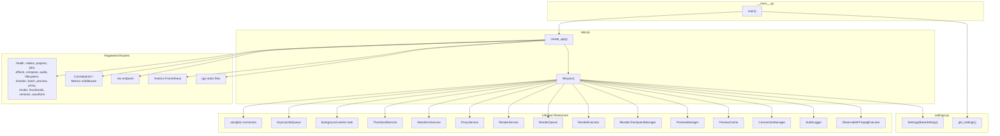

# C4 Code Level: API Application

## Overview
- **Name**: API Application
- **Description**: FastAPI application factory, settings, and entry point for the stoat-and-ferret video editor API
- **Location**: `src/stoat_ferret/api/`
- **Language**: Python (async/await)
- **Purpose**: Configure and wire together all API components including 16 routers, middleware, lifespan management, WebSocket support, Prometheus metrics, render/preview/proxy services, and static file serving
- **Parent Component**: [API Gateway](./c4-component-api-gateway.md)

## Code Elements

### Functions/Methods

#### app.py

- `async lifespan(app: FastAPI) -> AsyncGenerator[None, None]`
  - Description: Manages application lifecycle. On startup: configures structured logging, opens async and sync database connections, creates schema, initializes ConnectionManager, AuditLogger, batch/proxy repositories, job queue with scan/proxy handlers, ObservableFFmpegExecutor, ThumbnailService, WaveformService, ProxyService, RenderService (with queue, executor, checkpoint manager), PreviewManager with HLSGenerator and PreviewCache, then starts background job worker. On shutdown: initiates graceful render shutdown (reject new → cancel via stdin 'q' → wait grace → kill remaining → cleanup temp), cancels preview sessions, stops preview cache cleanup, cancels job worker, and closes database connections. Skips DB/worker setup when `_deps_injected` flag is set (test mode).
  - Location: `src/stoat_ferret/api/app.py:85`
  - Dependencies: `aiosqlite`, `get_settings`, `configure_logging`, `create_tables_async`, `AsyncSQLiteVideoRepository`, `ThumbnailService`, `WaveformService`, `ProxyService`, `RealFFmpegExecutor`, `ObservableFFmpegExecutor`, `RealAsyncFFmpegExecutor`, `AsyncioJobQueue`, `ConnectionManager`, `AuditLogger`, `AsyncSQLiteBatchRepository`, `SQLiteProxyRepository`, `RenderQueue`, `RenderExecutor`, `RenderCheckpointManager`, `RenderService`, `AsyncSQLiteRenderRepository`, `PreviewManager`, `PreviewCache`, `HLSGenerator`, `SQLitePreviewRepository`

- `create_app(*, video_repository: AsyncVideoRepository | None, project_repository: AsyncProjectRepository | None, clip_repository: AsyncClipRepository | None, timeline_repository: AsyncTimelineRepository | None, version_repository: AsyncVersionRepository | None, batch_repository: AsyncBatchRepository | None, proxy_repository: AsyncProxyRepository | None, render_repository: AsyncRenderRepository | None, render_queue: RenderQueue | None, render_service: RenderService | None, job_queue: AsyncioJobQueue | None, ws_manager: ConnectionManager | None, effect_registry: EffectRegistry | None, ffmpeg_executor: FFmpegExecutor | None, audit_logger: AuditLogger | None, preview_manager: PreviewManager | None, preview_cache: PreviewCache | None, thumbnail_service: ThumbnailService | None, waveform_service: WaveformService | None, gui_static_path: str | Path | None, client_identity_store: ClientIdentityStore | None) -> FastAPI`
  - Description: Application factory. Creates FastAPI app with 16 routers (health, videos, projects, jobs, effects, compose, audio, filesystem, timeline, batch, preview, proxy, render, thumbnails, versions, waveform), WebSocket route (/ws), 2 middleware layers (CorrelationId outermost, Metrics inner), Prometheus /metrics mount, optional frontend SPA at /gui, and custom OpenAPI schema injection for ProxyStatus/ProxyQuality enums. Full DI support for testing via keyword arguments. `client_identity_store` defaults to a new `InMemoryClientIdentityStore` if not provided; stored on `app.state.client_identity_store`. See [c4-code-websocket-identity.md](./c4-code-websocket-identity.md) for identity module details.
  - Location: `src/stoat_ferret/api/app.py:430`
  - Dependencies: All routers, middleware, settings, `ConnectionManager`, `prometheus_client`, `ClientIdentityStore`, `InMemoryClientIdentityStore`

#### settings.py

- `get_settings() -> Settings`
  - Description: Cached settings loader using `functools.lru_cache` for singleton behavior
  - Location: `src/stoat_ferret/api/settings.py:237`

#### __main__.py

- `main() -> None`
  - Description: Entry point — runs API server with uvicorn using host/port from settings
  - Location: `src/stoat_ferret/api/__main__.py:14`
  - Dependencies: `create_app`, `get_settings`, `uvicorn`

### Classes/Modules

#### settings.py

- `Settings(BaseSettings)`
  - Description: Application configuration via environment variables with `STOAT_` prefix, .env file, or direct instantiation
  - Location: `src/stoat_ferret/api/settings.py:13`
  - Fields:
    - `database_path: str` (default `"data/stoat.db"`)
    - `api_host: str` (default `"127.0.0.1"`)
    - `api_port: int` (default `8765`, range 1-65535)
    - `debug: bool` (default `False`)
    - `log_level: Literal["DEBUG","INFO","WARNING","ERROR","CRITICAL"]` (default `"INFO"`)
    - `thumbnail_dir: str` (default `"data/thumbnails"`)
    - `gui_static_path: str` (default `"gui/dist"`)
    - `ws_heartbeat_interval: int` (default `30`, min 1)
    - `log_backup_count: int` (default `5`)
    - `log_max_bytes: int` (default `10_485_760`)
    - `batch_parallel_limit: int` (default `4`, range 1-16)
    - `batch_max_jobs: int` (default `20`, range 1-100)
    - `render_max_concurrent: int` (default `4`, range 1-16)
    - `render_max_queue_depth: int` (default `50`, range 1-200)
    - `render_retry_count: int` (default `2`, range 0-5)
    - `render_timeout_seconds: int` (default `3600`, range 60-86400)
    - `render_cancel_grace_seconds: int` (default `10`, range 1-60)
    - `render_disk_degraded_threshold: float` (default `0.9`, range 0.0-1.0)
    - `version_retention_count: int | None` (default `None`, min 1)
    - `thumbnail_strip_interval: float` (default `5.0`, min 0.5)
    - `waveform_dir: str` (default `"data/waveforms"`)
    - `render_output_dir: str` (default `"data/renders"`)
    - `proxy_output_dir: str` (default `"data/proxies"`)
    - `proxy_max_storage_bytes: int` (default `10_737_418_240`)
    - `proxy_cleanup_threshold: float` (default `0.8`)
    - `proxy_auto_generate: bool` (default `False`)
    - `preview_output_dir: str` (default `"data/previews"`)
    - `preview_session_ttl_seconds: int` (default `3600`)
    - `preview_segment_duration: float` (default `2.0`, range 1.0-6.0)
    - `preview_cache_max_sessions: int` (default `5`, range 1-100)
    - `preview_cache_max_bytes: int` (default `1_073_741_824`)
    - `allowed_scan_roots: list[str]` (default `[]`)
  - Properties:
    - `database_path_resolved -> Path` — returns database_path as a Path object
  - Dependencies: `pydantic_settings.BaseSettings`, `pydantic.Field`

## Dependencies

### Internal Dependencies
- `stoat_ferret.api.middleware` — CorrelationIdMiddleware, MetricsMiddleware
- `stoat_ferret.api.routers` — health, videos, projects, jobs, effects, compose, audio, filesystem, timeline, batch, preview, proxy, render, thumbnails, versions, waveform
- `stoat_ferret.api.routers.ws` — websocket_endpoint
- `stoat_ferret.api.services` — ProxyService, make_proxy_handler, make_scan_handler, ThumbnailService, WaveformService
- `stoat_ferret.api.websocket` — ConnectionManager
- `stoat_ferret.api.websocket.identity` — ClientIdentityStore, InMemoryClientIdentityStore
- `stoat_ferret.db` — AsyncSQLiteVideoRepository, AsyncVideoRepository, AsyncClipRepository, AsyncProjectRepository, AsyncTimelineRepository, AsyncVersionRepository, AsyncBatchRepository, AsyncSQLiteBatchRepository, AsyncProxyRepository, SQLiteProxyRepository, AuditLogger, create_tables_async, ProxyQuality, ProxyStatus
- `stoat_ferret.effects.registry` — EffectRegistry
- `stoat_ferret.ffmpeg` — FFmpegExecutor, RealFFmpegExecutor, RealAsyncFFmpegExecutor, ObservableFFmpegExecutor
- `stoat_ferret.jobs.queue` — AsyncioJobQueue
- `stoat_ferret.preview` — PreviewCache, PreviewManager, HLSGenerator
- `stoat_ferret.render` — RenderQueue, RenderExecutor, RenderCheckpointManager, RenderService, AsyncRenderRepository, AsyncSQLiteRenderRepository
- `stoat_ferret.logging` — configure_logging

### External Dependencies
- `fastapi` — FastAPI, FileResponse
- `uvicorn` — ASGI server
- `aiosqlite` — Async SQLite database connection
- `structlog` — Structured logging
- `prometheus_client` — make_asgi_app for /metrics endpoint
- `pydantic_settings` — BaseSettings with env var support
- `pydantic` — Field, validation

## Relationships

```mermaid
flowchart TB
    subgraph "app.py"
        create_app["create_app()"]
        lifespan["lifespan()"]
    end

    subgraph "settings.py"
        Settings["Settings(BaseSettings)"]
        get_settings["get_settings()"]
    end

    subgraph "__main__.py"
        main["main()"]
    end

    main --> create_app
    main --> get_settings
    create_app --> lifespan
    lifespan --> Settings

    subgraph "Registered Routers"
        routers["health, videos, projects, jobs,<br/>effects, compose, audio, filesystem,<br/>timeline, batch, preview, proxy,<br/>render, thumbnails, versions, waveform"]
        middleware["CorrelationId +<br/>Metrics middleware"]
        ws_route["/ws endpoint"]
        metrics_app["/metrics Prometheus"]
        gui_mount["/gui static files"]
    end

    create_app --> routers
    create_app --> middleware
    create_app --> ws_route
    create_app --> metrics_app
    create_app --> gui_mount

    subgraph "Lifespan Resources"
        db["aiosqlite connection"]
        job_queue["AsyncioJobQueue"]
        worker["background worker task"]
        thumb_svc["ThumbnailService"]
        wave_svc["WaveformService"]
        proxy_svc["ProxyService"]
        render_svc["RenderService"]
        render_q["RenderQueue"]
        render_exec["RenderExecutor"]
        checkpoint["RenderCheckpointManager"]
        preview_mgr["PreviewManager"]
        preview_cache["PreviewCache"]
        ws_mgr["ConnectionManager"]
        audit["AuditLogger"]
        observable["ObservableFFmpegExecutor"]
    end

    lifespan --> db
    lifespan --> job_queue
    lifespan --> worker
    lifespan --> thumb_svc
    lifespan --> wave_svc
    lifespan --> proxy_svc
    lifespan --> render_svc
    lifespan --> render_q
    lifespan --> render_exec
    lifespan --> checkpoint
    lifespan --> preview_mgr
    lifespan --> preview_cache
    lifespan --> ws_mgr
    lifespan --> audit
    lifespan --> observable
```
