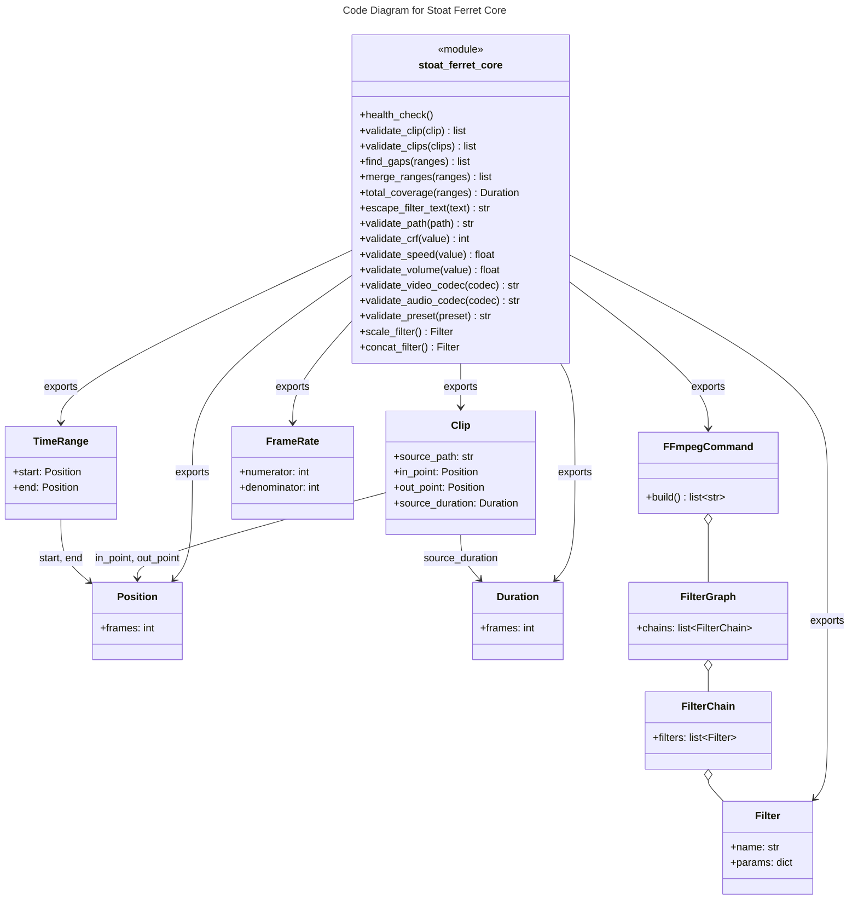

# C4 Code Level: Stoat Ferret Core (Python Bindings)

## Overview
- **Name**: Stoat Ferret Core Python Interface
- **Description**: Python package re-exporting Rust-powered video editing primitives via PyO3 bindings
- **Location**: `src/stoat_ferret_core/`
- **Language**: Python (wrapper for Rust via PyO3)
- **Purpose**: Provide Python-accessible types for clip validation, timeline math, FFmpeg command building, and input sanitization from the Rust core library

## Code Elements

### Functions/Methods

#### __init__.py (re-exported from Rust `_core` module)

**Clip Operations:**
- `validate_clip(clip: Clip) -> list[ClipValidationError]`
  - Description: Validate a single clip and return list of validation errors
- `validate_clips(clips: list[Clip]) -> list[ClipValidationError]`
  - Description: Validate multiple clips and return all validation errors

**Timeline Operations:**
- `find_gaps(ranges: list[TimeRange]) -> list[TimeRange]`
  - Description: Find gaps between time ranges
- `merge_ranges(ranges: list[TimeRange]) -> list[TimeRange]`
  - Description: Merge overlapping/adjacent time ranges
- `total_coverage(ranges: list[TimeRange]) -> Duration`
  - Description: Calculate total duration covered by ranges

**Filter Helpers:**
- `scale_filter(...) -> Filter`
  - Description: Create a scale filter
- `concat_filter(...) -> Filter`
  - Description: Create a concat filter

**Sanitization Functions:**
- `escape_filter_text(text: str) -> str`
  - Description: Escape special characters in FFmpeg filter parameters
- `validate_path(path: str) -> str`
  - Description: Validate file paths are safe to use
- `validate_crf(value: int) -> int`
  - Description: Validate CRF quality values (0-51)
- `validate_speed(value: float) -> float`
  - Description: Validate speed multipliers (0.25-4.0)
- `validate_volume(value: float) -> float`
  - Description: Validate volume multipliers (0.0-10.0)
- `validate_video_codec(codec: str) -> str`
  - Description: Validate video codec names
- `validate_audio_codec(codec: str) -> str`
  - Description: Validate audio codec names
- `validate_preset(preset: str) -> str`
  - Description: Validate encoding preset names

**Utility:**
- `health_check() -> ...`
  - Description: Verify the Rust extension is loaded and functional

### Classes/Modules (re-exported from Rust)

- `Clip` - Video clip representing a segment of source media
- `ClipValidationError` - Validation error with field, message, actual, expected
- `FrameRate` - Frame rate representation with common presets
- `Position` - Frame-accurate timeline position
- `Duration` - Frame-accurate duration
- `TimeRange` - Half-open interval [start, end) with set operations
- `FFmpegCommand` - Type-safe builder for FFmpeg command arguments
- `Filter` - Single FFmpeg filter with parameters
- `FilterChain` - Sequence of filters connected with commas
- `FilterGraph` - Multiple filter chains connected with semicolons

### Exceptions (re-exported from Rust)

- `ValidationError` - Raised when input validation fails
- `CommandError` - Raised when FFmpeg command building fails
- `SanitizationError` - Raised when input sanitization fails

### Fallback Behavior

When the Rust extension is not built, all exports are replaced with a `_not_built` stub that raises `RuntimeError` with a message to run `maturin develop`. Exceptions fall back to `RuntimeError`.

## Dependencies

### Internal Dependencies
- `stoat_ferret_core._core` - Compiled Rust PyO3 extension module (the actual Rust library)

### External Dependencies
- None (pure re-export layer; all computation is in Rust)

## Relationships

