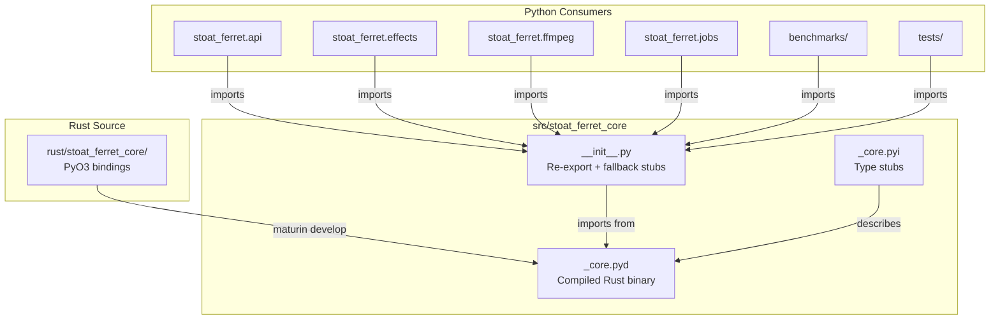

# C4 Code Level: Stoat Ferret Core Python Bindings

## Overview
- **Name**: Stoat Ferret Core Bindings Package
- **Description**: Python interface package that re-exports all Rust PyO3 types and provides fallback stubs when the native extension is unavailable.
- **Location**: `src/stoat_ferret_core/`
- **Language**: Python (binding layer for Rust)
- **Purpose**: Serves as the Python-facing API for the Rust `stoat_ferret_core` library, handling import of the compiled `_core` extension module and providing graceful degradation via `_not_built` stubs when the native extension hasn't been compiled.
- **Parent Component**: [Python Bindings Layer](./c4-component-python-bindings.md)

## Code Elements

### Functions/Methods

#### `_not_built` (fallback stub)
```python
def _not_built(*args, **kwargs) -> None
```
Catch-all stub replacing all Rust-bound names when the native extension is unavailable. Raises `RuntimeError` with a message directing the user to run `maturin develop`.

### Classes/Modules

#### `__init__.py`
Central re-export module. Tries to import from `stoat_ferret_core._core` (the compiled Rust extension). On `ImportError`, assigns all exported names to the `_not_built` stub and aliases exception types to `RuntimeError`.

**Exported categories (89 names in `__all__`):**

| Category | Types/Functions |
|----------|----------------|
| Utility | `health_check` |
| Clip types | `Clip`, `ClipValidationError`, `validate_clip`, `validate_clips` |
| Timeline types | `FrameRate`, `Position`, `Duration`, `TimeRange` |
| Drawtext | `DrawtextBuilder` |
| Speed control | `SpeedControl` |
| Audio mixing | `VolumeBuilder`, `AfadeBuilder`, `AmixBuilder`, `DuckingPattern`, `TrackAudioConfig`, `AudioMixSpec` |
| Transitions | `TransitionType`, `FadeBuilder`, `XfadeBuilder`, `AcrossfadeBuilder` |
| FFmpeg commands | `FFmpegCommand`, `Filter`, `FilterChain`, `FilterGraph` |
| Layout | `LayoutPosition`, `LayoutPreset`, `LayoutSpec` |
| Composition | `CompositionClip`, `TransitionSpec`, `calculate_composition_positions`, `calculate_timeline_duration`, `build_composition_graph`, `build_overlay_filter`, `build_scale_for_layout` |
| Preview | `PreviewQuality`, `is_expensive_filter`, `estimate_filter_cost`, `select_preview_quality`, `inject_preview_scale`, `simplify_filter_chain`, `simplify_filter_graph` |
| Filter helpers | `scale_filter`, `concat_filter` |
| Sanitization | `escape_filter_text`, `validate_path`, `validate_volume`, `validate_video_codec`, `validate_audio_codec`, `validate_preset` |
| Render | `RenderCommand`, `RenderSegment`, `RenderSettings`, `build_render_command`, `estimate_output_size`, `validate_render_settings` |
| Batch progress | `BatchJobStatus`, `BatchProgress`, `calculate_batch_progress` |
| Render progress | `FfmpegProgressUpdate`, `ProgressInfo`, `parse_ffmpeg_progress`, `calculate_progress`, `estimate_eta`, `aggregate_segment_progress` |
| Encoder detection | `EncoderInfo`, `EncoderType`, `detect_hardware_encoders`, `select_encoder`, `build_encoding_args` |
| Exceptions | `ValidationError`, `CommandError`, `SanitizationError`, `LayoutError` |

#### `_core.pyi`
Type stub file co-located with the compiled `_core.pyd` binary, providing IDE autocompletion for the Rust extension.

#### `_core.pyd`
The compiled Rust extension binary (platform-specific).

## Dependencies

### Internal Dependencies
| Module | Relationship |
|--------|-------------|
| `stoat_ferret_core._core` | Compiled Rust extension (primary import target) |

### External Dependencies
| Package | Purpose |
|---------|---------|
| PyO3 / maturin | Build system for the Rust-to-Python bindings |

## Relationships


```mermaid
graph TD
    subgraph "src/stoat_ferret_core"
        INIT["__init__.py<br/>Re-export + fallback stubs"]
        PYI["_core.pyi<br/>Type stubs"]
        PYD["_core.pyd<br/>Compiled Rust binary"]
    end

    subgraph "Rust Source"
        RUST["rust/stoat_ferret_core/<br/>PyO3 bindings"]
    end

    RUST -->|"maturin develop"| PYD
    INIT -->|"imports from"| PYD
    PYI -->|"describes"| PYD

    subgraph "Python Consumers"
        SF_API["stoat_ferret.api"]
        SF_EFFECTS["stoat_ferret.effects"]
        SF_FFMPEG["stoat_ferret.ffmpeg"]
        SF_JOBS["stoat_ferret.jobs"]
        BENCHMARKS["benchmarks/"]
        TESTS["tests/"]
    end

    SF_API -->|"imports"| INIT
    SF_EFFECTS -->|"imports"| INIT
    SF_FFMPEG -->|"imports"| INIT
    SF_JOBS -->|"imports"| INIT
    BENCHMARKS -->|"imports"| INIT
    TESTS -->|"imports"| INIT
```
