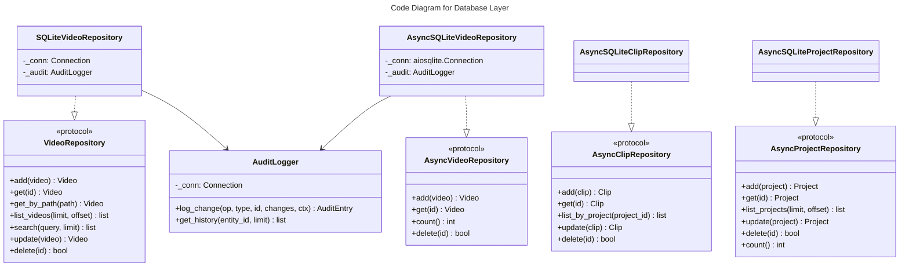

# C4 Code Level: Database Layer

## Overview
- **Name**: Database Layer
- **Description**: SQLite-based persistence layer with repository pattern for videos, projects, clips, and audit logging
- **Location**: `src/stoat_ferret/db/`
- **Language**: Python
- **Purpose**: Provide data access abstractions (sync and async) for all domain entities with full CRUD, FTS5 search, and audit trail support
- **Parent Component**: [Data Access Layer](./c4-component-data-access.md)

## Code Elements

### Functions/Methods

#### schema.py

- `create_tables(conn: sqlite3.Connection) -> None`
  - Description: Create all database tables (videos, projects, clips, audit_log), indexes, FTS5 virtual table, and triggers. Uses IF NOT EXISTS so is idempotent.
  - Location: `src/stoat_ferret/db/schema.py:122`
  - Dependencies: `sqlite3`

- `async create_tables_async(db: aiosqlite.Connection) -> None`
  - Description: Async version of create_tables(). Called from application lifespan to ensure schema exists on startup.
  - Location: `src/stoat_ferret/db/schema.py:148`
  - Dependencies: `aiosqlite`

#### repository.py

- `_any_token_startswith(text: str, prefix: str) -> bool`
  - Description: Check if any token in text starts with a given prefix (tokenized by non-alphanumeric chars). Used by in-memory search to approximate FTS5 behavior.
  - Location: `src/stoat_ferret/db/repository.py:294`
  - Dependencies: `re`

#### schema.py (Constants)

- `TABLE_VIDEOS`, `TABLE_VIDEOS_FTS`, `TABLE_AUDIT_LOG`, `TABLE_PROJECTS`, `TABLE_CLIPS` -- Table name constants
- `VIDEOS_TABLE`, `VIDEOS_PATH_INDEX`, `VIDEOS_FTS` -- Videos DDL with FTS5
- `VIDEOS_FTS_INSERT_TRIGGER`, `VIDEOS_FTS_DELETE_TRIGGER`, `VIDEOS_FTS_UPDATE_TRIGGER` -- FTS sync triggers
- `AUDIT_LOG_TABLE`, `AUDIT_LOG_INDEX` -- Audit log DDL
- `PROJECTS_TABLE`, `CLIPS_TABLE`, `CLIPS_PROJECT_INDEX`, `CLIPS_TIMELINE_INDEX` -- Projects/clips DDL

### Classes/Modules

#### models.py

- `ClipValidationError(Exception)`
  - Description: Exception wrapping Rust clip validation errors with field, message, actual, expected
  - Location: `src/stoat_ferret/db/models.py:14`
  - Methods:
    - `__init__(field: str, message: str, actual: str | None, expected: str | None) -> None`
    - `from_rust(err: RustClipValidationError) -> ClipValidationError` (classmethod)
  - Dependencies: `stoat_ferret_core.ClipValidationError` (Rust, TYPE_CHECKING only)

- `Clip` (dataclass)
  - Description: Video clip within a project -- segment of a source video placed on a timeline
  - Location: `src/stoat_ferret/db/models.py:59`
  - Fields: id, project_id, source_video_id, in_point (frames), out_point (frames), timeline_position (frames), created_at, updated_at, effects (list[dict] | None)
  - Methods:
    - `new_id() -> str` (static) -- Generate UUID
    - `validate(source_path: str, source_duration_frames: int | None) -> None` -- Validate via Rust core (Position, Duration, validate_clip)
  - Dependencies: `stoat_ferret_core` (Clip, Position, Duration, validate_clip)

- `Project` (dataclass)
  - Description: Video editing project with output settings and transitions
  - Location: `src/stoat_ferret/db/models.py:110`
  - Fields: id, name, output_width, output_height, output_fps, created_at, updated_at, transitions (list[dict] | None)
  - Methods: `new_id() -> str` (static)

- `AuditEntry` (dataclass)
  - Description: Audit log entry tracking data modifications
  - Location: `src/stoat_ferret/db/models.py:132`
  - Fields: id, timestamp, operation (INSERT/UPDATE/DELETE), entity_type, entity_id, changes_json, context
  - Methods: `new_id() -> str` (static)

- `Video` (dataclass)
  - Description: Video metadata entity with all file information
  - Location: `src/stoat_ferret/db/models.py:154`
  - Fields: id, path, filename, duration_frames, frame_rate_numerator, frame_rate_denominator, width, height, video_codec, file_size, created_at, updated_at, audio_codec, thumbnail_path
  - Properties: `frame_rate -> float`, `duration_seconds -> float`
  - Methods: `new_id() -> str` (static)

#### repository.py (sync)

- `VideoRepository(Protocol)`
  - Description: Protocol defining sync video CRUD operations
  - Location: `src/stoat_ferret/db/repository.py:16`
  - Methods: add, get, get_by_path, list_videos, search, update, delete

- `SQLiteVideoRepository`
  - Description: Sync SQLite implementation with FTS5 search and optional audit logging with diff computation
  - Location: `src/stoat_ferret/db/repository.py:109`
  - Methods: add, get, get_by_path, list_videos, search (FTS5), update (with _compute_diff), delete, _row_to_video

- `InMemoryVideoRepository`
  - Description: In-memory implementation for testing with token-prefix search
  - Location: `src/stoat_ferret/db/repository.py:312`
  - Methods: add, get, get_by_path, list_videos, search, update, delete

#### async_repository.py

- `AsyncVideoRepository(Protocol)`
  - Description: Protocol defining async video CRUD operations plus count() and delete()
  - Location: `src/stoat_ferret/db/async_repository.py:19`
  - Methods: add, get, get_by_path, list_videos, search, update, count, delete

- `AsyncSQLiteVideoRepository`
  - Description: Async SQLite implementation with FTS5 search and optional audit logging
  - Location: `src/stoat_ferret/db/async_repository.py:120`
  - Methods: add, get, get_by_path, list_videos, search (FTS5), count, update, delete, _row_to_video
  - Dependencies: `aiosqlite`

- `AsyncInMemoryVideoRepository`
  - Description: Async in-memory implementation with deepcopy isolation and seed() for testing
  - Location: `src/stoat_ferret/db/async_repository.py:301`
  - Methods: add, get, get_by_path, list_videos, search, count, update, delete, seed

#### clip_repository.py

- `AsyncClipRepository(Protocol)`
  - Description: Protocol defining async clip CRUD operations
  - Location: `src/stoat_ferret/db/clip_repository.py:15`
  - Methods: add, get, list_by_project, update, delete

- `AsyncSQLiteClipRepository`
  - Description: Async SQLite implementation for clips with JSON effects storage
  - Location: `src/stoat_ferret/db/clip_repository.py:85`
  - Methods: add, get, list_by_project (ordered by timeline_position), update, delete, _row_to_clip

- `AsyncInMemoryClipRepository`
  - Description: Async in-memory clip repository with deepcopy isolation for testing
  - Location: `src/stoat_ferret/db/clip_repository.py:186`
  - Methods: add, get, list_by_project, update, delete, seed

#### project_repository.py

- `AsyncProjectRepository(Protocol)`
  - Description: Protocol defining async project CRUD operations plus count()
  - Location: `src/stoat_ferret/db/project_repository.py:18`
  - Methods: add, get, list_projects, update, delete, count

- `AsyncSQLiteProjectRepository`
  - Description: Async SQLite implementation for projects with JSON transitions storage
  - Location: `src/stoat_ferret/db/project_repository.py:96`
  - Methods: add, get, list_projects, update, delete, count, _row_to_project

- `AsyncInMemoryProjectRepository`
  - Description: Async in-memory project repository with deepcopy isolation for testing
  - Location: `src/stoat_ferret/db/project_repository.py:213`
  - Methods: add, get, list_projects, update, delete, count, seed

#### audit.py

- `AuditLogger`
  - Description: Logger for recording audit trail of data changes to SQLite (sync)
  - Location: `src/stoat_ferret/db/audit.py:12`
  - Methods:
    - `__init__(conn: sqlite3.Connection) -> None`
    - `log_change(operation: str, entity_type: str, entity_id: str, changes: dict | None, context: str | None) -> AuditEntry`
    - `get_history(entity_id: str, limit: int = 100) -> list[AuditEntry]`
    - `_row_to_entry(row: tuple) -> AuditEntry`
  - Dependencies: `sqlite3`, `AuditEntry`, `json`

## Dependencies

### Internal Dependencies
- `stoat_ferret_core` -- Rust Clip, Position, Duration, validate_clip (used in Clip.validate)

### External Dependencies
- `sqlite3` -- Sync database operations
- `aiosqlite` -- Async database operations
- `json` -- Audit change serialization, effects/transitions JSON storage
- `copy` -- Deep copy for in-memory repository isolation
- `re` -- Token splitting for in-memory search

## Relationships

