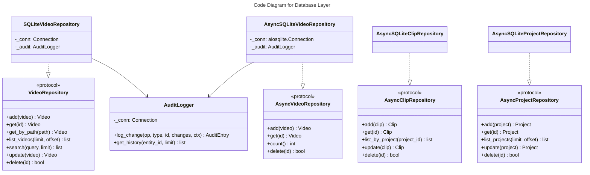

# C4 Code Level: Database Layer

## Overview
- **Name**: Database Layer
- **Description**: SQLite-based persistence layer with repository pattern for videos, projects, clips, and audit logging
- **Location**: `src/stoat_ferret/db/`
- **Language**: Python
- **Purpose**: Provide data access abstractions (sync and async) for all domain entities with full CRUD, FTS5 search, and audit trail support
- **Parent Component**: [Data Access Layer](./c4-component-data-access.md)

## Code Elements

### Functions/Methods

#### schema.py

- `create_tables(conn: sqlite3.Connection) -> None`
  - Description: Create all database tables, indexes, and FTS5 triggers (sync version, uses IF NOT EXISTS so is idempotent)
  - Location: `src/stoat_ferret/db/schema.py:122`
  - Dependencies: `sqlite3`

- `async create_tables_async(db: aiosqlite.Connection) -> None`
  - Description: Create all database tables, indexes, and FTS5 triggers (async version, uses IF NOT EXISTS so is idempotent). Called from application lifespan to ensure schema exists on startup.
  - Location: `src/stoat_ferret/db/schema.py:148`
  - Dependencies: `aiosqlite`

#### repository.py

- `_any_token_startswith(text: str, prefix: str) -> bool`
  - Description: Check if any token in text starts with a given prefix (tokenized by non-alphanumeric chars)
  - Location: `src/stoat_ferret/db/repository.py:294`
  - Dependencies: `re`

### Classes/Modules

#### models.py

- `ClipValidationError(Exception)`
  - Description: Exception wrapping Rust clip validation errors with field, message, actual, expected
  - Location: `src/stoat_ferret/db/models.py:14`
  - Methods:
    - `__init__(field, message, actual, expected) -> None`
    - `from_rust(err) -> ClipValidationError` (classmethod)
  - Dependencies: `stoat_ferret_core.ClipValidationError` (Rust, TYPE_CHECKING only)

- `Clip` (dataclass)
  - Description: Video clip within a project -- segment of a source video placed on a timeline
  - Location: `src/stoat_ferret/db/models.py:60`
  - Fields: id, project_id, source_video_id, in_point, out_point, timeline_position, created_at, updated_at, effects (list[dict] | None)
  - Methods:
    - `new_id() -> str` (static) -- Generate UUID
    - `validate(source_path, source_duration_frames) -> None` -- Validate via Rust core
  - Dependencies: `stoat_ferret_core` (Clip, Position, Duration, validate_clip)

- `Project` (dataclass)
  - Description: Video editing project with output settings
  - Location: `src/stoat_ferret/db/models.py:110`
  - Fields: id, name, output_width, output_height, output_fps, created_at, updated_at, transitions (list[dict] | None)
  - Methods:
    - `new_id() -> str` (static)

- `AuditEntry` (dataclass)
  - Description: Audit log entry tracking data modifications
  - Location: `src/stoat_ferret/db/models.py:132`
  - Fields: id, timestamp, operation, entity_type, entity_id, changes_json, context
  - Methods:
    - `new_id() -> str` (static)

- `Video` (dataclass)
  - Description: Video metadata entity with all file information
  - Location: `src/stoat_ferret/db/models.py:154`
  - Fields: id, path, filename, duration_frames, frame_rate_numerator, frame_rate_denominator, width, height, video_codec, file_size, created_at, updated_at, audio_codec, thumbnail_path
  - Properties:
    - `frame_rate -> float`
    - `duration_seconds -> float`
  - Methods:
    - `new_id() -> str` (static)

#### repository.py (sync)

- `VideoRepository(Protocol)`
  - Description: Protocol defining sync video CRUD operations
  - Location: `src/stoat_ferret/db/repository.py:16`
  - Methods: add, get, get_by_path, list_videos, search, update, delete

- `SQLiteVideoRepository`
  - Description: Sync SQLite implementation with optional audit logging
  - Location: `src/stoat_ferret/db/repository.py:109`
  - Methods: add, get, get_by_path, list_videos, search (FTS5), update, delete, _compute_diff, _row_to_video

- `InMemoryVideoRepository`
  - Description: In-memory implementation for testing
  - Location: `src/stoat_ferret/db/repository.py:312`
  - Methods: add, get, get_by_path, list_videos, search (token prefix matching), update, delete

#### async_repository.py

- `AsyncVideoRepository(Protocol)`
  - Description: Protocol defining async video CRUD operations plus count()
  - Location: `src/stoat_ferret/db/async_repository.py:19`
  - Methods: add, get, get_by_path, list_videos, search, update, count, delete

- `AsyncSQLiteVideoRepository`
  - Description: Async SQLite implementation for use with FastAPI
  - Location: `src/stoat_ferret/db/async_repository.py:120`
  - Methods: add, get, get_by_path, list_videos, search (FTS5), count, update, delete, _row_to_video
  - Dependencies: `aiosqlite`

- `AsyncInMemoryVideoRepository`
  - Description: Async in-memory implementation with deepcopy isolation for testing
  - Location: `src/stoat_ferret/db/async_repository.py:301`
  - Methods: add, get, get_by_path, list_videos, search, count, update, delete, seed

#### clip_repository.py

- `AsyncClipRepository(Protocol)`
  - Description: Protocol defining async clip CRUD operations
  - Location: `src/stoat_ferret/db/clip_repository.py:14`
  - Methods: add, get, list_by_project, update, delete

- `AsyncSQLiteClipRepository`
  - Description: Async SQLite implementation for clips
  - Location: `src/stoat_ferret/db/clip_repository.py:84`
  - Methods: add, get, list_by_project (ordered by timeline_position), update, delete, _row_to_clip
  - Dependencies: `aiosqlite`

- `AsyncInMemoryClipRepository`
  - Description: Async in-memory clip repository for testing
  - Location: `src/stoat_ferret/db/clip_repository.py:177`
  - Methods: add, get, list_by_project, update, delete, seed

#### project_repository.py

- `AsyncProjectRepository(Protocol)`
  - Description: Protocol defining async project CRUD operations
  - Location: `src/stoat_ferret/db/project_repository.py:17`
  - Methods: add, get, list_projects, update, delete

- `AsyncSQLiteProjectRepository`
  - Description: Async SQLite implementation for projects
  - Location: `src/stoat_ferret/db/project_repository.py:87`
  - Methods: add, get, list_projects, update, delete, _row_to_project
  - Dependencies: `aiosqlite`

- `AsyncInMemoryProjectRepository`
  - Description: Async in-memory project repository for testing
  - Location: `src/stoat_ferret/db/project_repository.py:185`
  - Methods: add, get, list_projects, update, delete, seed

#### audit.py

- `AuditLogger`
  - Description: Logger for recording audit trail of data changes to SQLite
  - Location: `src/stoat_ferret/db/audit.py:12`
  - Methods:
    - `__init__(conn: sqlite3.Connection) -> None`
    - `log_change(operation, entity_type, entity_id, changes, context) -> AuditEntry`
    - `get_history(entity_id, limit) -> list[AuditEntry]`
    - `_row_to_entry(row) -> AuditEntry`
  - Dependencies: `sqlite3`, `AuditEntry`

## Dependencies

### Internal Dependencies
- `stoat_ferret_core` -- Rust Clip, Position, Duration, validate_clip (used in Clip.validate)

### External Dependencies
- `sqlite3` -- Sync database operations
- `aiosqlite` -- Async database operations
- `json` -- Audit change serialization, effects/transitions JSON storage
- `copy` -- Deep copy for in-memory repository isolation
- `re` -- Token splitting for in-memory search

## Relationships

