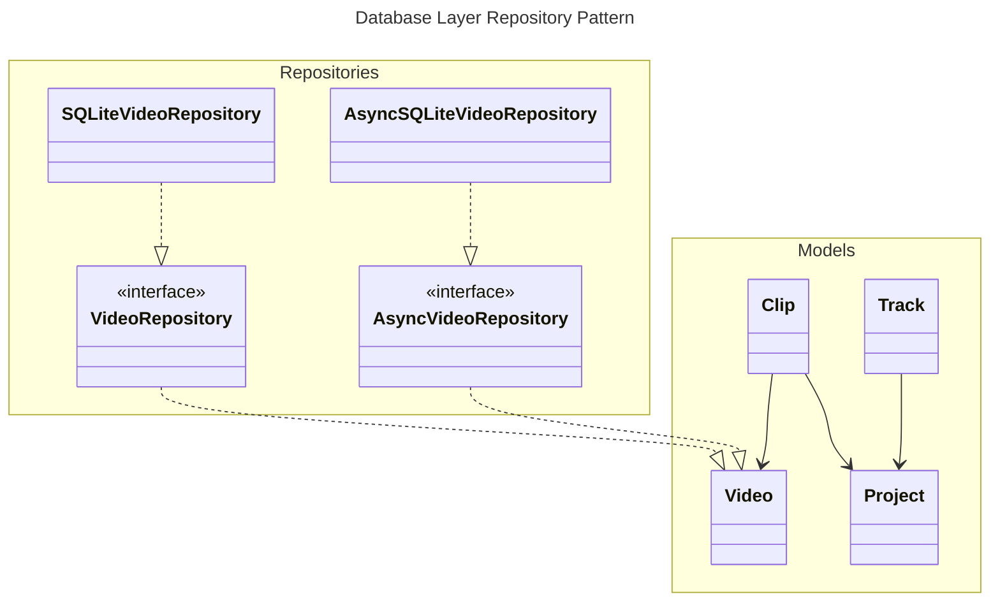

# C4 Code Level: Database Access Layer

## Overview

- **Name**: Database Access Layer (db)
- **Description**: SQLite-based persistence layer for video projects, clips, and timeline metadata with repository pattern abstractions for both sync and async operations.
- **Location**: src/stoat_ferret/db
- **Language**: Python
- **Purpose**: Provides data models, schema management, and repository implementations for CRUD operations on video editing projects, videos, clips, tracks, and audit logging.
- **Parent Component**: [Data Access Layer](./c4-component-data-access.md)

## Code Elements

### Models (models.py)

**Enumerations:** PreviewStatus, PreviewQuality, ThumbnailStripStatus, WaveformStatus, WaveformFormat, ProxyStatus, ProxyQuality

**Dataclasses:**
- `PreviewSession`: preview session metadata with new_id()
- `ThumbnailStrip`: sprite sheet metadata with new_id()
- `Waveform`: audio waveform metadata with new_id()
- `ProxyFile`: proxy video metadata with new_id()
- `Track`: timeline track with new_id()
- `Clip`: video clip on timeline with validate() and new_id()
- `Project`: editing project with new_id()
- `AuditEntry`: audit log entry with new_id()
- `Video`: video metadata with frame_rate, duration_seconds properties and new_id()

**Exceptions:**
- `ClipValidationError`: wraps Rust validation errors, includes from_rust()

**Functions:**
- `validate_preview_transition(current: str, new: str) -> None`

### Schema (schema.py)

**Functions:**
- `create_tables(conn: sqlite3.Connection) -> None`
- `create_tables_async(db: aiosqlite.Connection) -> None`
- `_alter_clips_add_timeline_columns(conn) -> None`
- `_alter_clips_add_timeline_columns_async(db) -> None`
- `_alter_projects_add_audio_mix_column(conn) -> None`
- `_alter_projects_add_audio_mix_column_async(db) -> None`

### Video Repositories (repository.py, async_repository.py)

**Sync Protocol:** `VideoRepository` - add, get, get_by_path, list_videos, search, update, delete

**Sync Implementations:**
- `SQLiteVideoRepository`: __init__(conn, audit_logger=None)
- `InMemoryVideoRepository`: __init__()

**Async Protocol:** `AsyncVideoRepository` - all sync methods plus async count()

**Async Implementations:**
- `AsyncSQLiteVideoRepository`: __init__(conn, audit_logger=None)
- `AsyncInMemoryVideoRepository`: __init__(), seed()

### Clip Repository (clip_repository.py)

**Protocol:** `AsyncClipRepository` - add, get, list_by_project, update, delete

**Implementations:**
- `AsyncSQLiteClipRepository`
- `AsyncInMemoryClipRepository` with seed()

### Project Repository (project_repository.py)

**Protocol:** `AsyncProjectRepository` - add, get, list_projects, update, delete, count

**Implementations:**
- `AsyncSQLiteProjectRepository`
- `AsyncInMemoryProjectRepository` with seed()

### Timeline Repository (timeline_repository.py)

**Protocol:** `AsyncTimelineRepository` - create_track, get_track, get_tracks_by_project, update_track, delete_track, get_clips_by_track, count_tracks, count_clips

**Implementations:**
- `AsyncSQLiteTimelineRepository`
- `AsyncInMemoryTimelineRepository` with seed(tracks, clips)

### Batch Job Repository (batch_repository.py)

**Classes:**
- `BatchJobRecord`: dataclass with id, batch_id, job_id, project_id, output_path, quality, status, progress, error, timestamps
- `AsyncBatchRepository`: Protocol - create_batch_job, get_by_batch_id, get_by_job_id, update_status, update_progress
- `AsyncSQLiteBatchRepository`: SQLite implementation
- `InMemoryBatchRepository`: in-memory with _next_id counter

**Functions:**
- `_validate_status_transition(current: str, new: str) -> None`

### Proxy Repository (proxy_repository.py)

**Protocol:** `AsyncProxyRepository` - add, get, get_by_video_and_quality, list_by_video, update_status, delete, count, total_size_bytes

### Audit Logging (audit.py)

**Classes:**
- `AuditLogger`: __init__(conn)
  - log_change(operation, entity_type, entity_id, changes=None, context=None) -> AuditEntry
  - get_history(entity_id, limit=100) -> list[AuditEntry]

## Dependencies

### Internal
- stoat_ferret_core: Rust types (Clip, Duration, Position, ClipValidationError)
- structlog: Structured logging

### External
- sqlite3, aiosqlite: Database interfaces
- json: JSON serialization
- uuid, datetime: ID and timestamp generation
- copy, re: Utilities

## Relationships

```mermaid
---
title: Database Layer Repository Pattern
---
classDiagram
    namespace Models {
        class Video
        class Clip
        class Project
        class Track
    }
    namespace Repositories {
        class VideoRepository {
            <<interface>>
        }
        class AsyncVideoRepository {
            <<interface>>
        }
        class SQLiteVideoRepository
        class AsyncSQLiteVideoRepository
    }
    VideoRepository ..|> Video
    AsyncVideoRepository ..|> Video
    SQLiteVideoRepository ..|> VideoRepository
    AsyncSQLiteVideoRepository ..|> AsyncVideoRepository
    Clip --> Video
    Clip --> Project
    Track --> Project
```
