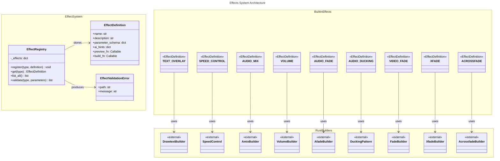

# C4 Code Level: Effects System

## Overview

- **Name**: Effects System (effects)
- **Description**: Effect discovery, registration, and parameter validation for video and audio processing filters with AI-friendly hints and preview generation.
- **Location**: src/stoat_ferret/effects
- **Language**: Python
- **Purpose**: Provides effect definitions, registry for managing available effects, parameter validation via JSON Schema, and FFmpeg filter builders abstraction.
- **Parent Component**: [Effects Engine](./c4-component-effects-engine.md)

## Code Elements

### Effect Definitions (definitions.py)

**Dataclass:**
- `EffectDefinition`: frozen dataclass with name, description, parameter_schema (dict), ai_hints (dict), preview_fn (Callable[[], str]), build_fn (Callable[[dict], str])

**Built-in Effect Definitions:**
- `TEXT_OVERLAY`: text overlays with font size, color, position, margin, font parameters
- `SPEED_CONTROL`: video/audio speed adjustment with factor (0.25-4.0) and drop_audio option
- `AUDIO_MIX`: mix multiple audio streams with inputs (2-32), duration_mode, weights, normalize
- `VOLUME`: adjust audio volume (0.0-10.0) with precision modes (fixed, float, double)
- `AUDIO_FADE`: fade in/out audio with type, duration, start_time, curve
- `AUDIO_DUCKING`: sidechain compression with threshold, ratio, attack, release parameters
- `VIDEO_FADE`: fade in/out video with type, duration, start_time, color, alpha
- `XFADE`: crossfade video with transition type, duration, offset
- `ACROSSFADE`: crossfade audio with duration, curve1, curve2, overlap

**Builder Functions:**
- `_text_overlay_preview() -> str`: default text overlay filter
- `_build_text_overlay(parameters: dict) -> str`: build drawtext filter
- `_speed_control_preview() -> str`: default speed control filter
- `_build_speed_control(parameters: dict) -> str`: build setpts/atempo filters
- `_build_audio_mix(parameters: dict) -> str`: build amix filter
- `_audio_mix_preview() -> str`: default amix filter
- `_build_volume(parameters: dict) -> str`: build volume filter (linear or dB)
- `_volume_preview() -> str`: default volume filter
- `_build_audio_fade(parameters: dict) -> str`: build afade filter
- `_audio_fade_preview() -> str`: default afade filter
- `_build_audio_ducking(parameters: dict) -> str`: build sidechaincompress filter
- `_audio_ducking_preview() -> str`: default ducking filter
- `_build_video_fade(parameters: dict) -> str`: build fade filter
- `_video_fade_preview() -> str`: default video fade filter
- `_build_xfade(parameters: dict) -> str`: build xfade filter
- `_xfade_preview() -> str`: default xfade filter
- `_build_acrossfade(parameters: dict) -> str`: build acrossfade filter
- `_acrossfade_preview() -> str`: default acrossfade filter

**Functions:**
- `create_default_registry() -> EffectRegistry`: create and populate registry with all built-in effects

### Effect Registry (registry.py)

**Classes:**

- `EffectValidationError`: structured validation error with path (str) and message (str)
  - `__repr__() -> str`

- `EffectRegistry`: registry for available effects with parameter schemas and AI hints
  - `__init__() -> None`: initialize with empty registry
  - `register(effect_type: str, definition: EffectDefinition) -> None`: register an effect
  - `get(effect_type: str) -> EffectDefinition | None`: get effect by type
  - `list_all() -> list[tuple[str, EffectDefinition]]`: list all registered effects
  - `validate(effect_type: str, parameters: dict) -> list[EffectValidationError]`: validate parameters against JSON Schema

**Functions:**
- None at module level (class-based API)

## Dependencies

### Internal
- stoat_ferret_core: Rust effect builders
  - AcrossfadeBuilder, AfadeBuilder, AmixBuilder, DrawtextBuilder, DuckingPattern
  - FadeBuilder, SpeedControl, TransitionType, VolumeBuilder, XfadeBuilder

### External
- jsonschema: JSON Schema validation (Draft7Validator)
- structlog: Structured logging
- dataclasses: dataclass decorator
- typing: TYPE_CHECKING imports

## Relationships

