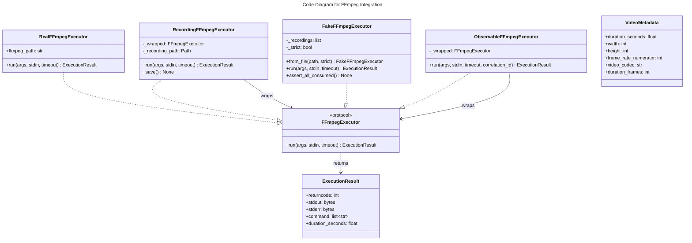

# C4 Code Level: FFmpeg Integration

## Overview
- **Name**: FFmpeg Integration
- **Description**: FFmpeg process execution, video probing, metrics collection, and Rust command integration
- **Location**: `src/stoat_ferret/ffmpeg/`
- **Language**: Python
- **Purpose**: Provide a testable abstraction layer for FFmpeg operations including execution, recording/replay for tests, metrics, and integration with Rust-built FFmpegCommand objects

## Code Elements

### Functions/Methods

#### probe.py

- `ffprobe_video(path: str, ffprobe_path: str = "ffprobe") -> VideoMetadata`
  - Description: Run ffprobe on a video file and return structured metadata (dimensions, duration, codecs, frame rate)
  - Location: `src/stoat_ferret/ffmpeg/probe.py:45`
  - Dependencies: `subprocess`, `json`, `pathlib`

- `_parse_ffprobe_output(data: dict[str, Any], file_path: Path) -> VideoMetadata`
  - Description: Parse ffprobe JSON output into VideoMetadata, extracting video and audio streams
  - Location: `src/stoat_ferret/ffmpeg/probe.py:97`
  - Dependencies: None (pure function)

#### integration.py

- `execute_command(executor: FFmpegExecutor, command: FFmpegCommand, *, timeout: float | None) -> ExecutionResult`
  - Description: Bridge Rust FFmpegCommand builder with Python executor - builds args, handles errors, executes
  - Location: `src/stoat_ferret/ffmpeg/integration.py:43`
  - Dependencies: `FFmpegExecutor`, `FFmpegCommand` (Rust), `ExecutionResult`

### Classes/Modules

#### probe.py

- `FFprobeError(Exception)`
  - Description: Error running ffprobe (not installed, timeout, parse failure)
  - Location: `src/stoat_ferret/ffmpeg/probe.py:12`

- `VideoMetadata` (dataclass)
  - Description: Video metadata extracted from ffprobe output
  - Location: `src/stoat_ferret/ffmpeg/probe.py:17`
  - Fields: duration_seconds, width, height, frame_rate_numerator, frame_rate_denominator, video_codec, audio_codec, file_size
  - Properties:
    - `frame_rate -> tuple[int, int]`
    - `duration_frames -> int`

#### executor.py

- `ExecutionResult` (dataclass)
  - Description: Result of an FFmpeg execution with returncode, stdout, stderr, command, duration
  - Location: `src/stoat_ferret/ffmpeg/executor.py:19`
  - Fields: returncode (int), stdout (bytes), stderr (bytes), command (list[str]), duration_seconds (float)

- `FFmpegExecutor(Protocol)`
  - Description: Protocol for FFmpeg command execution
  - Location: `src/stoat_ferret/ffmpeg/executor.py:38`
  - Methods:
    - `run(args: list[str], *, stdin: bytes | None, timeout: float | None) -> ExecutionResult`

- `RealFFmpegExecutor`
  - Description: Production executor that runs FFmpeg via subprocess
  - Location: `src/stoat_ferret/ffmpeg/executor.py:61`
  - Methods:
    - `__init__(ffmpeg_path: str = "ffmpeg") -> None`
    - `run(args, *, stdin, timeout) -> ExecutionResult`
  - Dependencies: `subprocess`, `time`

- `RecordingFFmpegExecutor`
  - Description: Wraps an executor and records all interactions to JSON for test replay
  - Location: `src/stoat_ferret/ffmpeg/executor.py:114`
  - Methods:
    - `__init__(wrapped: FFmpegExecutor, recording_path: Path) -> None`
    - `run(args, *, stdin, timeout) -> ExecutionResult`
    - `save() -> None` - Save recordings to file
  - Dependencies: `json`, `pathlib`

- `FakeFFmpegExecutor`
  - Description: Replays recorded FFmpeg interactions without subprocess execution
  - Location: `src/stoat_ferret/ffmpeg/executor.py:171`
  - Methods:
    - `__init__(recordings: list[dict], *, strict: bool = False) -> None`
    - `from_file(path: Path, *, strict: bool = False) -> FakeFFmpegExecutor` (classmethod)
    - `run(args, *, stdin, timeout) -> ExecutionResult`
    - `assert_all_consumed() -> None`
  - Dependencies: `json`, `pathlib`

#### observable.py

- `ObservableFFmpegExecutor`
  - Description: Decorator executor that adds structured logging and Prometheus metrics to any FFmpegExecutor
  - Location: `src/stoat_ferret/ffmpeg/observable.py:23`
  - Methods:
    - `__init__(wrapped: FFmpegExecutor) -> None`
    - `run(args, *, stdin, timeout, correlation_id) -> ExecutionResult`
  - Dependencies: `structlog`, Prometheus metrics, `FFmpegExecutor`

#### integration.py

- `CommandExecutionError(Exception)`
  - Description: Error executing FFmpeg command, with command args and cause exception
  - Location: `src/stoat_ferret/ffmpeg/integration.py:17`
  - Attributes: command (list[str] | None), cause (Exception | None)

#### metrics.py

- Module-level Prometheus metrics:
  - `ffmpeg_executions_total: Counter` - Total FFmpeg executions by status (success/failure)
    - Location: `src/stoat_ferret/ffmpeg/metrics.py:11`
  - `ffmpeg_execution_duration_seconds: Histogram` - Execution duration with custom buckets
    - Location: `src/stoat_ferret/ffmpeg/metrics.py:17`
  - `ffmpeg_active_processes: Gauge` - Currently running FFmpeg processes
    - Location: `src/stoat_ferret/ffmpeg/metrics.py:23`

## Dependencies

### Internal Dependencies
- `stoat_ferret_core` - FFmpegCommand, CommandError (Rust types for command building)

### External Dependencies
- `subprocess` - Process execution
- `prometheus_client` - Counter, Histogram, Gauge
- `structlog` - Structured logging
- `json` - Recording serialization
- `pathlib` - Path handling

## Relationships

