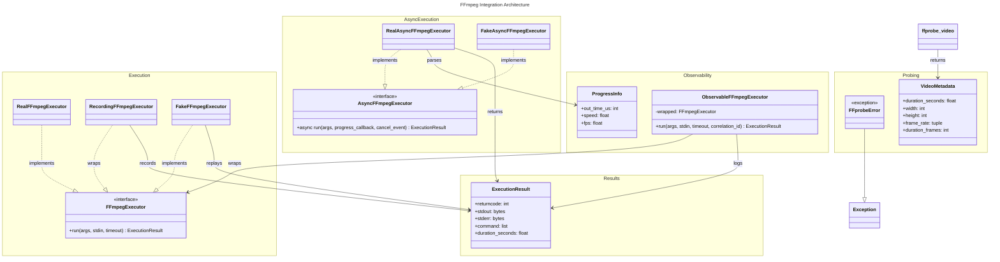

# C4 Code Level: FFmpeg Integration

## Overview

- **Name**: FFmpeg Integration (ffmpeg)
- **Description**: FFmpeg process execution abstractions with video probing, progress parsing, recording/replay for tests, metrics collection, and observable logging wrapper.
- **Location**: src/stoat_ferret/ffmpeg
- **Language**: Python
- **Purpose**: Provides a testable abstraction layer for FFmpeg operations including execution, metrics, and integration with video metadata extraction.
- **Parent Component**: [Application Services](./c4-component-application-services.md)

## Code Elements

### Video Probing (probe.py)

**Classes:**

- `FFprobeError(Exception)`: error running ffprobe (not found, timeout, parse failure)

- `VideoMetadata` (dataclass): video metadata extracted from ffprobe
  - Fields: duration_seconds (float), width (int), height (int), frame_rate_numerator (int), frame_rate_denominator (int), video_codec (str), audio_codec (str | None), file_size (int)
  - Properties: `frame_rate: tuple[int, int]`, `duration_frames: int`

**Functions:**

- `async ffprobe_video(path: str, ffprobe_path: str = "ffprobe") -> VideoMetadata`: run ffprobe with 30s timeout, returns metadata
- `_parse_ffprobe_output(data: dict, file_path: Path) -> VideoMetadata`: parse ffprobe JSON output into VideoMetadata

### Synchronous Execution (executor.py)

**Classes:**

- `ExecutionResult` (dataclass): result of FFmpeg execution
  - Fields: returncode (int), stdout (bytes), stderr (bytes), command (list[str]), duration_seconds (float)

- `FFmpegExecutor` (Protocol): protocol for FFmpeg command execution
  - `run(args: list[str], stdin: bytes | None = None, timeout: float | None = None) -> ExecutionResult`

- `RealFFmpegExecutor`: executes FFmpeg via subprocess
  - `__init__(ffmpeg_path: str = "ffmpeg") -> None`
  - `run(args, stdin=None, timeout=None) -> ExecutionResult`

- `RecordingFFmpegExecutor`: wraps executor and records all interactions to JSON
  - `__init__(wrapped: FFmpegExecutor, recording_path: Path) -> None`
  - `run(args, stdin=None, timeout=None) -> ExecutionResult`
  - `save() -> None`: write recordings to file

- `FakeFFmpegExecutor`: replays recorded interactions for testing
  - `__init__(recordings: list[dict], strict: bool = False) -> None`
  - `@classmethod from_file(path: Path, strict: bool = False) -> FakeFFmpegExecutor`
  - `run(args, stdin=None, timeout=None) -> ExecutionResult`
  - `assert_all_consumed() -> None`: verify all recordings used

### Asynchronous Execution (async_executor.py)

**Classes:**

- `ProgressInfo` (dataclass): parsed progress from FFmpeg -progress output
  - Fields: out_time_us (int), speed (float), fps (float)

- `AsyncFFmpegExecutor` (Protocol): protocol for async FFmpeg execution
  - `async run(args: list[str], progress_callback: ProgressCallback | None = None, cancel_event: asyncio.Event | None = None) -> ExecutionResult`

- `RealAsyncFFmpegExecutor`: async subprocess execution with progress parsing
  - `__init__(ffmpeg_path: str = "ffmpeg") -> None`
  - `async run(args, progress_callback=None, cancel_event=None) -> ExecutionResult`: executes with stderr parsing, supports cancellation

- `FakeAsyncFFmpegExecutor` (dataclass): deterministic test double
  - Fields: returncode (int), stderr_lines (list[str]), stdout (bytes), calls (list[list[str]])
  - `async run(args, progress_callback=None, cancel_event=None) -> ExecutionResult`: simulates execution with configurable stderr

**Functions:**

- `parse_progress_line(line: str, info: ProgressInfo) -> ProgressInfo`: parse single FFmpeg progress line (key=value), updates info in-place and returns it

**Type Alias:**

- `ProgressCallback = Callable[[ProgressInfo], Awaitable[None]]`

### Observable Logging (observable.py)

**Classes:**

- `ObservableFFmpegExecutor`: wraps any FFmpegExecutor with logging and Prometheus metrics
  - `__init__(wrapped: FFmpegExecutor) -> None`
  - `run(args: list[str], stdin: bytes | None = None, timeout: float | None = None, correlation_id: str | None = None) -> ExecutionResult`: executes with structured logging, increments counters/gauges, observes duration

### Metrics (metrics.py)

**Prometheus Metrics:**

- `ffmpeg_executions_total` (Counter): total executions by status [success, failure]
- `ffmpeg_execution_duration_seconds` (Histogram): execution duration with buckets [0.1, 0.5, 1.0, 2.0, 5.0, 10.0, 30.0, 60.0, 120.0, 300.0]
- `ffmpeg_active_processes` (Gauge): number of currently running FFmpeg processes

## Dependencies

### Internal
- None (no internal cross-module imports at code level)

### External
- asyncio: Async subprocess and event management
- subprocess: Synchronous subprocess execution
- time: Duration measurement
- json: Recording serialization
- pathlib: Path handling
- structlog: Structured logging
- prometheus_client: Metrics (Counter, Gauge, Histogram)
- uuid: Correlation ID generation
- contextlib: suppress() for error handling

## Relationships

```mermaid
---
title: FFmpeg Integration Architecture
---
classDiagram
    namespace Execution {
        class FFmpegExecutor {
            <<interface>>
            +run(args, stdin, timeout) ExecutionResult
        }
        class RealFFmpegExecutor
        class RecordingFFmpegExecutor
        class FakeFFmpegExecutor
    }

    namespace AsyncExecution {
        class AsyncFFmpegExecutor {
            <<interface>>
            +async run(args, progress_callback, cancel_event) ExecutionResult
        }
        class RealAsyncFFmpegExecutor
        class FakeAsyncFFmpegExecutor
    }

    namespace Probing {
        class FFprobeError {
            <<exception>>
        }
        class VideoMetadata {
            +duration_seconds: float
            +width: int
            +height: int
            +frame_rate: tuple
            +duration_frames: int
        }
    }

    namespace Observability {
        class ProgressInfo {
            +out_time_us: int
            +speed: float
            +fps: float
        }
        class ObservableFFmpegExecutor {
            -wrapped: FFmpegExecutor
            +run(args, stdin, timeout, correlation_id) ExecutionResult
        }
    }

    namespace Results {
        class ExecutionResult {
            +returncode: int
            +stdout: bytes
            +stderr: bytes
            +command: list
            +duration_seconds: float
        }
    }

    RealFFmpegExecutor ..|> FFmpegExecutor : implements
    RecordingFFmpegExecutor ..|> FFmpegExecutor : wraps
    FakeFFmpegExecutor ..|> FFmpegExecutor : implements
    RealAsyncFFmpegExecutor ..|> AsyncFFmpegExecutor : implements
    FakeAsyncFFmpegExecutor ..|> AsyncFFmpegExecutor : implements
    RecordingFFmpegExecutor --> ExecutionResult : records
    FakeFFmpegExecutor --> ExecutionResult : replays
    RealAsyncFFmpegExecutor --> ProgressInfo : parses
    RealAsyncFFmpegExecutor --> ExecutionResult : returns
    ObservableFFmpegExecutor --> FFmpegExecutor : wraps
    ObservableFFmpegExecutor --> ExecutionResult : logs
    ffprobe_video --> VideoMetadata : returns
    FFprobeError --|> Exception
```
