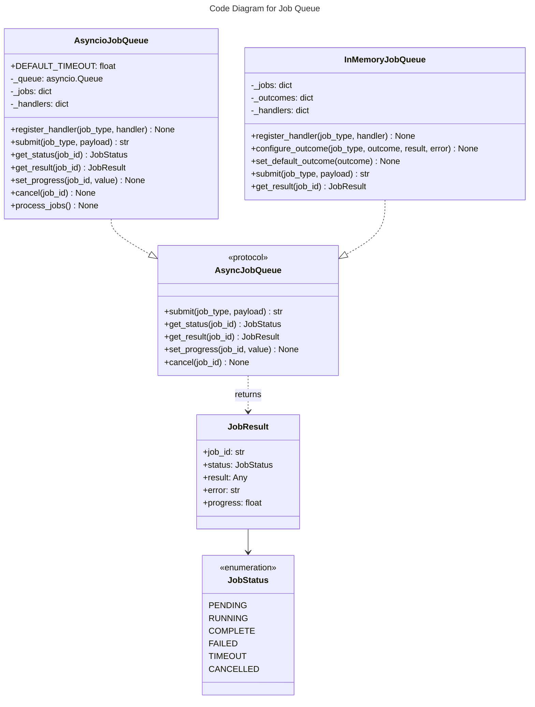

# C4 Code Level: Job Queue

## Overview
- **Name**: Job Queue
- **Description**: Async job queue protocol and implementations for background task processing
- **Location**: `src/stoat_ferret/jobs/`
- **Language**: Python
- **Purpose**: Provide async job submission, status tracking, cancellation, and background processing with asyncio for long-running operations like video scanning
- **Parent Component**: TBD

## Code Elements

### Classes/Modules

#### queue.py

- `JobStatus(Enum)`
  - Description: Enumeration of job states
  - Location: `src/stoat_ferret/jobs/queue.py:17`
  - Values: PENDING, RUNNING, COMPLETE, FAILED, TIMEOUT, CANCELLED

- `JobOutcome(Enum)`
  - Description: Configurable test outcome for InMemoryJobQueue
  - Location: `src/stoat_ferret/jobs/queue.py:28`
  - Values: SUCCESS, FAILURE, TIMEOUT

- `JobResult` (dataclass)
  - Description: Result of a completed job with status, return value, error, and progress
  - Location: `src/stoat_ferret/jobs/queue.py:36`
  - Fields: job_id (str), status (JobStatus), result (Any), error (str | None), progress (float | None)

- `AsyncJobQueue(Protocol)`
  - Description: Protocol for async job queue operations
  - Location: `src/stoat_ferret/jobs/queue.py:55`
  - Methods:
    - `async submit(job_type: str, payload: dict[str, Any]) -> str`
    - `async get_status(job_id: str) -> JobStatus`
    - `async get_result(job_id: str) -> JobResult`
    - `set_progress(job_id: str, value: float) -> None`
    - `cancel(job_id: str) -> None`

- `InMemoryJobQueue`
  - Description: In-memory job queue with synchronous deterministic execution for testing. Supports configurable outcomes per job type and handler registration.
  - Location: `src/stoat_ferret/jobs/queue.py:134`
  - Methods:
    - `register_handler(job_type: str, handler: JobHandler) -> None`
    - `configure_outcome(job_type: str, outcome: JobOutcome, result: Any, error: str | None) -> None`
    - `set_default_outcome(outcome: JobOutcome) -> None`
    - `set_progress(job_id: str, value: float) -> None` -- No-op
    - `cancel(job_id: str) -> None` -- No-op
    - `async submit(job_type: str, payload: dict[str, Any]) -> str` -- Execute synchronously
    - `async get_status(job_id: str) -> JobStatus`
    - `async get_result(job_id: str) -> JobResult`

- `AsyncioJobQueue`
  - Description: Production async job queue using asyncio.Queue with background worker coroutine. Dispatches to registered handlers with per-job timeout and cooperative cancellation support.
  - Location: `src/stoat_ferret/jobs/queue.py:316`
  - Attributes: `DEFAULT_TIMEOUT: float = 300.0`
  - Methods:
    - `__init__(*, timeout: float | None = None) -> None`
    - `register_handler(job_type: str, handler: JobHandler) -> None`
    - `set_progress(job_id: str, value: float) -> None`
    - `cancel(job_id: str) -> None` -- Sets cancel event for cooperative cancellation
    - `async submit(job_type: str, payload: dict[str, Any]) -> str`
    - `async get_status(job_id: str) -> JobStatus`
    - `async get_result(job_id: str) -> JobResult`
    - `async process_jobs() -> None` -- Background worker loop with timeout, cancellation, and error handling

### Type Aliases

- `JobHandler = Callable[[str, dict[str, Any]], Awaitable[Any]]`
  - Description: Type alias for job handler functions
  - Location: `src/stoat_ferret/jobs/queue.py:299`

### Internal Data Classes

- `_JobEntry` (dataclass) -- Internal storage for InMemoryJobQueue jobs
- `_AsyncJobEntry` (dataclass) -- Internal storage for AsyncioJobQueue jobs, includes cancel_event

## Dependencies

### Internal Dependencies
- None (leaf module)

### External Dependencies
- `asyncio` -- Queue, wait_for, CancelledError, Event
- `structlog` -- Structured logging
- `uuid` -- Job ID generation
- `enum` -- Enumerations

## Relationships

