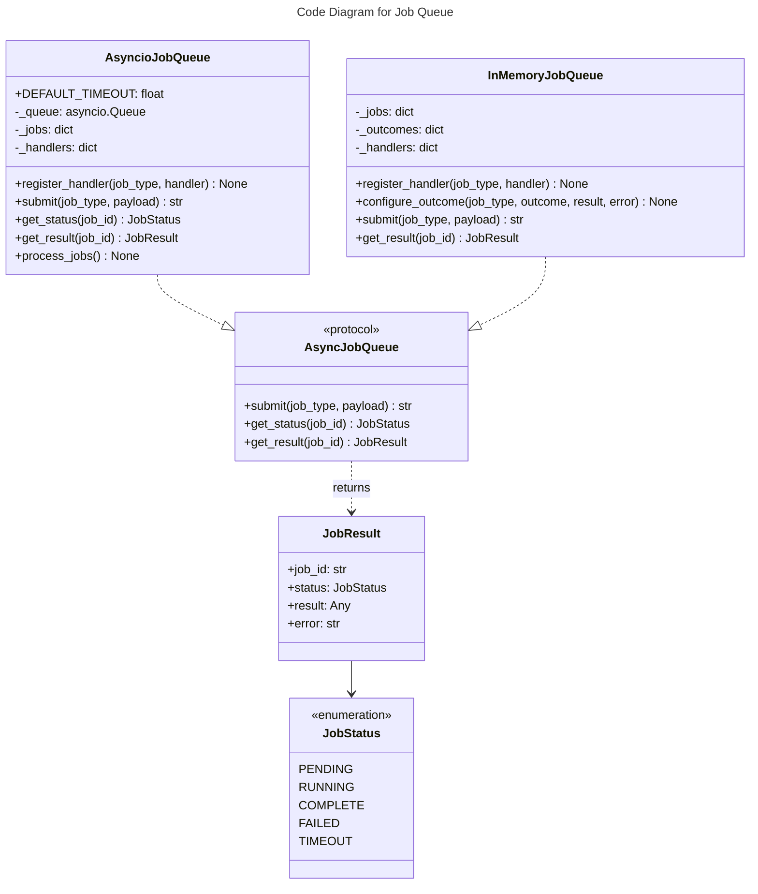

# C4 Code Level: Job Queue

## Overview
- **Name**: Job Queue
- **Description**: Async job queue protocol and implementations for background task processing
- **Location**: `src/stoat_ferret/jobs/`
- **Language**: Python
- **Purpose**: Provide async job submission, status tracking, and background processing with asyncio for long-running operations like video scanning

## Code Elements

### Classes/Modules

#### queue.py

- `JobStatus(Enum)`
  - Description: Enumeration of job states
  - Location: `src/stoat_ferret/jobs/queue.py:17`
  - Values: PENDING, RUNNING, COMPLETE, FAILED, TIMEOUT

- `JobOutcome(Enum)`
  - Description: Configurable test outcome for InMemoryJobQueue
  - Location: `src/stoat_ferret/jobs/queue.py:27`
  - Values: SUCCESS, FAILURE, TIMEOUT

- `JobResult` (dataclass)
  - Description: Result of a completed job with status, return value, and error
  - Location: `src/stoat_ferret/jobs/queue.py:35`
  - Fields: job_id (str), status (JobStatus), result (Any), error (str | None)

- `AsyncJobQueue(Protocol)`
  - Description: Protocol for async job queue operations
  - Location: `src/stoat_ferret/jobs/queue.py:52`
  - Methods:
    - `async submit(job_type: str, payload: dict[str, Any]) -> str`
    - `async get_status(job_id: str) -> JobStatus`
    - `async get_result(job_id: str) -> JobResult`

- `InMemoryJobQueue`
  - Description: In-memory job queue with synchronous deterministic execution for testing. Supports configurable outcomes and handler registration.
  - Location: `src/stoat_ferret/jobs/queue.py:114`
  - Methods:
    - `register_handler(job_type: str, handler: JobHandler) -> None`
    - `configure_outcome(job_type: str, outcome: JobOutcome, result: Any, error: str | None) -> None`
    - `set_default_outcome(outcome: JobOutcome) -> None`
    - `async submit(job_type: str, payload: dict[str, Any]) -> str` - Execute synchronously at submit time
    - `async get_status(job_id: str) -> JobStatus`
    - `async get_result(job_id: str) -> JobResult`

- `AsyncioJobQueue`
  - Description: Production async job queue using asyncio.Queue with background worker coroutine. Dispatches to registered handlers with per-job timeout.
  - Location: `src/stoat_ferret/jobs/queue.py:279`
  - Attributes: `DEFAULT_TIMEOUT: float = 300.0`
  - Methods:
    - `__init__(*, timeout: float | None) -> None`
    - `register_handler(job_type: str, handler: JobHandler) -> None`
    - `async submit(job_type: str, payload: dict[str, Any]) -> str`
    - `async get_status(job_id: str) -> JobStatus`
    - `async get_result(job_id: str) -> JobResult`
    - `async process_jobs() -> None` - Background worker loop with timeout and cancellation support

### Type Aliases

- `JobHandler = Callable[[str, dict[str, Any]], Awaitable[Any]]`
  - Description: Type alias for job handler functions
  - Location: `src/stoat_ferret/jobs/queue.py:264`

## Dependencies

### Internal Dependencies
- None (leaf module)

### External Dependencies
- `asyncio` - Queue, wait_for, CancelledError
- `structlog` - Structured logging
- `uuid` - Job ID generation
- `enum` - Enumerations

## Relationships

