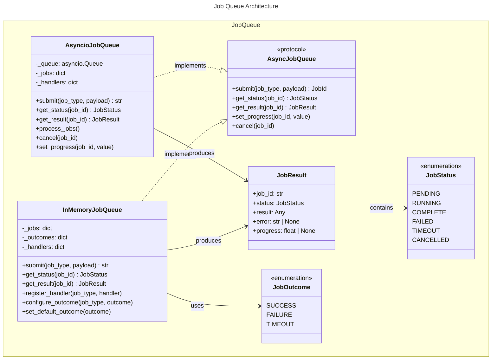

# C4 Code Level: Job Queue Infrastructure

## Overview

- **Name**: Job Queue Infrastructure
- **Description**: Generic async job queue protocol and implementations for background task execution
- **Location**: `src/stoat_ferret/jobs/`
- **Language**: Python
- **Purpose**: Provides job queuing abstractions with support for synchronous testing (InMemoryJobQueue) and real async processing with timeout and cancellation support (AsyncioJobQueue)
- **Parent Component**: [Application Services](./c4-component-application-services.md)

## Code Elements

### Enumerations

- `JobStatus` (enum)
  - Values: PENDING, RUNNING, COMPLETE, FAILED, TIMEOUT, CANCELLED
  - Description: Represents the lifecycle state of a job
  - Location: queue.py:17-25

- `JobOutcome` (enum)
  - Values: SUCCESS, FAILURE, TIMEOUT
  - Description: Configurable outcome for InMemoryJobQueue test mode
  - Location: queue.py:28-33

### Data Classes

- `JobResult`
  - Description: Encapsulates the result of a completed job including status, return value, error, and progress
  - Location: queue.py:37-52
  - Attributes: job_id (str), status (JobStatus), result (Any), error (str | None), progress (float | None)

- `_JobEntry` (internal)
  - Description: Internal storage for a submitted job in InMemoryJobQueue
  - Location: queue.py:121-131
  - Attributes: job_id (str), job_type (str), payload (dict), result (JobResult)

- `_AsyncJobEntry` (internal)
  - Description: Internal storage for a job in AsyncioJobQueue with cancellation support
  - Location: queue.py:308-318
  - Attributes: job_id (str), job_type (str), payload (dict), status (JobStatus), result (Any), error (str | None), progress (float | None), cancel_event (asyncio.Event)

### Protocols/Interfaces

- `AsyncJobQueue` (Protocol)
  - Description: Protocol defining the async job queue interface for implementations
  - Location: queue.py:55-117
  - Methods:
    - `async submit(job_type: str, payload: dict[str, Any]) -> str`
    - `async get_status(job_id: str) -> JobStatus`
    - `async get_result(job_id: str) -> JobResult`
    - `set_progress(job_id: str, value: float) -> None`
    - `cancel(job_id: str) -> None`

### Type Aliases

- `JobHandler`
  - Description: Type alias for async job handler functions
  - Location: queue.py:304
  - Signature: `Callable[[str, dict[str, Any]], Awaitable[Any]]`

### Classes

- `InMemoryJobQueue`
  - Description: Synchronous in-memory job queue for deterministic testing. Jobs execute immediately with configurable outcomes or registered handlers.
  - Location: queue.py:134-300
  - Methods:
    - `__init__() -> None` - Initialize empty queue
    - `register_handler(job_type: str, handler: JobHandler, *, timeout: float | None = None) -> None` - Register async handler for job type
    - `configure_outcome(job_type: str, outcome: JobOutcome, result: Any = None, error: str | None = None) -> None` - Set preconfigured outcome
    - `set_default_outcome(outcome: JobOutcome) -> None` - Set fallback outcome for unconfigured types
    - `set_progress(job_id: str, value: float) -> None` - No-op for protocol compliance
    - `cancel(job_id: str) -> None` - No-op for protocol compliance
    - `async submit(job_type: str, payload: dict[str, Any]) -> str` - Submit and execute synchronously
    - `async get_status(job_id: str) -> JobStatus` - Get job status by ID
    - `async get_result(job_id: str) -> JobResult` - Get completed job result
  - Dependencies: uuid, structlog

- `AsyncioJobQueue`
  - Description: Async job queue using asyncio.Queue with background worker for real async execution. Supports per-job timeouts, graceful cancellation, and progress tracking.
  - Location: queue.py:321-518
  - Class Attributes: DEFAULT_TIMEOUT = 300.0
  - Methods:
    - `__init__(*, timeout: float | None = None) -> None` - Initialize with optional default timeout
    - `register_handler(job_type: str, handler: JobHandler, *, timeout: float | None = None) -> None` - Register handler with optional override timeout
    - `set_progress(job_id: str, value: float) -> None` - Update progress for running job
    - `cancel(job_id: str) -> None` - Request graceful cancellation
    - `async submit(job_type: str, payload: dict[str, Any]) -> str` - Submit job to queue
    - `async get_status(job_id: str) -> JobStatus` - Get job status
    - `async get_result(job_id: str) -> JobResult` - Get job result with progress
    - `async process_jobs() -> None` - Worker coroutine that processes queue indefinitely
  - Dependencies: asyncio, uuid, structlog
  - Notes: Handles asyncio.TimeoutError from asyncio.wait_for() with Python 3.10 compatibility

## Dependencies

### Internal Dependencies
- None (self-contained module)

### External Dependencies
- `asyncio` - Async primitives (Queue, Event, wait_for, CancelledError)
- `uuid` - Unique job ID generation
- `structlog` - Structured logging
- Standard library: enum, dataclasses, collections.abc

## Relationships

```mermaid
---
title: Job Queue Architecture
---
classDiagram
    namespace JobQueue {
        class JobStatus {
            <<enumeration>>
            PENDING
            RUNNING
            COMPLETE
            FAILED
            TIMEOUT
            CANCELLED
        }
        
        class JobOutcome {
            <<enumeration>>
            SUCCESS
            FAILURE
            TIMEOUT
        }
        
        class JobResult {
            +job_id: str
            +status: JobStatus
            +result: Any
            +error: str | None
            +progress: float | None
        }
        
        class AsyncJobQueue {
            <<protocol>>
            +submit(job_type, payload) JobId
            +get_status(job_id) JobStatus
            +get_result(job_id) JobResult
            +set_progress(job_id, value)
            +cancel(job_id)
        }
        
        class InMemoryJobQueue {
            -_jobs: dict
            -_outcomes: dict
            -_handlers: dict
            +submit(job_type, payload) str
            +get_status(job_id) JobStatus
            +get_result(job_id) JobResult
            +register_handler(job_type, handler)
            +configure_outcome(job_type, outcome)
            +set_default_outcome(outcome)
        }
        
        class AsyncioJobQueue {
            -_queue: asyncio.Queue
            -_jobs: dict
            -_handlers: dict
            +submit(job_type, payload) str
            +get_status(job_id) JobStatus
            +get_result(job_id) JobResult
            +process_jobs()
            +cancel(job_id)
            +set_progress(job_id, value)
        }
    }
    
    InMemoryJobQueue ..|> AsyncJobQueue: implements
    AsyncioJobQueue ..|> AsyncJobQueue: implements
    JobResult --> JobStatus: contains
    InMemoryJobQueue --> JobOutcome: uses
    InMemoryJobQueue --> JobResult: produces
    AsyncioJobQueue --> JobResult: produces
```

## Notes

- The project targets Python >=3.10; AsyncioJobQueue specifically handles `asyncio.TimeoutError` (not `builtins.TimeoutError`) for compatibility
- InMemoryJobQueue executes jobs synchronously for deterministic testing; handlers run immediately via `await` within submit()
- AsyncioJobQueue uses injection of `_job_id` and `_cancel_event` into the payload dict to allow handlers to track cancellation
- All progress tracking in InMemoryJobQueue is a no-op; progress is tracked in AsyncioJobQueue via dict mutation
- Job IDs are UUIDs generated at submission time
