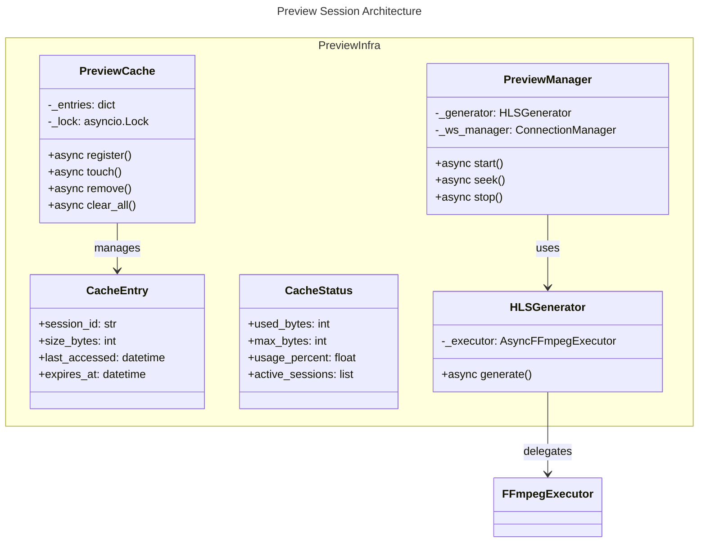

# C4 Code Level: Preview Session Infrastructure

## Overview

- **Name**: Preview Session Infrastructure
- **Description**: HLS preview generation and session management with cache and WebSocket event broadcasting
- **Location**: `src/stoat_ferret/preview/`
- **Language**: Python
- **Purpose**: Manages preview session lifecycle, HLS segment generation, LRU+TTL cache management, and real-time progress broadcasting for video preview playback
- **Parent Component**: [Application Services](./c4-component-application-services.md)

## Code Elements

### Data Classes

- `CacheEntry`
  - Description: In-memory metadata for a cached preview session with LRU tracking
  - Location: cache.py:30-37
  - Attributes: session_id (str), size_bytes (int), last_accessed (datetime), expires_at (datetime)

- `CacheStatus`
  - Description: Snapshot of current preview cache state including usage and active sessions
  - Location: cache.py:40-47
  - Attributes: used_bytes (int), max_bytes (int), usage_percent (float), active_sessions (list[str])

### Exception Classes

- `PreviewManagerError` - Base exception for preview manager operations
  - Location: manager.py:48-49

- `SessionLimitError(PreviewManagerError)` - Raised when concurrent session limit is reached
  - Location: manager.py:52-53

- `SessionNotFoundError(PreviewManagerError)` - Raised when session is not found
  - Location: manager.py:56-57

- `SessionExpiredError(PreviewManagerError)` - Raised when accessing an expired session
  - Location: manager.py:60-61

- `InvalidTransitionError(PreviewManagerError)` - Raised on invalid state transition
  - Location: manager.py:64-65

### Classes

- `PreviewCache`
  - Description: LRU+TTL cache manager for preview sessions with background cleanup task. Enforces size limits via eviction and TTL-based expiry.
  - Location: cache.py:50-351
  - Key Methods:
    - `async register(session_id: str, expires_at: datetime) -> None` - Register session with LRU eviction
    - `async touch(session_id: str) -> None` - Update last_accessed and check TTL
    - `async remove(session_id: str) -> None` - Remove from cache metadata only
    - `async status() -> CacheStatus` - Get current cache snapshot
    - `async clear_all() -> tuple[int, int]` - Remove all sessions and free disk
    - `async rebuild_from_disk() -> None` - Restore cache state from filesystem
    - `async start_cleanup_task() -> None` - Start background periodic cleanup
    - `async stop_cleanup_task() -> None` - Stop cleanup task
  - Properties: used_bytes (int), max_bytes (int)
  - Dependencies: asyncio, structlog, pathlib, metrics

- `HLSGenerator`
  - Description: Generates HLS VOD segments from project timelines using FFmpeg with filter simplification and progress callbacks
  - Location: hls_generator.py:135-276
  - Methods:
    - `__init__(*, async_executor: AsyncFFmpegExecutor, output_base_dir: str | None = None) -> None`
    - `async generate(*, session_id: str, input_path: str, filter_graph: FilterGraph | None = None, duration_us: int | None = None, progress_callback: Callable[[float], Awaitable[None]] | None = None, cancel_event: asyncio.Event | None = None) -> Path`
  - Dependencies: FFmpeg executor, Rust bindings for filter simplification, metrics

- `PreviewManager`
  - Description: Orchestrates preview session lifecycle with state machine, concurrent limits, seek regeneration, cancellation, and WebSocket event broadcasting
  - Location: manager.py:68-708
  - Key Methods:
    - `async start(*, project_id: str, input_path: str, filter_graph: FilterGraph | None = None, duration_us: int | None = None, quality_level: PreviewQuality = PreviewQuality.MEDIUM) -> PreviewSession` - Start new session
    - `async seek(session_id: str, *, input_path: str, filter_graph: FilterGraph | None = None, duration_us: int | None = None) -> PreviewSession` - Seek and regenerate segments
    - `async stop(session_id: str) -> None` - Stop session and cleanup
    - `async get_status(session_id: str) -> PreviewSession` - Get session status with expiry check
    - `async cancel_all() -> int` - Cancel all active sessions for graceful shutdown
    - `async cleanup_expired() -> int` - Clean up all expired sessions
  - Private Methods:
    - `async _run_generation(*, session_id, input_path, filter_graph, duration_us, cancel_event) -> None`
    - `async _run_seek_generation(*, session_id, input_path, filter_graph, duration_us, cancel_event) -> None`
    - `_make_progress_callback(session_id: str) -> Callable[[float], Awaitable[None]]`
    - `async _broadcast_event(event_type: EventType, session_id: str, **extra) -> None`
    - `async _transition(session: PreviewSession, new_status: PreviewStatus) -> None`
    - `async _check_expired(session: PreviewSession) -> None`
    - `async _cleanup_session(session: PreviewSession) -> None`
  - Class Attributes: _PROGRESS_THROTTLE_SECONDS = 0.5
  - Dependencies: asyncio, structlog, db models, metrics, WebSocket manager

### Module-Level Functions

- `get_segment_duration() -> float`
  - Location: hls_generator.py:41-48
  - Description: Get configured preview segment duration from settings

- `build_hls_args(input_path: str, output_dir: Path, filter_complex: str | None, segment_duration: float) -> list[str]`
  - Location: hls_generator.py:51-98
  - Description: Build FFmpeg arguments for HLS VOD segment generation

- `simplify_filter_for_preview(filter_graph: FilterGraph | None) -> str | None`
  - Location: hls_generator.py:101-132
  - Description: Apply Rust filter simplification for preview quality based on estimated cost

- `_cleanup_session_dir(output_dir: Path) -> None`
  - Location: hls_generator.py:268-276
  - Description: Remove session output directory and all contents

- `_calculate_dir_size(path: Path) -> int`
  - Location: cache.py:336-351
  - Description: Calculate total size of a directory recursively in bytes

## Dependencies

### Internal Dependencies
- `stoat_ferret.api.settings` - Settings for cache and session configuration
- `stoat_ferret.api.websocket` - WebSocket event broadcasting
- `stoat_ferret.db.models` - PreviewSession, PreviewStatus, PreviewQuality models
- `stoat_ferret.ffmpeg.async_executor` - AsyncFFmpegExecutor for FFmpeg process management
- `stoat_ferret.preview.metrics` - Prometheus metrics for preview operations
- `stoat_ferret_core` - Rust PyO3 bindings for filter simplification

### External Dependencies
- `asyncio` - Async primitives (Queue, Lock, Event, Task, wait_for)
- `structlog` - Structured logging
- `pathlib.Path` - File system path operations
- `shutil` - Directory operations
- `datetime` - Timezone-aware datetime handling

## Relationships

## Metrics

- preview_sessions_total (Counter, by quality)
- preview_sessions_active (Gauge)
- preview_generation_seconds (Histogram, by quality)
- preview_segment_seconds (Histogram)
- preview_seek_latency_seconds (Histogram)
- preview_errors_total (Counter, by error_type)
- preview_cache_bytes (Gauge)
- preview_cache_max_bytes (Gauge)
- preview_cache_evictions_total (Counter, by reason)
- preview_cache_hit_ratio (Gauge)

## State Machine

Session states: INITIALIZING → GENERATING → READY or ERROR
From READY: SEEKING → READY
From any non-terminal state: EXPIRED (via cleanup)

## Notes

- Session state machine: INITIALIZING -> GENERATING -> READY or ERROR; READY -> SEEKING -> READY
- Cache enforces asyncio.Lock for thread-safe metadata updates
- Progress callbacks throttled at 0.5s intervals unless final progress (1.0)
- Seek operations serialize via per-session locks to prevent concurrent regeneration
- Cancel events injected into FFmpeg execution for cooperative cancellation
- Cache cleanup task runs every 60s by default, checking TTL expiry
- All datetime operations use UTC with timezone awareness
- LRU eviction removes oldest-accessed sessions when max_bytes exceeded
- Background cleanup task can be started/stopped independently

