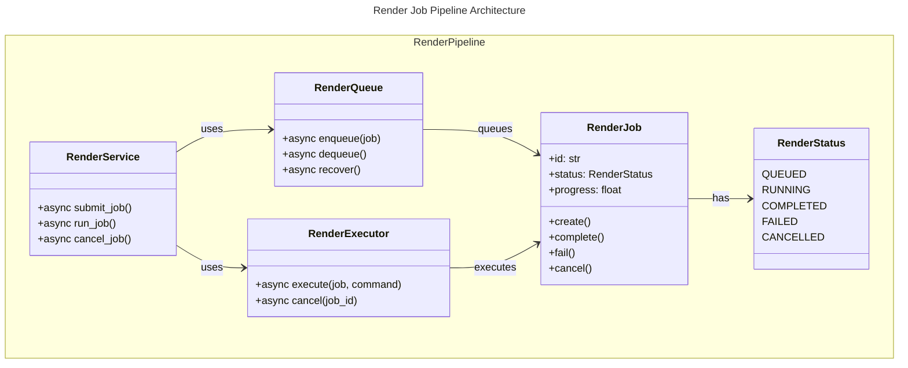

# C4 Code Level: Render Job Pipeline

## Overview

- **Name**: Render Job Pipeline
- **Description**: Batch video rendering with job queuing, executor management, crash recovery
- **Location**: src/stoat_ferret/render/
- **Language**: Python
- **Purpose**: Orchestrates full render job lifecycle
- **Parent Component**: [Application Services](./c4-component-application-services.md)

## Code Elements

### Enumerations

- RenderStatus (str enum): QUEUED, RUNNING, COMPLETED, FAILED, CANCELLED
  Location: models.py:15-27

- OutputFormat (str enum): MP4, WEBM, MOV, MKV
  Location: models.py:30-36

- QualityPreset (str enum): DRAFT, STANDARD, HIGH
  Location: models.py:39-44

### Data Classes

- RenderJob: Main job model with state machine methods
  Location: models.py:75-215
  Attributes: id, project_id, status, output_path, output_format, quality_preset, render_plan, progress, error_message, retry_count, timestamps

### Classes

- RenderCheckpointManager: Manages per-segment render checkpoints
  Location: checkpoints.py:18-151
  Key Methods: write_checkpoint, get_completed_segments, recover, cleanup_stale

- RenderQueue: Persistent FIFO queue with concurrency limits
  Location: queue.py:35-177
  Key Methods: enqueue, dequeue, recover

- RenderExecutor: FFmpeg subprocess lifecycle management
  Location: executor.py:81
  Key Methods: execute, cancel, cancel_all, kill_remaining

- RenderService: Complete job lifecycle orchestration
  Location: service.py:169
  Key Methods: submit_job, run_job, cancel_job, recover

- QCService (optional dependency injected into RenderService):
  Location: `stoat_ferret.api.services.qc_service`
  Role: Optional quality-control service invoked by RenderService after each render job completes
  Key method: `run_checks(artifact_path, job_id=None, delivery_profile_id=None, assertions=None) -> QCReportRecord` (`qc_service.py:113`)
  Added: v078 PR #551

- StaleRenderSweeper: Background task that detects and fails stuck running jobs
  Location: sweeper.py
  Purpose: Periodically polls for render jobs that have been in RUNNING status longer than `STOAT_RENDER_STUCK_THRESHOLD_SECONDS`; transitions each stale job to FAILED and broadcasts a RENDER_FAILED WebSocket event
  Key Method: `run()` — main async loop that calls `list_stale_running()` on each sweep pass and handles each stale job via `_handle_stale_job()`

### Repository Implementations

- AsyncSQLiteRenderRepository: SQLite implementation
  Location: render_repository.py:141-353
  Key Methods: save, get, list, update_status, list_stale_running

  - `list_stale_running(older_than: datetime) -> list[RenderJob]` — Returns render jobs currently in RUNNING status whose `updated_at` timestamp is older than the given cutoff datetime. Used by `StaleRenderSweeper` to identify jobs stuck beyond the configured threshold. Both the concrete SQLite implementation and the InMemoryRenderRepository implement this method.

- InMemoryRenderRepository: In-memory test implementation
  Location: render_repository.py:356-456

### Encoder Cache

#### `encoder_cache.py`

**File**: `src/stoat_ferret/render/encoder_cache.py`

Provides hardware encoder detection result caching using SQLite.

| Class / Type | Description |
|---|---|
| `EncoderCacheEntry` | Dataclass storing encoder name, type, availability status, and detection timestamp |
| `AsyncEncoderCacheRepository` | Abstract Protocol type for encoder cache persistence — pluggable implementation |
| `AsyncSQLiteEncoderCacheRepository` | Concrete SQLite implementation of `AsyncEncoderCacheRepository` using aiosqlite |

### worker.py

**Purpose:** Multi-clip render orchestration. Dequeues jobs from RenderQueue, builds FFmpeg commands, routes long filter arguments to temp files on Windows, and executes renders via RenderExecutor.

**Key types:**
- `CommandBuildError` — exception raised when FFmpeg command construction fails
- `RenderWorkerLoop` — background async loop that dequeues and executes render jobs

**Key functions:**
- `build_command_for_job(job, project, clips, video_repo, clip_repo, effect_registry, settings) -> list[str]` — constructs FFmpeg argument list from RenderJob render_plan JSON; dispatches through RenderGraphTranslator for multi-clip plans
- `_maybe_route_filter_to_file(command, job, executor) -> tuple[list[str], Path | None]` (`worker.py:78`) — on Windows: routes long `-vf`/`-filter_complex` arguments to a temp file via `-filter_script`/`-filter_complex_script` when filter string length exceeds `WINDOWS_ARGV_LIMIT - COMMAND_OVERHEAD_CHARS`

**Constants:** `WINDOWS_ARGV_LIMIT = 32767`, `COMMAND_OVERHEAD_CHARS = 500`

**Key imports:** `RenderGraphTranslator` from `stoat_ferret_core`; `RenderPlanSettings`, `SoftSubtitleSpec` from `api.schemas.render`

**v094 addition:** `_maybe_route_filter_to_file()` for Windows argv-limit routing

## Dependencies

Internal: stoat_ferret.api.settings, .api.websocket, .render.metrics, stoat_ferret_core, stoat_ferret.api.services.qc_service
External: asyncio, aiosqlite, structlog, pathlib, datetime

## Relationships

## Notes

- State machine enforces valid transitions; retry moves failed to queued
- Progress throttling at 0.5s intervals to reduce broadcast overhead
- Executor uses stdin q for graceful FFmpeg shutdown (cross-platform)
- Checkpoints enable crash recovery with segment-level resumption
- All timestamps use UTC with timezone awareness
- Pre-flight checks validate settings via Rust bindings and disk space
- Queue persisted in database; recovers from server restart
- Per-job retry count tracked and incremented on transition to queued
