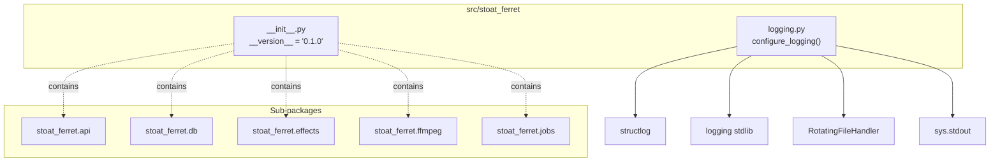

# C4 Code Level: Stoat Ferret Package Root

## Overview
- **Name**: Stoat Ferret Package Root
- **Description**: Top-level Python package providing version metadata and structured logging configuration
- **Location**: `src/stoat_ferret/`
- **Language**: Python
- **Purpose**: Defines the package namespace, exports the version string, and provides centralized structured logging using structlog with JSON/console output modes and rotating file handler
- **Parent Component**: TBD

## Code Elements

### Functions/Methods

#### logging.py

- `configure_logging(json_format: bool = True, level: int = logging.INFO, log_dir: str | Path = "logs", max_bytes: int = 10_485_760, backup_count: int = 5) -> None`
  - Description: Configures structlog for the application with shared processors (log level, logger name, timestamps, stack info), JSON or console rendering, and stdlib integration via ProcessorFormatter. Adds StreamHandler to stdout and RotatingFileHandler for persistent log output. Both are idempotent (skipped if handler type already exists on root logger).
  - Location: `src/stoat_ferret/logging.py:18`
  - Dependencies: `structlog`, `logging`, `sys`, `logging.handlers.RotatingFileHandler`, `pathlib.Path`

### Module-Level Variables

#### __init__.py

- `__version__: str = "0.1.0"`
  - Description: Package version string
  - Location: `src/stoat_ferret/__init__.py:5`

## Dependencies

### Internal Dependencies
- None (package root)

### External Dependencies
- `structlog` -- Structured logging framework (BoundLogger, ProcessorFormatter, JSONRenderer, ConsoleRenderer, TimeStamper)
- `logging` (stdlib) -- Python standard logging (StreamHandler, getLogger, RotatingFileHandler)
- `sys` (stdlib) -- System module for stdout stream
- `pathlib` (stdlib) -- Path for log directory creation

## Relationships

