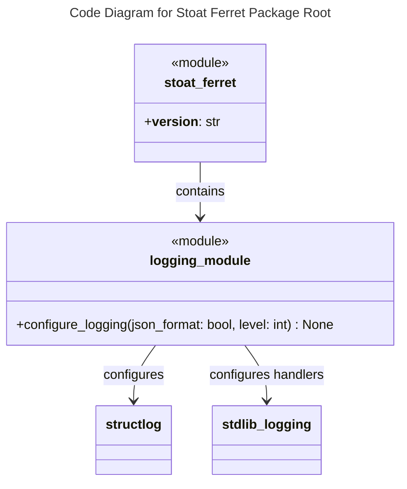

# C4 Code Level: Stoat Ferret Package Root

## Overview
- **Name**: Stoat Ferret Package Root
- **Description**: Top-level Python package providing version info and structured logging configuration
- **Location**: `src/stoat_ferret/`
- **Language**: Python
- **Purpose**: Define the package root, expose version metadata, and provide centralized logging configuration

## Code Elements

### Functions/Methods

#### logging.py

- `configure_logging(json_format: bool = True, level: int = logging.INFO) -> None`
  - Description: Configure structlog for the application with JSON (production) or console (development) output format
  - Location: `src/stoat_ferret/logging.py:15`
  - Dependencies: `structlog`, `logging`

### Module-Level Variables

#### __init__.py

- `__version__: str = "0.1.0"`
  - Description: Package version string
  - Location: `src/stoat_ferret/__init__.py:5`

## Dependencies

### Internal Dependencies
- None (package root)

### External Dependencies
- `structlog` - Structured logging framework (BoundLogger, ProcessorFormatter, JSONRenderer, ConsoleRenderer)
- `logging` - Standard library logging (StreamHandler, getLogger)

## Relationships

