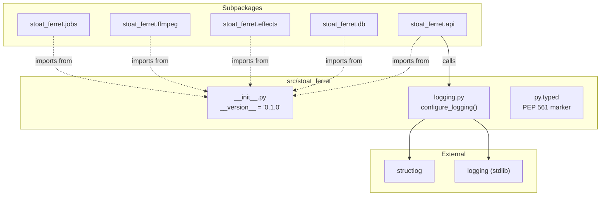

# C4 Code Level: Stoat Ferret Python Package Root

## Overview
- **Name**: Stoat Ferret Package Root
- **Description**: Top-level Python package providing version metadata and structured logging configuration.
- **Location**: `src/stoat_ferret/`
- **Language**: Python
- **Purpose**: Defines the `stoat_ferret` package identity (version string, py.typed marker) and centralizes structured logging with support for JSON/console output and rotating file handlers.
- **Parent Component**: [Data Access Layer](./c4-component-data-access.md)

## Code Elements

### Functions/Methods

#### `configure_logging` (`logging.py`)
```python
def configure_logging(
    json_format: bool = True,
    level: int = logging.INFO,
    log_dir: str | Path = "logs",
    max_bytes: int = 10_485_760,
    backup_count: int = 5,
) -> None
```
Configures structlog for the application with both stdout and rotating file logging. Idempotent: checks for existing handlers before adding new ones. Uses `structlog.stdlib.ProcessorFormatter` to unify structlog and stdlib formatting.

**Processors configured:**
- `add_log_level` - Adds log level to events
- `add_logger_name` - Adds logger name to events
- `TimeStamper(fmt="iso")` - ISO-format timestamps
- `StackInfoRenderer()` - Stack trace rendering
- `JSONRenderer()` or `ConsoleRenderer()` - Output formatting based on `json_format` flag

### Classes/Modules

#### `__init__.py`
- Defines `__version__ = "0.1.0"` as the package version string.

#### `py.typed`
- PEP 561 marker file indicating the package ships inline type information.

## Dependencies

### Internal Dependencies
- None (this is the root package; subpackages import from here)

### External Dependencies
| Package | Purpose |
|---------|---------|
| `structlog` | Structured logging framework |
| `logging` (stdlib) | Python standard logging infrastructure |
| `logging.handlers.RotatingFileHandler` (stdlib) | File-based log rotation |

## Relationships


```mermaid
graph TD
    subgraph "src/stoat_ferret"
        INIT["__init__.py<br/>__version__ = '0.1.0'"]
        LOGGING["logging.py<br/>configure_logging()"]
        TYPED["py.typed<br/>PEP 561 marker"]
    end

    subgraph "External"
        STRUCTLOG["structlog"]
        STDLIB_LOG["logging (stdlib)"]
    end

    LOGGING --> STRUCTLOG
    LOGGING --> STDLIB_LOG

    subgraph "Subpackages"
        API["stoat_ferret.api"]
        DB["stoat_ferret.db"]
        EFFECTS["stoat_ferret.effects"]
        FFMPEG["stoat_ferret.ffmpeg"]
        JOBS["stoat_ferret.jobs"]
    end

    API -.->|"imports from"| INIT
    DB -.->|"imports from"| INIT
    EFFECTS -.->|"imports from"| INIT
    FFMPEG -.->|"imports from"| INIT
    JOBS -.->|"imports from"| INIT
    API -->|"calls"| LOGGING
```
