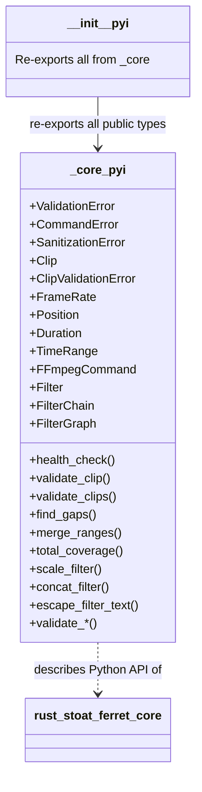

# C4 Code Level: Python Type Stubs

## Overview
- **Name**: Python Type Stubs for stoat_ferret_core
- **Description**: Manually maintained Python `.pyi` type stubs providing type annotations for the Rust PyO3 bindings
- **Location**: `stubs/stoat_ferret_core/`
- **Language**: Python (type stub files)
- **Purpose**: Provides complete Python type annotations for the `stoat_ferret_core` Rust extension module, enabling IDE autocompletion and mypy type checking

## Code Elements

### Classes/Modules

#### `__init__.pyi` - Package Re-exports

- Description: Re-exports all public types and functions from `_core` module with explicit `as` aliases for type checker visibility
- Location: `stubs/stoat_ferret_core/__init__.pyi`
- Exports (via `__all__`):
  - Utility: `health_check`
  - Clip types: `Clip`, `ClipValidationError`, `validate_clip`, `validate_clips`
  - Timeline types: `FrameRate`, `Position`, `Duration`, `TimeRange`
  - TimeRange operations: `find_gaps`, `merge_ranges`, `total_coverage`
  - FFmpeg: `FFmpegCommand`, `Filter`, `FilterChain`, `FilterGraph`, `scale_filter`, `concat_filter`
  - Sanitization: `escape_filter_text`, `validate_path`, `validate_crf`, `validate_speed`, `validate_volume`, `validate_video_codec`, `validate_audio_codec`, `validate_preset`
  - Exceptions: `ValidationError`, `CommandError`, `SanitizationError`

#### `_core.pyi` - Full Type Definitions

- `ValidationError(Exception)` - Custom exception for validation failures
  - Location: `stubs/stoat_ferret_core/_core.pyi:10`

- `CommandError(Exception)` - Custom exception for FFmpeg command building failures
  - Location: `stubs/stoat_ferret_core/_core.pyi:22`

- `SanitizationError(Exception)` - Custom exception for sanitization failures
  - Location: `stubs/stoat_ferret_core/_core.pyi:34`

- `Clip` - Video clip with source path, in/out points, and optional source duration
  - Location: `stubs/stoat_ferret_core/_core.pyi:60`
  - Properties: `source_path: str`, `in_point: Position`, `out_point: Position`, `source_duration: Duration | None`
  - Methods: `__new__(cls, source_path, in_point, out_point, source_duration)`, `duration() -> Duration | None`

- `ClipValidationError` - Validation error data with field, message, actual, expected
  - Location: `stubs/stoat_ferret_core/_core.pyi:118`
  - Properties: `field: str`, `message: str`, `actual: str | None`, `expected: str | None`
  - Methods: `__new__(cls, field, message)`, `with_values_py(field, message, actual, expected)`

- `FrameRate` - Rational frame rate (numerator/denominator)
  - Location: `stubs/stoat_ferret_core/_core.pyi:216`
  - Properties: `numerator: int`, `denominator: int`
  - Static methods: `fps_24()`, `fps_25()`, `fps_30()`, `fps_60()`, `ntsc_30()`, `ntsc_60()`
  - Methods: `as_float() -> float`

- `Position` - Timeline position as frame count
  - Location: `stubs/stoat_ferret_core/_core.pyi:282`
  - Static methods: `from_frames(frames)`, `from_seconds(seconds, frame_rate)`, `from_timecode(h, m, s, f, frame_rate)`
  - Methods: `frames() -> int`, `to_seconds(frame_rate) -> float`
  - Operators: `__eq__`, `__lt__`, `__le__`, `__gt__`, `__ge__`, `__add__`, `__sub__`

- `Duration` - Timeline duration as frame count
  - Location: `stubs/stoat_ferret_core/_core.pyi:356`
  - Static methods: `from_frames(frames)`, `from_seconds(seconds, frame_rate)`, `between(start, end)`
  - Methods: `frames() -> int`, `to_seconds(frame_rate) -> float`
  - Operators: `__eq__`, `__lt__`, `__le__`, `__gt__`, `__ge__`, `__add__`

- `TimeRange` - Half-open interval [start, end) with set operations
  - Location: `stubs/stoat_ferret_core/_core.pyi:424`
  - Properties: `start: Position`, `end: Position`, `duration: Duration`
  - Methods: `overlaps`, `adjacent`, `overlap`, `gap`, `intersection`, `union`, `difference`

- `FFmpegCommand` - Type-safe FFmpeg argument builder
  - Location: `stubs/stoat_ferret_core/_core.pyi:539`
  - Methods: `overwrite`, `loglevel`, `input`, `seek`, `duration`, `stream_loop`, `output`, `video_codec`, `audio_codec`, `preset`, `crf`, `format`, `filter_complex`, `map`, `build`

- `Filter` - Single FFmpeg filter with parameters
  - Location: `stubs/stoat_ferret_core/_core.pyi:616`
  - Methods: `param(key, value)`, static methods: `scale`, `scale_fit`, `concat`, `pad`, `format`

- `FilterChain` - Sequence of filters with input/output labels
  - Location: `stubs/stoat_ferret_core/_core.pyi:656`
  - Methods: `input(label)`, `filter(f)`, `output(label)`

- `FilterGraph` - Multiple filter chains for `-filter_complex`
  - Location: `stubs/stoat_ferret_core/_core.pyi:679`
  - Methods: `chain(chain)`

### Functions/Methods

- `health_check() -> str` - Location: `_core.pyi:48`
- `validate_clip(clip: Clip) -> list[ClipValidationError]` - Location: `_core.pyi:181`
- `validate_clips(clips: list[Clip]) -> list[tuple[int, ClipValidationError]]` - Location: `_core.pyi:199`
- `find_gaps(ranges: list[TimeRange]) -> list[TimeRange]` - Location: `_core.pyi:492`
- `merge_ranges(ranges: list[TimeRange]) -> list[TimeRange]` - Location: `_core.pyi:507`
- `total_coverage(ranges: list[TimeRange]) -> Duration` - Location: `_core.pyi:522`
- `scale_filter(width: int, height: int) -> Filter` - Location: `_core.pyi:696`
- `concat_filter(n: int, v: int, a: int) -> Filter` - Location: `_core.pyi:709`
- `escape_filter_text(input: str) -> str` - Location: `_core.pyi:725`
- `validate_path(path: str) -> None` - Location: `_core.pyi:737`
- `validate_crf(crf: int) -> int` - Location: `_core.pyi:749`
- `validate_speed(speed: float) -> float` - Location: `_core.pyi:764`
- `validate_volume(volume: float) -> float` - Location: `_core.pyi:779`
- `validate_video_codec(codec: str) -> str` - Location: `_core.pyi:794`
- `validate_audio_codec(codec: str) -> str` - Location: `_core.pyi:809`
- `validate_preset(preset: str) -> str` - Location: `_core.pyi:824`

## Dependencies

### Internal Dependencies
- `stoat_ferret_core._core` - The actual Rust PyO3 compiled module that these stubs describe

### External Dependencies
- None (pure type stubs, no runtime dependencies)

## Relationships

