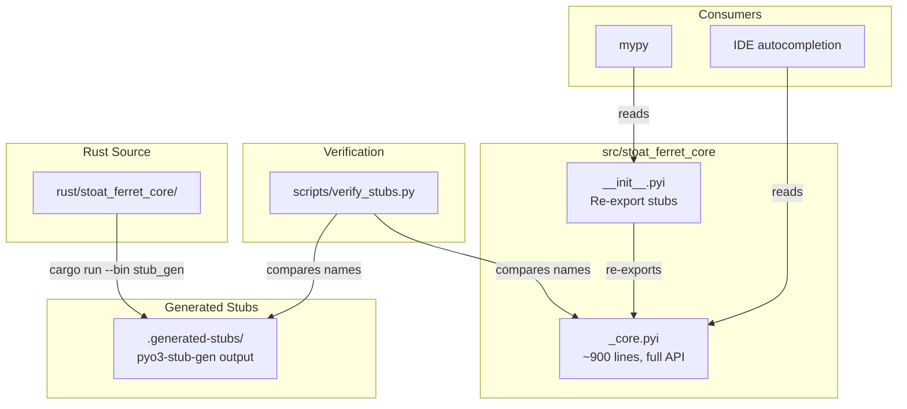

# C4 Code Level: Manual Type Stubs for Rust Core

## Overview
- **Name**: Stoat Ferret Core Type Stubs
- **Description**: Manually maintained Python type stubs providing full method signatures for the Rust PyO3 bindings.
- **Location**: `src/stoat_ferret_core/`
- **Language**: Python (`.pyi` stub files)
- **Purpose**: Provides complete type information (method signatures, docstrings, property types) for IDE autocompletion and static analysis tools (mypy, pyright) against the Rust extension. These stubs are manually maintained because `pyo3-stub-gen` only generates class docstrings without method signatures.
- **Parent Component**: [Python Bindings Layer](./c4-component-python-bindings.md)

## Code Elements

### Classes/Modules

#### `__init__.pyi`
Re-export stub that imports all public types from `_core.pyi` using explicit `as` re-exports for type checker visibility. Defines `__all__` with 27 entries covering utility, progress, clip, timeline, FFmpeg, filter, sanitization, exception, and encoder types.

#### `_core.pyi`
Complete type stub file (~900 lines) defining the full Python API surface of the Rust `_core` module.

**Exception Types:**
| Class | Description |
|-------|-------------|
| `ValidationError(Exception)` | Invalid timeline parameters, frame rates, timecodes |
| `CommandError(Exception)` | FFmpeg command building failures |
| `SanitizationError(Exception)` | Path, codec, and bounds validation failures |
| `LayoutError(Exception)` | Layout coordinate validation failures (0.0-1.0 range) |

**Core Data Types:**
| Class | Key Methods |
|-------|-------------|
| `Clip` | `__new__(source_path, in_point, out_point, source_duration?)`, `duration()` |
| `ClipValidationError` | `__new__(field, message)`, `with_values_py(field, message, actual, expected)` |
| `FrameRate` | `__new__(numerator, denominator)`, `fps_24()`, `fps_25()`, `fps_30()`, `fps_60()`, `ntsc_30()`, `ntsc_60()`, `as_float()` |
| `Position` | `__new__(frames)`, `from_frames()`, `from_seconds()`, `from_timecode()`, `frames()`, `to_seconds()`, arithmetic operators |
| `Duration` | `__new__(frames)`, `from_frames()`, `from_seconds()`, `between()`, `frames()`, `to_seconds()`, comparison operators |
| `TimeRange` | `__new__(start, end)`, `overlaps()`, `adjacent()`, `overlap()`, `gap()`, `intersection()`, `union()`, `difference()` |

**Builder Types:**
| Class | Key Methods |
|-------|-------------|
| `FFmpegCommand` | `overwrite()`, `loglevel()`, `input()`, `seek()`, `duration()`, `output()`, `video_codec()`, `audio_codec()`, `preset()`, `crf()`, `format()`, `filter_complex()`, `map()`, `build()` |
| `DrawtextBuilder` | `__new__(text)`, `font()`, `fontfile()`, `fontsize()`, `fontcolor()`, `position()`, `shadow()`, `box_background()`, `alpha()`, `alpha_fade()`, `enable()`, `build()` |
| `SpeedControl` | `__new__(factor)`, `drop_audio()`, `setpts_filter()`, `atempo_filters()` |
| `VolumeBuilder` | `__new__(volume)`, `from_db()`, `precision()`, `build()` |
| `AfadeBuilder` | `__new__(fade_type, duration)`, `start_time()`, `curve()`, `build()` |
| `AmixBuilder` | `__new__(inputs)`, `duration_mode()`, `weights()`, `normalize()`, `build()` |

**Standalone Functions:**
| Function | Signature |
|----------|-----------|
| `health_check` | `() -> str` |
| `validate_clip` | `(clip: Clip) -> list[ClipValidationError]` |
| `validate_clips` | `(clips: list[Clip]) -> list[tuple[int, ClipValidationError]]` |
| `escape_filter_text` | `(text: str) -> str` |
| `validate_path` | `(path: str) -> None` |
| `validate_volume` | `(volume: float) -> None` |
| `validate_video_codec` | `(codec: str) -> None` |
| `validate_audio_codec` | `(codec: str) -> None` |
| `validate_preset` | `(preset: str) -> None` |
| `scale_filter` | `(width: int, height: int) -> Filter` |
| `concat_filter` | `(segment_count: int, has_audio: bool) -> Filter` |

### Functions/Methods

See tables above for complete function signatures with types.

## Dependencies

### Internal Dependencies
| Module | Relationship |
|--------|-------------|
| `stoat_ferret_core._core` | The compiled Rust module these stubs describe |

### External Dependencies
None (stub files have no runtime dependencies).

## Relationships

```mermaid
graph TD
    subgraph "src/stoat_ferret_core"
        INIT_PYI["__init__.pyi<br/>Re-export stubs"]
        CORE_PYI["_core.pyi<br/>~900 lines, full API"]
    end

    subgraph "Rust Source"
        RUST_SRC["rust/stoat_ferret_core/"]
    end

    subgraph "Generated Stubs"
        GEN_STUBS[".generated-stubs/<br/>pyo3-stub-gen output"]
    end

    subgraph "Verification"
        VERIFY["scripts/verify_stubs.py"]
    end

    RUST_SRC -->|"cargo run --bin stub_gen"| GEN_STUBS
    VERIFY -->|"compares names"| GEN_STUBS
    VERIFY -->|"compares names"| CORE_PYI
    INIT_PYI -->|"re-exports"| CORE_PYI

    subgraph "Consumers"
        MYPY["mypy"]
        IDE["IDE autocompletion"]
    end

    MYPY -->|"reads"| INIT_PYI
    IDE -->|"reads"| CORE_PYI
```
