# C4 Code Level: Smoke Test Suite

## Overview

- **Name**: Smoke Test Suite (tests/smoke)
- **Description**: End-to-end HTTP API integration tests exercising the full backend stack (HTTP → FastAPI → Services → PyO3/Rust → SQLite) with real video files and isolated test databases.
- **Location**: `tests/smoke/`
- **Language**: Python 3.10+
- **Purpose**: Validate all HTTP API endpoints, business logic, and Rust core integration against live video metadata and real FFmpeg operations.
- **Parent Component**: [Test Infrastructure](./c4-component-test-infrastructure.md)

## Code Elements

### Test Fixtures (Shared Infrastructure)

#### Core Fixtures

- `smoke_client(tmp_path: Path) -> httpx.AsyncClient` — Per-test async HTTP client with isolated database and temporary paths. Manually invokes lifespan for app initialization. Location: `conftest.py:123-174`

- `videos_dir() -> Path` — Session-scoped fixture verifying presence of 6+ MP4 files in the `videos/demo/` directory. Raises AssertionError if missing. Location: `conftest.py:103-120`

- `sample_project(smoke_client, videos_dir) -> dict` — Creates the canonical "Running Montage" project with 4 clips, 5 effects, and 1 transition. Returns metadata dict with project_id, video_ids, clip_ids, effects_applied, transitions_applied. Location: `conftest.py:408-509`

- `background_safe_client(tmp_path: Path) -> httpx.AsyncClient` — Like smoke_client but with `raise_app_exceptions=False` to suppress background task exceptions (e.g., FFmpeg errors post-response). Used for thumbnail strip and waveform endpoints. Location: `test_preview_endpoints.py:21-68`

- `batch_client(smoke_client) -> httpx.AsyncClient` — Injects no-op batch render handler into app.state for batch job testing. Location: `test_batch.py:25-41`

- `dir_tree(tmp_path) -> Path` — Creates deterministic directory structure (alpha, beta, gamma subdirs + .hidden) for filesystem tests. Location: `test_filesystem.py:15-26`

#### Helper Functions

- `create_version_repo(client: httpx.AsyncClient) -> AsyncSQLiteVersionRepository` — Extracts live database from ASGI transport for direct version creation (no HTTP endpoint). Location: `conftest.py:177-193`

- `poll_job_until_terminal(client, job_id, timeout=30.0, interval=0.5) -> dict` — Polls GET /api/v1/jobs/{job_id} until status reaches {complete, failed, timeout, cancelled}. Raises asyncio.TimeoutError on timeout. Location: `conftest.py:196-232`

- `scan_videos_and_wait(client, videos_path, timeout=30.0) -> dict` — Submits scan request and polls until terminal. Returns final job status. Location: `conftest.py:235-257`

- `create_project_with_clips(client, project_name, video_ids, clips) -> tuple[dict, list]` — Creates project and adds list of clips. Returns (project_response, list_of_clip_responses). Location: `conftest.py:260-297`

- `create_adjacent_clips_timeline(client, videos_dir) -> dict` — Full setup: scans videos, creates project, timeline with video track, and two adjacent clips (clip_a.timeline_end == clip_b.timeline_start). Returns {project_id, track_id, clip_a_id, clip_b_id}. Location: `conftest.py:300-405`

### Test Functions by Category

| Category | Files | Tests | Key Endpoints Tested |
|----------|-------|-------|---------------------|
| Health | test_health.py | 2 | `/health/live`, `/health/ready` |
| Video Library | test_library.py, test_scan_workflow.py | 9 | `/videos`, `/videos/scan`, `/jobs/{id}/cancel` |
| Projects | test_project_workflow.py | 2 | `/projects` CRUD |
| Clips | test_clip_workflow.py | 2 | `/projects/{id}/clips` CRUD |
| Timeline | test_timeline.py | 6 | `/timeline` PUT/GET, clip positioning, transitions |
| Transitions | test_transitions.py | 3 | `/effects/transition`, timeline transition lifecycle |
| Effects | test_effects.py | 13 | `/effects` catalog, preview, apply, stacking, thumbnails |
| Audio | test_audio.py | 2 | `/audio/mix` configure and preview |
| Composition | test_compose.py | 3 | `/compose/presets`, layout application |
| Render | test_render_api.py | 10 | `/render` CRUD, encoders, formats, queue, preview |
| Render Contract | test_render_contract.py | 7 | `/render` noop mode contract, render_plan validation, error detail shape (BL-371, BL-372) |
| Batch | test_batch.py | 2 | `/render/batch` submit, poll, persistence across restart |
| Proxy | test_proxy.py | 4 | `/videos/{id}/proxy` generate, status, delete, batch |
| Preview | test_preview_endpoints.py, test_preview.py | 6 | Preview start, cache status, thumbnail strip, waveform |
| Versions | test_versions.py | 9 | `/projects/{id}/versions` CRUD, restore, retention |
| Filesystem | test_filesystem.py | 3 | `/filesystem/directories` listing, hidden exclusion |
| Negative Paths | test_negative_paths.py | 6 | Invalid inputs, nonexistent resources → 404/422 |
| Regression | test_sample_project.py | 1 | Running Montage canonical structure and render job queueing validation (BL-239) |

## Test Inventory

- **Total Tests**: 191 (verify with `uv run pytest tests/smoke/ --co -q | tail -1`)
- **Test Files**: 37
- **Fixture Files**: 1 (conftest.py)

| File | Test Count | Description |
|------|-----------|-------------|
| test_health.py | 4 | Liveness/readiness probes, health check structure |
| test_library.py | 10 | Video search, detail, thumbnail, delete with pagination/FTS5 |
| test_scan_workflow.py | 2 | Scan videos, cancel job with metadata validation |
| test_scan_recursion.py | 3 | Recursive scan prohibition (RECURSIVE_SCAN_FORBIDDEN) on multi-subdir paths |
| test_project_workflow.py | 2 | Project CRUD with default/custom settings, idempotent delete |
| test_clip_workflow.py | 2 | Add, list, modify (PATCH in/out/timeline), delete clips |
| test_timeline.py | 6 | Timeline/track CRUD, clip positioning, transition lifecycle |
| test_timeline_contract.py | 4 | Timeline constraint and contract enforcement tests |
| test_transitions.py | 3 | Fade transition create/delete, effects router interop |
| test_effects.py | 9 | Effects catalog, preview, apply, update, delete, stacking, thumbnails, effect type coverage |
| test_audio.py | 2 | Audio mix configure/preview with filter strings |
| test_compose.py | 3 | Preset discovery, layout application, invalid preset |
| test_render_api.py | 28 | CRUD, encoders, formats, queue, preview (single + all formats), delete, settings preflight |
| test_render_contract.py | 10 | Render plan contract (noop mode): plan construction from timeline, multi-project isolation, 422 without total_duration/settings, structured detail shape (BL-371, BL-372) |
| test_smoke_render.py | 7 | Render smoke tests exercising full render stack |
| test_stuck_render_sweeper.py | 3 | StaleRenderSweeper integration: stale job detection, auto-fail, and threshold behavior |
| test_batch.py | 2 | Batch submit/poll, persistence across restart |
| test_batch_quality.py | 9 | Batch quality field and quality_preset asymmetry validation |
| test_proxy.py | 6 | Generate, status, delete, batch operations |
| test_preview_endpoints.py | 5 | Preview start, proxy, cache, thumbnail strip, waveform |
| test_preview.py | 1 | Preview session creation |
| test_preview_smoke.py | 2 | Preview endpoint smoke tests (added v073) |
| test_versions.py | 10 | List empty, create/list, restore (success/404/nonexistent), retention (default/prune/keep_more) |
| test_smoke_version.py | 3 | Version endpoint smoke tests |
| test_filesystem.py | 3 | Directory listing with pagination, not found, hidden excluded |
| test_negative_paths.py | 7 | Invalid track type, nonexistent resources, empty tracks, insufficient inputs |
| test_sample_project.py | 2 | Running Montage regression: clip frames, source videos, effect mappings, render job queueing (BL-239) |
| test_schema.py | 7 | API schema and contract validation smoke tests |
| test_smoke_flags.py | 3 | Feature flag and environment variable behavior smoke tests |
| test_smoke_health.py | 7 | Health endpoint smoke tests (full liveness/readiness probe coverage) |
| test_smoke_monitoring.py | 2 | Monitoring and metrics endpoint smoke tests |
| test_system_state_smoke.py | 3 | System state endpoint smoke tests (`/api/v1/system/state`) |
| test_uat_journey_names.py | 1 | UAT journey name registration validation |
| test_uat_runner.py | 11 | UAT runner script execution, result parsing, and error handling |
| test_uat_subprocess_timeout.py | 1 | UAT runner subprocess timeout guard (defence-in-depth, BL-398) |
| test_websocket_replay.py | 6 | WebSocket event replay, reconnect, and Last-Event-ID semantics |
| test_video_auxiliary_streams.py | 2 | Video auxiliary stream detection (subtitle count, data stream presence, BL-408) |
| conftest.py | 0 | Fixtures and helpers (no direct tests) |

### Render Contract Test Module

**File**: `tests/smoke/test_render_contract.py`
**Added**: v067/v068 (BL-371, BL-372)
**Behavioral scope**: Verifies that `render_plan.total_duration` is required and correctly derived from timeline duration in noop mode (`STOAT_RENDER_MODE=noop`). Also verifies the structured error `detail` shape expected by the frontend.

**Helper Functions**:
- `_seed_stub_clip(client, project_id)` — inserts a stub clip row directly via `AsyncSQLiteClipRepository` to bypass video-scan prerequisites, enabling render tests without real video files
- `_create_project_with_timeline(client, project_name, timeline_end)` — creates a project + clip + timeline track + one clip spanning `[0, timeline_end]` seconds; returns `(project_id, timeline_end)`

**Fixture**: `smoke_client_noop` — smoke client with `STOAT_RENDER_MODE=noop` environment override; adds a non-local `conftest.py` fixture (co-located in `tests/smoke/`)

**Test Cases** (7 total):

| Test | Behavioral Scope |
|------|-----------------|
| `test_render_plan_construction_from_timeline` | GETs timeline for a 100s project, submits render with `render_plan.total_duration == duration`, asserts 201. Verifies plan is correctly derived from timeline (BL-371-AC-2). |
| `test_render_plan_multiple_projects` | Creates two projects (100s, 200s), submits separate renders with respective durations, asserts both return 201. Verifies distinct projects produce distinct render_plan values. |
| `test_render_422_without_render_plan` | Submits render with `render_plan: {}` (missing total_duration) in noop mode, asserts 422 with `detail.code == "PREFLIGHT_FAILED"` and `"total_duration"` in `detail.message`. Negative test confirming the guard is active (BL-371-AC-1 boundary). |
| `test_error_response_detail_message` | Triggers 422 via missing total_duration, asserts `detail` is a `dict` (not a string or object) with `code` and `message` string fields. Verifies backend emits structured detail so frontend can extract `detail.message` safely (BL-372-AC-1 backend assertion). |
| `test_error_response_missing_detail` | Submits render for a non-existent project (all-zeros UUID) with valid render_plan, asserts 404 with structured `detail` dict containing `code` and `message`. Verifies the fallback error path also returns structured detail. |
| `test_noop_render_success` | Creates a 50s project, submits render, asserts 201 and job appears in GET /api/v1/render list. Verifies job is visible in render queue after submission (BL-371-AC-1, BL-371-AC-3). |
| `test_job_polling_noop_completed` | Submits a noop render, polls GET /api/v1/render/{job_id} until status == "completed" (timeout 10s). Verifies job reports completed status on re-fetch (BL-371-AC-3). |

**Render Plan Requirement**: In `STOAT_RENDER_MODE=noop`, `RenderService.submit_job()` checks `plan_data.get("total_duration") is None` and raises `PreflightError` (→ 422 PREFLIGHT_FAILED). The test suite acts as a contract boundary ensuring the GUI's `useRenderModal` hook derives total_duration from the project timeline before submitting.

## Dependencies

### Internal Dependencies

- `stoat_ferret.api.app`: `create_app()`, `lifespan()`
- `stoat_ferret.api.settings`: `get_settings` (caching fixture)
- `stoat_ferret.db.version_repository`: `AsyncSQLiteVersionRepository`
- `stoat_ferret.db.models`: `ProxyFile`, `ProxyQuality`, `ProxyStatus`
- `stoat_ferret.db.proxy_repository`: `SQLiteProxyRepository`

### External Dependencies

- `httpx`: AsyncClient, ASGITransport (test HTTP client)
- `pytest`: Test framework, fixtures, parametrize, marks
- `asyncio`: Event loop, TimeoutError, sleep
- `pathlib`: Path operations
- Standard library: `os`, `uuid`

### Test Data

- **EXPECTED_VIDEOS**: 6 MP4 files with hardcoded metadata (resolution, fps, duration_frames, codec)
- **SAMPLE_EFFECT_DEFS**: 5 effects (video_fade, text_overlay, speed_control, text_overlay, video_fade)
- **SAMPLE_TRANSITION_DEFS**: 1 crossfade transition

## Relationships

```mermaid
---
title: Test Suite Code Structure
---
flowchart TB
    subgraph Fixtures["Fixtures (conftest.py)"]
        smoke_client["smoke_client<br/>Isolated DB + App"]
        videos_dir["videos_dir<br/>Session-scoped"]
        sample_project["sample_project<br/>Running Montage"]
        batch_client["batch_client<br/>Batch handler"]
        bg_safe["background_safe_client<br/>raise_app_exceptions=False"]
    end
    
    subgraph Helpers["Helper Functions (conftest.py)"]
        poll["poll_job_until_terminal<br/>Polls until {complete,failed,timeout,cancelled}"]
        scan["scan_videos_and_wait<br/>POST scan + poll"]
        create_timeline["create_adjacent_clips_timeline<br/>Full timeline setup"]
        create_project["create_project_with_clips<br/>Project + clips"]
    end
    
    subgraph Tests["Test Modules (37 files, 191 tests)"]
        health["test_health.py<br/>2 tests"]
        library["test_library.py<br/>7 tests"]
        scan["test_scan_workflow.py<br/>2 tests"]
        project["test_project_workflow.py<br/>2 tests"]
        clip["test_clip_workflow.py<br/>2 tests"]
        timeline["test_timeline.py<br/>6 tests"]
        transition["test_transitions.py<br/>3 tests"]
        effects["test_effects.py<br/>13 tests"]
        audio["test_audio.py<br/>2 tests"]
        compose["test_compose.py<br/>3 tests"]
        render["test_render_api.py<br/>10 tests"]
        batch["test_batch.py<br/>2 tests"]
        proxy["test_proxy.py<br/>4 tests"]
        preview_ep["test_preview_endpoints.py<br/>5 tests"]
        preview["test_preview.py<br/>1 test"]
        versions["test_versions.py<br/>9 tests"]
        filesystem["test_filesystem.py<br/>3 tests"]
        negative["test_negative_paths.py<br/>6 tests"]
        sample["test_sample_project.py<br/>1 test"]
    end
    
    subgraph API["HTTP API Endpoints (FastAPI)"]
        health_ep["GET /health/{live,ready}"]
        video_ep["GET/POST /videos, /videos/{id}"]
        scan_ep["POST /videos/scan, /jobs/{id}/cancel"]
        project_ep["GET/POST/DELETE /projects/{id}"]
        clip_ep["GET/POST/PATCH/DELETE /clips"]
        timeline_ep["PUT/GET /timeline, POST/PATCH/DELETE /timeline/clips"]
        effect_ep["GET /effects, POST /effects/preview, POST/PATCH/DELETE /clips/{id}/effects"]
        audio_ep["PUT /projects/{id}/audio/mix, POST /audio/mix/preview"]
        compose_ep["GET /compose/presets, POST /projects/{id}/compose/layout"]
        render_ep["GET/POST/DELETE /render, /render/{id}, /render/encoders, /render/formats, /render/queue, /render/preview"]
        batch_ep["POST /render/batch, GET /render/batch/{id}"]
        proxy_ep["POST /videos/{id}/proxy, GET /videos/{id}/proxy, DELETE, POST /proxy/batch"]
        preview_ep["POST /projects/{id}/preview/start, GET /preview/cache, POST /thumbnails/strip, POST /waveform"]
        version_ep["GET/POST /projects/{id}/versions, POST /versions/{num}/restore"]
        fs_ep["GET /filesystem/directories"]
    end
    
    smoke_client -->|Uses| health
    smoke_client -->|Uses| library
    smoke_client -->|Uses| clip
    videos_dir -->|Used by| library
    videos_dir -->|Used by| scan
    videos_dir -->|Used by| timeline
    sample_project -->|Uses| sample
    batch_client -->|Uses| batch
    bg_safe -->|Uses| preview_ep
    
    poll -->|Called by| scan
    scan -->|Called by| library
    scan -->|Called by| timeline
    create_timeline -->|Called by| preview
    create_timeline -->|Called by| transition
    create_project -->|Called by| transition
    
    health -->|Tests| health_ep
    library -->|Tests| video_ep
    scan -->|Tests| scan_ep
    project -->|Tests| project_ep
    clip -->|Tests| clip_ep
    timeline -->|Tests| timeline_ep
    transition -->|Tests| timeline_ep
    effects -->|Tests| effect_ep
    audio -->|Tests| audio_ep
    compose -->|Tests| compose_ep
    render -->|Tests| render_ep
    batch -->|Tests| batch_ep
    proxy -->|Tests| proxy_ep
    preview_ep -->|Tests| preview_ep
    versions -->|Tests| version_ep
    filesystem -->|Tests| fs_ep
    negative -->|Tests| timeline_ep
```

## Notes

- Uses `asyncio.TimeoutError` explicitly (Python 3.10 compat)
- Manually invokes `lifespan(app)` context manager (httpx.ASGITransport skips ASGI lifespan)
- Each test gets a fresh SQLite database in `tmp_path` for full isolation
- Uses real PyO3/Rust `stoat_ferret_core` module (not mocked)
- Tests expect 6 MP4 files in `videos/demo/` with hardcoded metadata
- All tests are async; `asyncio_mode = "auto"` configured in pytest
