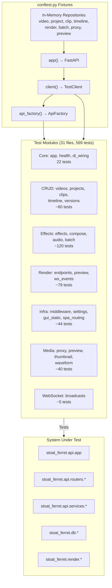

# C4 Code Level: Test Suite (tests/test_api)

## Overview

- **Name**: API Test Suite
- **Description**: Comprehensive integration and unit test suite for FastAPI application, covering all endpoints, middleware, WebSocket broadcasting, dependency injection, and system-level behaviors
- **Location**: tests/test_api/
- **Language**: Python
- **Purpose**: Validates FastAPI application factory, all HTTP endpoints, WebSocket events, middleware stack, DI wiring, and end-to-end workflows
- **Parent Component**: [Test Infrastructure](./c4-component-test-infrastructure.md)

## Code Elements

### Shared Test Infrastructure (conftest.py)

**Fixtures** (provide in-memory test doubles):
- video_repository() - AsyncInMemoryVideoRepository
- project_repository() - AsyncInMemoryProjectRepository
- clip_repository() - AsyncInMemoryClipRepository
- app() - FastAPI instance via parameter injection
- client() - TestClient with lifespan support
- api_factory() - Factory for HTTP-based test data

**Test Data Factory Classes**:
- ApiFactory - Wraps TestClient + VideoRepository
- _ApiProjectBuilder - Builder for projects via HTTP

## Test Files Summary

- test_app.py: 9 tests (app factory, lifespan)
- test_di_wiring.py: 7 tests (dependency injection)
- test_health.py: 6 tests (liveness, readiness)
- test_health_render.py: 12 tests + 5 classes (render health)
- test_videos.py: 16 tests (video CRUD, scanning)
- test_projects.py: 7 tests (project management)
- test_timeline.py: 13 tests (timeline CRUD)
- test_compose.py: 38 tests (layout presets)
- test_effects.py: 42 tests (effect discovery)
- test_audio.py: 23 tests (audio processing)
- test_clips.py: 4 tests (clip operations)
- test_batch.py: 15 tests (batch jobs)
- test_render_endpoints.py: 62 tests + 17 classes (render jobs)
- test_render_preview.py: 11 tests (command preview)
- test_render_ws_events.py: 6 tests + 10 classes (WebSocket events)
- test_websocket_broadcasts.py: 5 tests + 2 classes (broadcasting)
- test_middleware.py: 9 tests + 3 classes (middleware stack)
- test_gui_static.py: 5 tests + 1 class (static files)
- test_spa_routing.py: 9 tests + 5 classes (SPA routing)
- test_settings.py: 21 tests + 2 classes (settings)
- test_proxy.py: 6 classes (proxy operations)
- test_preview_endpoints.py: 7 classes (preview generation)
- test_preview_cache_endpoints.py: 3 classes (preview caching)
- test_thumbnail_endpoint.py: 1 test (thumbnails)
- test_thumbnail_strip_endpoints.py: 4 classes (thumbnail stripping)
- test_waveform_endpoints.py: 5 classes (waveform extraction)
- test_versions.py: 4 tests (metadata)
- test_filesystem.py: 12 tests (file operations)
- test_factory_api.py: 3 tests + 2 classes (factory patterns)

## Test Inventory

- **Total Tests**: 569 verified (pytest --co -q)
- **Test Files**: 31
- **Test Classes**: 72+
- **Test Functions**: 218+

## Dependencies

### Internal Dependencies
- stoat_ferret.api.app - FastAPI factory
- stoat_ferret.api.routers.* - Endpoint implementations
- stoat_ferret.api.middleware.* - Middleware stack
- stoat_ferret.api.websocket.* - WebSocket manager
- stoat_ferret.db.* - Repositories
- stoat_ferret.render.* - Render service
- stoat_ferret.effects.* - Effect registry
- tests.factories - Test data
- tests.test_repository_contract - Contract tests

### External Dependencies
- pytest - Test framework
- fastapi.testclient.TestClient - HTTP client
- unittest.mock - Mocking
- fastapi - Web framework
- stoat_ferret_core - Rust bindings

## Relationships

## Notes

- 569 verified tests via pytest --collect-only -q
- No dependency_overrides used (pure parameter injection)
- WebSocket tests use mock ConnectionManager
- Render tests include parity, pagination, filtering, lifecycle scenarios
