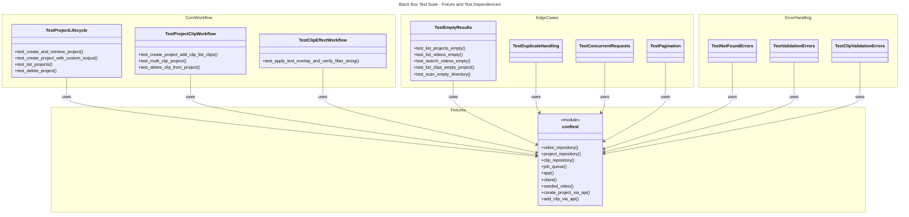

# C4 Code Level: tests/test_blackbox

## Overview

- **Name**: Black Box Test Suite
- **Description**: Complete REST API workflow tests exercising the full stack without FFmpeg or database dependencies
- **Location**: tests/test_blackbox/
- **Language**: Python
- **Purpose**: Validate end-to-end user workflows through REST API, including project lifecycle, clip management, and effects
- **Parent Component**: [Test Infrastructure](./c4-component-test-infrastructure.md)

## Code Elements

### Test Inventory

- **Total Tests**: 31 verified tests
- **Test Files**: 3 test files + 1 conftest

| File | Test Count | Description |
|------|-----------|-------------|
| test_core_workflow.py | 8 | Project lifecycle (create, retrieve, list, delete), clip workflow, effects |
| test_edge_cases.py | 10 | Empty results, duplicates, concurrent requests, pagination, search |
| test_error_handling.py | 13 | Not-found errors, validation errors, clip validation |

### Fixtures (conftest.py)

- `video_repository()` → AsyncInMemoryVideoRepository (line 26)
- `project_repository()` → AsyncInMemoryProjectRepository (line 31)
- `clip_repository()` → AsyncInMemoryClipRepository (line 37)
- `job_queue(video_repository)` → InMemoryJobQueue (line 43)
- `app(video_repository, project_repository, clip_repository, job_queue)` → FastAPI (line 51)
- `client(app)` → Generator[TestClient, None, None] (line 67)
- `seeded_video(video_repository)` → dict[str, Any] (line 74, async)

### Helper Functions (conftest.py)

- `create_project_via_api(client, name, **kwargs)` → dict[str, Any] (line 92)
  - Creates project via POST /api/v1/projects
- `add_clip_via_api(client, project_id, source_video_id, in_point, out_point, timeline_position)` → dict[str, Any] (line 111)
  - Adds clip to project via POST /api/v1/projects/{project_id}/clips

### Test Classes

**test_core_workflow.py**
- TestProjectLifecycle (4 tests): create, retrieve, list, delete projects
- TestProjectClipWorkflow (3 tests): full project→clip workflow
- TestClipEffectWorkflow (1 test): apply effects and verify filter storage

**test_edge_cases.py**
- TestEmptyResults (5 tests): empty list responses
- TestDuplicateHandling (2 tests): duplicate resource handling
- TestConcurrentRequests (2 tests): concurrent access via ThreadPoolExecutor
- TestPagination (1 test): paginated project listing

**test_error_handling.py**
- TestNotFoundErrors (6 tests): 404 responses
- TestValidationErrors (4 tests): 422/400 validation errors
- TestClipValidationErrors (3 tests): clip validation from Rust core

## Dependencies

### Internal Dependencies
- stoat_ferret.api.app.create_app
- stoat_ferret.api.services.scan (SCAN_JOB_TYPE, make_scan_handler)
- stoat_ferret.db.async_repository.AsyncInMemoryVideoRepository
- stoat_ferret.db.clip_repository.AsyncInMemoryClipRepository
- stoat_ferret.db.project_repository.AsyncInMemoryProjectRepository
- stoat_ferret.jobs.queue.InMemoryJobQueue
- tests.factories.make_test_video

### External Dependencies
- pytest
- fastapi.FastAPI, fastapi.testclient.TestClient
- concurrent.futures.ThreadPoolExecutor

## Relationships

## Notes

- All tests marked with `pytest.mark.blackbox` for selective execution
- Complete isolation via in-memory test doubles (no FFmpeg, no SQLite)
- All interaction through REST HTTP API only
- Concurrent tests use ThreadPoolExecutor for thread-based access patterns
