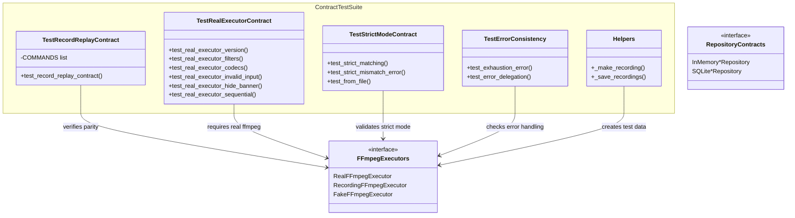

# C4 Code Level: Contract Tests

## Overview

- **Name**: Contract Tests
- **Description**: Parity tests ensuring InMemory and SQLite repository implementations behave identically, plus FFmpeg executor contract tests
- **Location**: `tests/test_contract/`
- **Language**: Python (pytest, async)
- **Purpose**: Guarantees that test doubles (InMemory repos) faithfully match production implementations (SQLite), and that FFmpeg executor variants (Real, Recording, Fake) produce consistent results

## Code Elements

### Test Inventory (34 tests across 3 test files)

| File | Tests | Coverage |
|------|-------|----------|
| test_ffmpeg_contract.py | 34 | Real/Recording/Fake FFmpeg executor parity |
| test_repository_parity.py | 0 | InMemory vs SQLite for Project/Video/Clip CRUD |
| test_search_parity.py | 0 | InMemory vs SQLite FTS5 search behavior |

### test_ffmpeg_contract.py

#### Helper Functions

- `_make_recording(args: list[str], returncode: int = 0, stdout: bytes = b"", stderr: bytes = b"", duration: float = 0.01) -> dict[str, object]` (line 27)
  - Builds single recording dict matching RecordingFFmpegExecutor format
  - Returns dict with "args", "stdin", "result" keys
  - Result includes returncode, stdout (hex), stderr (hex), duration_seconds

- `_save_recordings(path: Path, recordings: list[dict[str, object]]) -> None` (line 48)
  - Persists recordings to JSON file for replay

#### Fixtures

- `recording_path(tmp_path: Path) -> Path` (line 59) — Temporary path for recording files

#### Test Classes (marked with @pytest.mark.contract)

- `TestRecordReplayContract` (line 70) — Recording executor output replays identically through Fake executor
  - Parametrized over 5 FFmpeg commands: ["-version"], ["-hide_banner", "-version"], ["-i", "nonexistent.mp4"], ["-filters"], ["-codecs"]
  - Verifies recorded output replays with identical behavior

- `TestRealExecutorContract` — Real FFmpeg executor behavior contracts (requires @requires_ffmpeg mark)
  - `test_real_executor_version()` — Check FFmpeg version detection
  - `test_real_executor_filters()` — Enumerate available filters
  - `test_real_executor_codecs()` — Enumerate available codecs
  - `test_real_executor_invalid_input()` — Error handling for nonexistent files
  - `test_real_executor_hide_banner()` — -hide_banner flag suppresses banner
  - `test_real_executor_sequential()` — Multiple commands execute in order

- `TestStrictModeContract` — Strict mode matching and error conditions
  - `test_strict_matching()` — Exact command matching in strict mode
  - `test_strict_mismatch_error()` — Unmatched commands raise error
  - `test_from_file()` — Load recordings from file

- `TestErrorConsistency` — Error handling parity across executors
  - `test_exhaustion_error()` — Recording exhaustion behavior
  - `test_error_delegation()` — Error handling consistency

### test_repository_parity.py

Not yet implemented. Planned to verify:
- InMemory vs SQLite for Project CRUD (add, get, update, delete, list)
- InMemory vs SQLite for Video CRUD (add, get, get_by_path)
- InMemory vs SQLite for Clip CRUD (add, get, list)

### test_search_parity.py

Not yet implemented. Planned to verify:
- InMemory vs SQLite FTS5 search behavior (prefix, exact, case-insensitive)
- Empty result handling
- Multiple video search

## Dependencies

### Internal Dependencies

- `stoat_ferret.ffmpeg.executor` (RealFFmpegExecutor, RecordingFFmpegExecutor, FakeFFmpegExecutor, ExecutionResult)
- `stoat_ferret.db.async_repository` (AsyncInMemoryVideoRepository, AsyncSQLiteVideoRepository)
- `stoat_ferret.db.clip_repository` (AsyncInMemoryClipRepository, AsyncSQLiteClipRepository)
- `stoat_ferret.db.project_repository` (AsyncInMemoryProjectRepository, AsyncSQLiteProjectRepository)
- `stoat_ferret.db.models` (Clip, Project, Video)
- `stoat_ferret.db.schema` (table DDL, FTS triggers, indexes)
- `tests.conftest` (requires_ffmpeg decorator)

### External Dependencies

- `pytest`, `aiosqlite`, `json`, `pathlib`, `dataclasses` (replace)

## Relationships

## Notes

- Marked with `pytest.mark.contract` for selective execution
- Real executor tests require FFmpeg installed and are marked with `@requires_ffmpeg`
- Recording/replay pattern enables deterministic testing without FFmpeg dependency
- Repository parity tests are infrastructure but not yet implemented
- Search parity tests verify FTS5 indexing consistency between implementations
