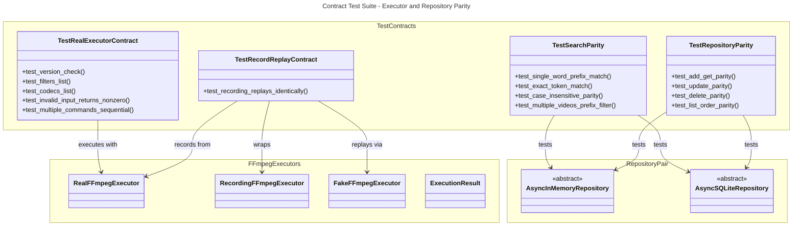

# C4 Code Level: tests/test_contract

## Overview

- **Name**: Contract Test Suite
- **Description**: Parity tests verifying InMemory/SQLite repository equivalence and FFmpeg executor behavior consistency
- **Location**: tests/test_contract/
- **Language**: Python
- **Purpose**: Guarantee test doubles match production implementations and FFmpeg executor variants produce identical results
- **Parent Component**: [Test Infrastructure](./c4-component-test-infrastructure.md)

## Code Elements

### Test Inventory

- **Total Tests**: 69 verified tests
- **Test Files**: 5 test files + 1 __init__.py

| File | Test Count | Description |
|------|-----------|-------------|
| test_ffmpeg_contract.py | 25 | FFmpeg executor parity (recording/replay, real, strict, drawtext, speed, audio, transition, overlay) |
| test_composition_contract.py | 3 | Composition graph and audio mix filter contracts with real FFmpeg |
| test_preview_contract.py | 9 | HLS, filter simplification, thumbnail, waveform generation |
| test_repository_parity.py | 17 | InMemory vs SQLite video/project/clip CRUD and ordering |
| test_search_parity.py | 15 | InMemory vs SQLite FTS5 search parity |

### test_ffmpeg_contract.py (25 tests)

**Test Classes**
- TestRecordReplayContract (5 tests) - Recording executor replays identically via Fake
- TestRealExecutorContract (5 tests) - Real FFmpeg executor behavior (requires_ffmpeg)
- TestStrictModeContract (7 tests) - Strict mode argument verification
- TestDrawtextContract (5 tests) - DrawtextBuilder output validity (requires_ffmpeg)
- TestSpeedControlContract (3 tests) - SpeedControl filters (requires_ffmpeg)
- TestAudioBuilderContract (5 tests) - VolumeBuilder, AfadeBuilder, AmixBuilder (requires_ffmpeg)
- TestTransitionContract (4 tests) - XfadeBuilder, AcrossfadeBuilder (requires_ffmpeg)
- TestErrorConsistency (3 tests) - Error handling across executor types
- TestOverlayScaleContract (3 tests) - Overlay and scale filters (requires_ffmpeg)

**Helper Functions**
- `_make_recording(args, returncode, stdout, stderr, duration)` → dict (line 27)
- `_save_recordings(path, recordings)` → None (line 48)

**Fixtures**
- `recording_path(tmp_path)` → Path (line 59)

### test_composition_contract.py (3 tests)

**Test Classes**
- TestOverlayFilterContract (2 tests) - build_overlay_filter output validity (requires_ffmpeg)
- TestCompositionGraphContract (2 tests) - build_composition_graph output validity (requires_ffmpeg)
- TestAudioMixContract (2 tests) - AudioMixSpec.build_filter_chain() validity (requires_ffmpeg)

### test_preview_contract.py (9 tests)

**Test Classes**
- TestHLSGenerationContract (2 tests) - HLS manifest and segment generation (requires_ffmpeg)
- TestSimplifiedFilterChainContract (2 tests) - Rust filter simplification (requires_ffmpeg)
- TestThumbnailStripContract (1 test) - Sprite sheet generation (requires_ffmpeg)
- TestWaveformContract (2 tests) - Waveform PNG generation (requires_ffmpeg)

**Helper Functions**
- `_read_jpeg_dimensions(data)` → tuple[int, int] (line 264)
- `_read_png_dimensions(data)` → tuple[int, int] (line 299)

### test_repository_parity.py (17 tests)

**Helper Functions**
- `create_all_tables(conn)` → None (line 49, async)
- `make_project(**kwargs)` → Project (line 71)
- `make_video(**kwargs)` → Video (line 87)
- `make_clip(**kwargs)` → Clip (line 109)

**Fixtures**
- `sqlite_conn()` → AsyncGenerator[aiosqlite.Connection, None] (line 126)

**Test Classes**
- TestProjectParity (4 tests) - InMemory vs SQLite project CRUD
- TestVideoParity (2 tests) - InMemory vs SQLite video CRUD
- TestClipParity (2 tests) - InMemory vs SQLite clip CRUD

### test_search_parity.py (15 tests)

**Helper Functions**
- `_create_video_tables(conn)` → None (line 30, async)
- `_make_video(**kwargs)` → Video (line 41)

**Fixtures**
- `search_repos()` → AsyncGenerator[tuple[...], None] (line 64)

**Test Classes**
- TestSearchParity (9 tests) - InMemory vs SQLite FTS5 search behavior

## Dependencies

### Internal Dependencies
- stoat_ferret.ffmpeg.executor (RealFFmpegExecutor, RecordingFFmpegExecutor, FakeFFmpegExecutor, ExecutionResult)
- stoat_ferret_core (DrawtextBuilder, SpeedControl, LayoutPosition, CompositionClip, AudioMixSpec, Filter, FilterGraph, etc.)
- stoat_ferret.api.services.thumbnail, waveform
- stoat_ferret.preview.hls_generator
- stoat_ferret.db.async_repository (AsyncInMemoryVideoRepository, AsyncSQLiteVideoRepository)
- stoat_ferret.db.clip_repository (AsyncInMemoryClipRepository, AsyncSQLiteClipRepository)
- stoat_ferret.db.project_repository (AsyncInMemoryProjectRepository, AsyncSQLiteProjectRepository)
- stoat_ferret.db.models (Video, Project, Clip)
- stoat_ferret.db.schema (DDL, FTS, indexes)
- tests.conftest (requires_ffmpeg)
- tests.test_executor (MockExecutor)

### External Dependencies
- pytest, aiosqlite, json, struct, pathlib, dataclasses

## Relationships

```mermaid
---
title: Contract Test Suite - Executor and Repository Parity
---
classDiagram
    namespace FFmpegExecutors {
        class RealFFmpegExecutor
        class RecordingFFmpegExecutor
        class FakeFFmpegExecutor
        class ExecutionResult
    }

    namespace RepositoryPair {
        class AsyncInMemoryRepository {
            <<abstract>>
        }
        class AsyncSQLiteRepository {
            <<abstract>>
        }
    }

    namespace TestContracts {
        class TestRecordReplayContract {
            +test_recording_replays_identically()
        }
        class TestRealExecutorContract {
            +test_version_check()
            +test_filters_list()
            +test_codecs_list()
            +test_invalid_input_returns_nonzero()
            +test_multiple_commands_sequential()
        }
        class TestRepositoryParity {
            +test_add_get_parity()
            +test_update_parity()
            +test_delete_parity()
            +test_list_order_parity()
        }
        class TestSearchParity {
            +test_single_word_prefix_match()
            +test_exact_token_match()
            +test_case_insensitive_parity()
            +test_multiple_videos_prefix_filter()
        }
    }

    TestRecordReplayContract --> RealFFmpegExecutor : records from
    TestRecordReplayContract --> RecordingFFmpegExecutor : wraps
    TestRecordReplayContract --> FakeFFmpegExecutor : replays via
    TestRealExecutorContract --> RealFFmpegExecutor : executes with
    TestRepositoryParity --> AsyncInMemoryRepository : tests
    TestRepositoryParity --> AsyncSQLiteRepository : tests
    TestSearchParity --> AsyncInMemoryRepository : tests
    TestSearchParity --> AsyncSQLiteRepository : tests
```

## Notes

- All tests marked with `pytest.mark.contract` for selective execution
- FFmpeg-dependent tests marked with `@requires_ffmpeg` and skipped if FFmpeg unavailable
- Recording/replay pattern enables deterministic testing without FFmpeg dependency
- Repository parity verifies deepcopy isolation and seed behavior consistency
- Search parity tests verify FTS5 full-text search consistency
