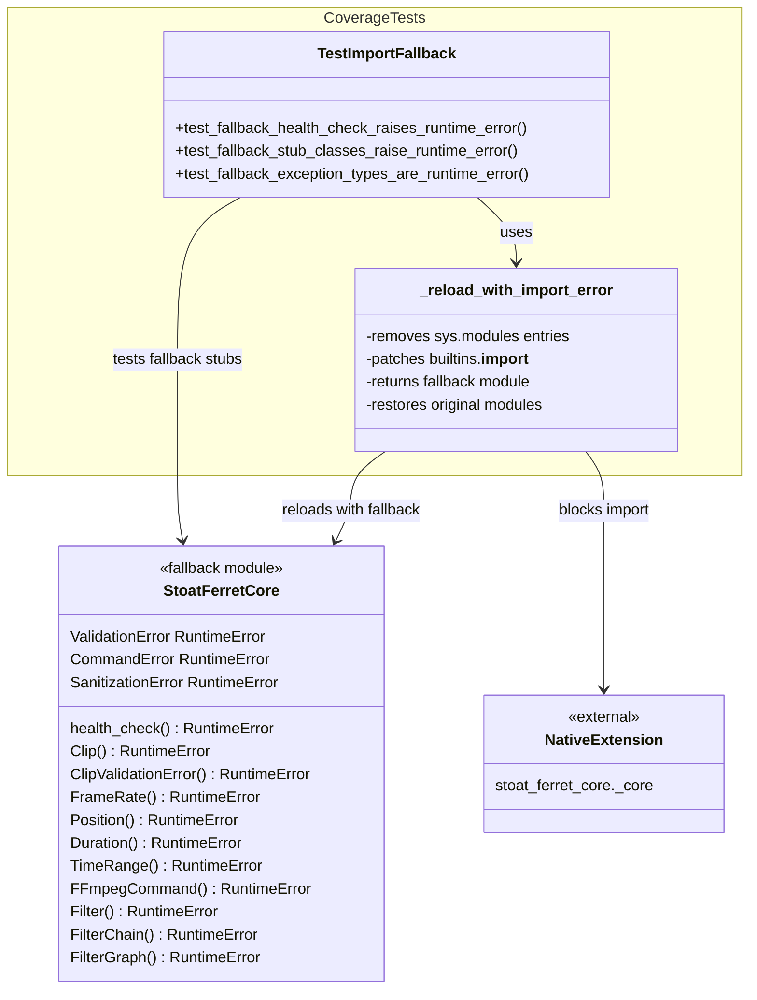

# C4 Code Level: Coverage Tests

## Overview

- **Name**: Coverage Tests
- **Description**: Tests for import fallback paths ensuring the package degrades gracefully when the Rust native extension is not built
- **Location**: `tests/test_coverage/`
- **Language**: Python (pytest)
- **Purpose**: Verifies that stoat_ferret_core provides informative RuntimeError stubs when the native _core extension is unavailable

## Code Elements

### Test Inventory (6 tests in 1 test file)

| File | Tests | Coverage |
|------|-------|----------|
| test_import_fallback.py | 6 | stoat_ferret_core fallback stubs on ImportError |

### test_import_fallback.py

#### Helper Function

- `_reload_with_import_error() -> module` (line 16)
  - Temporarily removes stoat_ferret_core modules from sys.modules
  - Patches builtins.__import__ to raise ImportError for _core extension
  - Returns reloaded module with fallback stubs active
  - Restores original modules in finally block for test isolation
  - Returns: Reloaded stoat_ferret_core module with fallback behavior

#### Test Class: TestImportFallback

- `test_fallback_health_check_raises_runtime_error(self) -> None` (line 55)
  - Verifies health_check() raises RuntimeError("native extension not built")
  - Tests that the public health check function properly reflects missing extension

- `test_fallback_stub_classes_raise_runtime_error(self) -> None` (line 61)
  - Tests 10 stub class definitions raise RuntimeError when instantiated
  - Classes tested: Clip, ClipValidationError, FrameRate, Position, Duration, TimeRange, FFmpegCommand, Filter, FilterChain, FilterGraph
  - Each class must raise RuntimeError with message containing "native extension not built"

- `test_fallback_exception_types_are_runtime_error(self) -> None` (line 82)
  - Verifies exception type aliases resolve to RuntimeError
  - Checks: ValidationError is RuntimeError
  - Checks: CommandError is RuntimeError
  - Checks: SanitizationError is RuntimeError

## Dependencies

### Internal Dependencies

- `stoat_ferret_core` — The fallback import path being tested
  - Tested class exports: Clip, ClipValidationError, FrameRate, Position, Duration, TimeRange, FFmpegCommand, Filter, FilterChain, FilterGraph
  - Tested functions: health_check()
  - Tested exception types: ValidationError, CommandError, SanitizationError

### External Dependencies

- `pytest` — Test framework
- `importlib` — Module reloading (importlib.reload)
- `sys` — sys.modules manipulation for cache control
- `unittest.mock` (patch) — Import patching

## Relationships

## Notes

- Tests verify graceful degradation when Rust native extension is not built
- Import fallback is critical for development environments and cross-platform support
- The _reload_with_import_error helper provides complete isolation to prevent test pollution
- All fallback stubs are RuntimeError functions/classes with informative message
- sys.modules manipulation in finally block ensures proper test cleanup
