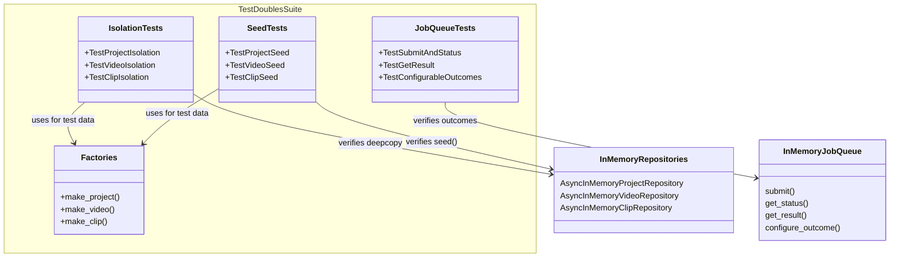

# C4 Code Level: Test Doubles Tests

## Overview

- **Name**: Test Doubles Tests
- **Description**: Tests for in-memory test doubles verifying deepcopy isolation, job queue behavior, and seed helper functionality
- **Location**: `tests/test_doubles/`
- **Language**: Python (pytest, async)
- **Purpose**: Ensures in-memory repository implementations provide proper data isolation (deepcopy on read/write) and that InMemoryJobQueue supports configurable outcomes for testing

## Code Elements

### Test Inventory (29 test methods across 3 test files)

| File | Tests | Coverage |
|------|-------|----------|
| test_inmemory_isolation.py | 10 | Deepcopy isolation for Project/Video/Clip repos |
| test_inmemory_job_queue.py | 11 | InMemoryJobQueue submit, status, configurable outcomes |
| test_seed_helpers.py | 8 | seed() method for all 3 repository types |

### test_inmemory_isolation.py

#### Factory Helpers (lines 16-68)

- `make_project(**kwargs: object) -> Project` (line 16)
  - Creates test project with default values
  - Defaults: id (new), name, dimensions (1920x1080), fps (30), timestamps

- `make_video(**kwargs: object) -> Video` (line 32)
  - Creates test video with default values
  - Defaults: id, path, filename, duration_frames (1000), frame_rate (24/1), dimensions (1920x1080), h264, file_size (1MB), timestamps

- `make_clip(**kwargs: object) -> Clip` (line 54)
  - Creates test clip with default values
  - Defaults: id, project_id, source_video_id, in/out points, timeline position, timestamps

#### Test Classes

- `TestProjectIsolation` (line 71) — Deepcopy isolation for AsyncInMemoryProjectRepository
  - `test_get_returns_isolated_copy()` — Mutating returned project doesn't affect store
  - `test_add_returns_isolated_copy()` — Mutating add() result doesn't affect store
  - `test_add_isolates_from_caller()` — Mutating original after add() doesn't affect store
  - `test_list_returns_isolated_copies()` — Mutating list() results doesn't affect store
  - `test_update_returns_isolated_copy()` — Mutating update() result doesn't affect store

- `TestVideoIsolation` (line 115) — Deepcopy isolation for AsyncInMemoryVideoRepository
  - `test_get_returns_isolated_copy()` — Mutating returned video doesn't affect store
  - `test_list_returns_isolated_copies()` — Mutating list() results doesn't affect store
  - `test_search_returns_isolated_copies()` — Mutating search() results doesn't affect store

- `TestClipIsolation` (line 155) — Deepcopy isolation for AsyncInMemoryClipRepository
  - `test_get_returns_isolated_copy()` — Mutating returned clip doesn't affect store
  - `test_list_by_project_returns_isolated_copies()` — Mutating list_by_project() results doesn't affect store

### test_inmemory_job_queue.py

#### Test Classes

- `TestSubmitAndStatus` (line 13) — Basic job lifecycle
  - `test_submit_returns_job_id()` — submit() returns unique string ID (async)
  - `test_submit_generates_unique_ids()` — Each submit() call generates different ID (async)
  - `test_default_outcome_is_complete()` — Jobs complete successfully by default (async)

- `TestGetResult` (line 38) — Job result retrieval
  - `test_successful_result()` — COMPLETE status with result (async)
  - `test_custom_success_result()` — Configured success outcome returned (async)
  - `test_get_result_unknown_job_raises()` — KeyError for nonexistent job (async)
  - `test_get_status_unknown_job_raises()` — KeyError for nonexistent job status (async)

- `TestConfigurableOutcomes` (line 75) — Configure job outcomes for testing
  - `test_failure_outcome()` — FAILED status with error message (async)
  - `test_timeout_outcome()` — TIMEOUT status without result/error (async)
  - `test_different_types_per_job_type()` — Different job types get different outcomes (async)
  - `test_default_change()` — Global default outcome can be changed (async)

### test_seed_helpers.py

#### Factory Helpers (lines 16-68)

- `make_project(**kwargs: object) -> Project` (line 16) — Same as test_inmemory_isolation.py
- `make_video(**kwargs: object) -> Video` (line 32) — Same as test_inmemory_isolation.py
- `make_clip(**kwargs: object) -> Clip` (line 54) — Same as test_inmemory_isolation.py

#### Test Classes

- `TestProjectSeed` (line 71) — seed() method for AsyncInMemoryProjectRepository
  - `test_seed_populates_data()` — Seeded projects are retrievable (async)
  - `test_seed_isolates_from_source()` — Mutating seed source doesn't affect store (async)
  - `test_seed_appears_in_list()` — Seeded projects appear in list_projects() (async)

- `TestVideoSeed` (line 102) — seed() method for AsyncInMemoryVideoRepository
  - `test_seed_by_id_populates_data()` — Seeded videos retrievable by ID (async)
  - `test_seed_by_path_populates_data()` — Seeded videos retrievable by path (async)

- `TestClipSeed` (line 125) — seed() method for AsyncInMemoryClipRepository
  - `test_seed_populates_data()` — Seeded clips are retrievable (async)
  - `test_seed_isolates_from_source()` — Mutating seed source doesn't affect store (async)
  - `test_seed_appears_in_list_by_project()` — Seeded clips appear in list_by_project() (async)

## Dependencies

### Internal Dependencies

- `stoat_ferret.db.async_repository` (AsyncInMemoryVideoRepository)
- `stoat_ferret.db.clip_repository` (AsyncInMemoryClipRepository)
- `stoat_ferret.db.project_repository` (AsyncInMemoryProjectRepository)
- `stoat_ferret.db.models` (Clip, Project, Video)
- `stoat_ferret.jobs.queue` (InMemoryJobQueue, JobOutcome, JobStatus)

### External Dependencies

- `pytest` — Test framework
- `datetime` (datetime, timezone) — Timestamp generation

## Relationships

## Notes

- All tests use async methods (pytest-asyncio with asyncio_mode = "auto")
- Deepcopy isolation is critical to prevent test pollution and ensure proper encapsulation
- InMemoryJobQueue.configure_outcome() enables deterministic testing of job status paths
- seed() methods provide rapid test data population with full isolation guarantees
- Factory helpers reduce boilerplate and maintain consistent default values across all test files
