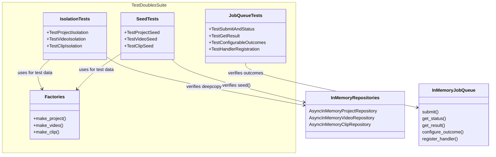

# C4 Code Level: Test Doubles Tests

## Overview

- **Name**: Test Doubles Tests
- **Description**: Tests for in-memory test doubles verifying deepcopy isolation, job queue behavior, and seed helper functionality
- **Location**: `tests/test_doubles/`
- **Language**: Python (pytest, async)
- **Purpose**: Ensures in-memory repository implementations provide proper data isolation (deepcopy on read/write) and that InMemoryJobQueue supports configurable outcomes for testing
- **Parent Component**: [Test Infrastructure](./c4-component-test-infrastructure.md)

## Code Elements

### Test Inventory (33 tests across 3 test files)

| File | Tests | Coverage |
|------|-------|----------|
| test_inmemory_isolation.py | 10 | Deepcopy isolation for Project/Video/Clip repos |
| test_inmemory_job_queue.py | 15 | InMemoryJobQueue submit, status, configurable outcomes, handler registration |
| test_seed_helpers.py | 8 | seed() method for all 3 repository types |

### test_inmemory_isolation.py

#### Factory Helpers (lines 16-68)

- `make_project(**kwargs: object) -> Project` -- Creates test project with defaults
- `make_video(**kwargs: object) -> Video` -- Creates test video with defaults
- `make_clip(**kwargs: object) -> Clip` -- Creates test clip with defaults

#### Test Classes

- `TestProjectIsolation` -- Deepcopy isolation for AsyncInMemoryProjectRepository
  - `test_get_returns_isolated_copy()` -- Mutating returned project doesn't affect store
  - `test_add_returns_isolated_copy()` -- Mutating add() result doesn't affect store
  - `test_add_isolates_from_caller()` -- Mutating original after add() doesn't affect store
  - `test_list_returns_isolated_copies()` -- Mutating list() results doesn't affect store
  - `test_update_returns_isolated_copy()` -- Mutating update() result doesn't affect store

- `TestVideoIsolation` -- Deepcopy isolation for AsyncInMemoryVideoRepository
  - `test_get_returns_isolated_copy()` -- Mutating returned video doesn't affect store
  - `test_list_returns_isolated_copies()` -- Mutating list() results doesn't affect store
  - `test_search_returns_isolated_copies()` -- Mutating search() results doesn't affect store

- `TestClipIsolation` -- Deepcopy isolation for AsyncInMemoryClipRepository
  - `test_get_returns_isolated_copy()` -- Mutating returned clip doesn't affect store
  - `test_list_by_project_returns_isolated_copies()` -- Mutating list_by_project() results doesn't affect store

### test_inmemory_job_queue.py

#### Test Classes

- `TestSubmitAndStatus` -- Basic job lifecycle
  - `test_submit_returns_job_id()`, `test_submit_generates_unique_ids()`, `test_default_outcome_is_complete()`

- `TestGetResult` -- Job result retrieval
  - `test_successful_result()`, `test_custom_success_result()`, `test_get_result_unknown_job_raises()`, `test_get_status_unknown_job_raises()`

- `TestConfigurableOutcomes` -- Configure job outcomes for testing
  - `test_failure_outcome()`, `test_timeout_outcome()`, `test_different_types_per_job_type()`, `test_default_change()`

- `TestHandlerRegistration` -- Handler execution at submit time
  - Tests for handler-based execution, handler errors, and priority over configured outcomes

### test_seed_helpers.py

#### Test Classes

- `TestProjectSeed` -- seed() method for AsyncInMemoryProjectRepository (3 tests)
- `TestVideoSeed` -- seed() method for AsyncInMemoryVideoRepository (2 tests)
- `TestClipSeed` -- seed() method for AsyncInMemoryClipRepository (3 tests)

## Dependencies

### Internal Dependencies

- `stoat_ferret.db.async_repository` (AsyncInMemoryVideoRepository)
- `stoat_ferret.db.clip_repository` (AsyncInMemoryClipRepository)
- `stoat_ferret.db.project_repository` (AsyncInMemoryProjectRepository)
- `stoat_ferret.db.models` (Clip, Project, Video)
- `stoat_ferret.jobs.queue` (InMemoryJobQueue, JobOutcome, JobStatus)

### External Dependencies

- `pytest` -- Test framework
- `datetime` (datetime, timezone) -- Timestamp generation

## Relationships

## Notes

- All tests use async methods (pytest-asyncio with asyncio_mode = "auto")
- Deepcopy isolation is critical to prevent test pollution and ensure proper encapsulation
- InMemoryJobQueue.configure_outcome() enables deterministic testing of job status paths
- seed() methods provide rapid test data population with full isolation guarantees
- Factory helpers reduce boilerplate and maintain consistent default values across all test files
