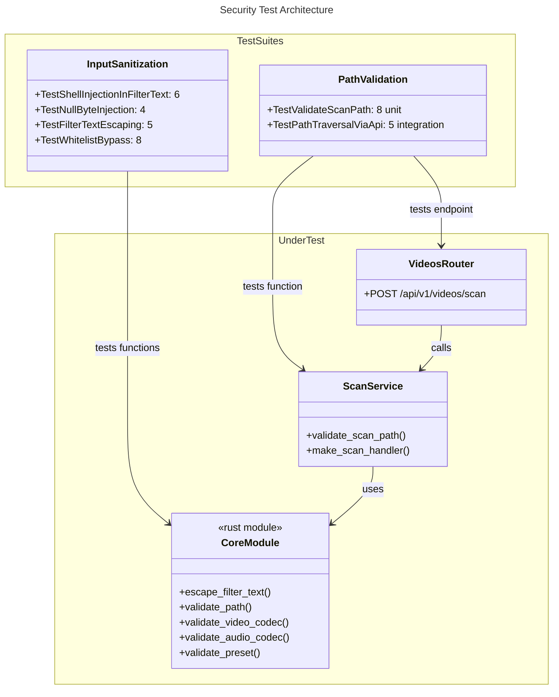

# C4 Code Level: Security Tests

## Overview

- **Name**: Security Tests
- **Description**: Security-focused tests for input sanitization, path validation, and scan root restrictions
- **Location**: [tests/test_security/](../../tests/test_security/)
- **Language**: Python (pytest, async)
- **Purpose**: Validates defense against shell injection, null byte injection, FFmpeg filter syntax injection, whitelist bypass, path traversal attacks, and scan root enforcement

## Code Elements

### Test Inventory

| File | Tests | Coverage |
|------|-------|----------|
| test_input_sanitization.py | 19 | escape_filter_text, validate_* functions |
| test_path_validation.py | 8 | validate_scan_path unit tests |
| **API Integration** | 5 | Path traversal via POST /api/v1/videos/scan |
| **Total** | **32** | **Security infrastructure** |

### test_input_sanitization.py

#### Test Classes

**TestShellInjectionInFilterText** (6 tests, lines 23-60)
- `test_backtick_command_substitution()` — Backticks safely pass through (no shell context)
- `test_dollar_paren_command_substitution()` — $() not dangerous in FFmpeg filter context
- `test_pipe_injection()` — Pipe character safely passes through (not FFmpeg-special)
- `test_semicolon_is_escaped()` — Semicolons escaped (separate FFmpeg filter chains)
- `test_newline_injection()` — Newlines escaped to prevent filter string breakout
- `test_carriage_return_injection()` — Carriage returns escaped

**TestNullByteInjection** (4 tests, lines 62-84)
- `test_null_byte_mid_path()` — Null byte in middle of path rejected
- `test_null_byte_at_start()` — Null byte at path start rejected
- `test_null_byte_at_end()` — Null byte at path end rejected
- `test_empty_path_rejected()` — Empty string paths rejected

**TestFilterTextEscaping** (5 tests, lines 86-115)
- `test_colon_escaped()` — Colons escaped (FFmpeg parameter separator)
- `test_brackets_escaped()` — Square brackets escaped (FFmpeg stream labels)
- `test_backslash_escaped()` — Backslashes double-escaped
- `test_single_quote_escaped()` — Single quotes use shell-style escaping
- `test_combined_injection()` — Multiple special chars escaped correctly

**TestWhitelistBypass** (8 tests, lines 117-159)
- `test_video_codec_injection()` — Command injection in video codec rejected
- `test_video_codec_command_substitution()` — Command substitution rejected
- `test_video_codec_case_bypass()` — Case variation (LIBX264) rejected
- `test_audio_codec_injection()` — Injection in audio codec rejected
- `test_audio_codec_with_spaces()` — Trailing spaces rejected
- `test_preset_injection()` — Injection in preset rejected
- `test_preset_case_bypass()` — Case variation in preset rejected
- `test_preset_with_null_byte()` — Null bytes in preset rejected

#### Source Functions Under Test
- `stoat_ferret_core.escape_filter_text(text: str) -> str` — Escapes FFmpeg filter-special characters
- `stoat_ferret_core.validate_path(path: str) -> None` — Rejects null bytes and empty paths
- `stoat_ferret_core.validate_video_codec(codec: str) -> None` — Whitelist validation
- `stoat_ferret_core.validate_audio_codec(codec: str) -> None` — Whitelist validation
- `stoat_ferret_core.validate_preset(preset: str) -> None` — Whitelist validation

### test_path_validation.py

#### Unit Tests

**TestValidateScanPath** (8 tests, lines 22-89)
- `test_empty_allowlist_permits_all()` — Empty allowlist permits any path
- `test_path_under_allowed_root()` — Path under allowed root is permitted
- `test_path_not_under_any_root()` — Path outside roots rejected with error
- `test_exact_root_is_allowed()` — Root directory itself is valid target
- `test_multiple_roots()` — Path matching any multiple root is permitted
- `test_traversal_outside_root_is_blocked()` — ../ escapes blocked
- `test_traversal_back_slash_blocked()` — ..\ escapes blocked
- `test_symlink_resolved_against_root()` — Symlinks resolved before checking (skipped on Windows)

#### Integration Tests

**TestPathTraversalViaApi** (5 tests, lines 91-146)
- `test_traversal_relative_path()` — Relative ../../../etc traversal rejected
- `test_null_byte_in_path()` — Null byte in path rejected with 400 status
- `test_traversal_with_allowed_roots()` — Path outside roots returns 403 error
- `test_allowed_root_permits_scan()` — Valid path under allowed root returns 202
- `test_traversal_encoded_dots()` — URL-encoded traversal sequences rejected

#### Source Functions Under Test
- `stoat_ferret.api.services.scan.validate_scan_path(path: str, allowed_roots: list[str]) -> str | None`
- `POST /api/v1/videos/scan` endpoint integration

## Dependencies

### Internal Dependencies
- `stoat_ferret_core` (Rust PyO3 bindings for sanitization and validation)
- `stoat_ferret.api.services.scan` (validate_scan_path, SCAN_JOB_TYPE)
- `stoat_ferret.api.app` (create_app)
- `stoat_ferret.api.routers.videos` (scan endpoint)
- `stoat_ferret.db` repositories (video, project, clip)
- `stoat_ferret.jobs.queue` (InMemoryJobQueue)

### External Dependencies
- pytest
- fastapi (TestClient)
- unittest.mock (patch)
- sys (platform detection for symlink tests)

## Relationships

## Notes

- **Threat Model**: Tests defend against shell injection, FFmpeg filter injection, path traversal, null byte injection, and whitelist bypass
- **Escaping Strategy**: FFmpeg-specific escaping (colons, brackets, semicolons) differs from shell escaping
- **Whitelist Approach**: Codecs and presets validated against hardcoded allowlist, not blacklist
- **Path Resolution**: Symlinks and ../ sequences resolved to canonical paths before validation
- **Integration Layer**: API tests patch get_settings() to test with/without allowed_scan_roots
