# C4 Code Level: Unit Tests

## Overview

- **Name**: Unit Tests - Preview, Proxy, Cache, and WebSocket
- **Description**: Unit tests for preview session lifecycle, proxy management, cache operations, health checks, structured logging, metrics, and WebSocket progress callbacks
- **Location**: `tests/unit`
- **Language**: Python (pytest, asyncio)
- **Purpose**: Verify preview/proxy subsystem behavior, graceful shutdown, health monitoring, structured logging, Prometheus metrics, and real-time progress updates
- **Parent Component**: [Test Infrastructure](./c4-component-test-infrastructure.md)

## Code Elements

### Test Inventory

| File | Test Count | Focus Area |
|------|-----------|-----------|
| test_graceful_shutdown.py | 11 | FFmpeg subprocess management, degradation, graceful shutdown |
| test_health_preview.py | 17 | Preview health checks, cache status, readiness endpoint |
| test_preview_logging.py | 20 | Structured logging events, correlation IDs, logging conventions |
| test_preview_metrics.py | 26 | Prometheus metric definitions, instrumentation, lifecycle |
| test_websocket_progress.py | 9 | Progress callbacks, throttling, WebSocket broadcasting |
| **Total** | **83** | **Preview subsystem verification** |

### test_graceful_shutdown.py (11 tests)

**TestStdinPipe** (1 test)
- `test_real_executor_uses_stdin_pipe()` — FFmpeg subprocess created with stdin=PIPE

**TestDegradation** (6 tests)
- `test_app_starts_without_ffmpeg()` — App starts without FFmpeg, serves non-preview endpoints
- `test_start_preview_returns_503_without_ffmpeg()` — Preview start returns 503 FFMPEG_UNAVAILABLE
- `test_seek_preview_returns_503_without_ffmpeg()` — Preview seek returns 503 FFMPEG_UNAVAILABLE
- `test_preview_endpoints_work_when_ffmpeg_available()` — Preview endpoints proceed normally with FFmpeg
- `test_proxy_auto_queue_skipped_without_ffmpeg()` — Scan completes without proxy generation when FFmpeg unavailable
- `test_non_preview_endpoints_unaffected()` — Non-preview endpoints remain available without FFmpeg

**TestGracefulShutdown** (4 tests)
- `test_cancel_all_no_active_sessions()` — cancel_all() works when no sessions active
- `test_cancel_all_cancels_active_tasks()` — Active FFmpeg processes terminated on shutdown
- `test_cancel_all_cleans_up_temp_files()` — Temporary preview segment files cleaned up
- `test_cancel_all_completes_within_timeout()` — Shutdown completes within 10 seconds

### test_health_preview.py (17 tests)

**TestCheckPreview** (6 tests)
- `test_returns_ok_when_no_preview_cache()` — Returns ok defaults when cache not configured
- `test_returns_ok_when_cache_below_threshold()` — Cache under 90% reports ok
- `test_returns_degraded_when_cache_above_threshold()` — Cache over 90% reports degraded
- `test_returns_ok_at_exactly_threshold()` — Cache at exactly 90% is ok (threshold >90%)
- `test_returns_degraded_on_exception()` — Exception in cache status reports degraded
- `test_response_structure()` — All required fields present in response

**TestCheckProxy** (7 tests)
- `test_returns_ok_when_no_proxy_service()` — Returns ok defaults when proxy_service not configured
- `test_returns_ok_when_dir_writable()` — Writable proxy dir with zero pending reports ok
- `test_returns_degraded_when_dir_not_writable()` — Non-writable proxy dir reports degraded
- `test_counts_pending_and_generating()` — Pending proxies sums PENDING + GENERATING statuses
- `test_returns_degraded_on_exception()` — Exception in proxy check reports degraded
- `test_response_structure()` — All required fields present in response

**TestReadinessWithPreviewProxy** (4 tests)
- `test_readiness_includes_preview_and_proxy_keys()` — Response contains preview and proxy check keys
- `test_overall_degraded_not_unhealthy_when_preview_degraded()` — Overall status degraded (not 503) when preview cache high
- `test_overall_ok_when_all_healthy()` — Overall status ok when all checks pass
- `test_readiness_response_preserves_existing_keys()` — Existing database and ffmpeg check keys still present

### test_preview_logging.py (20 tests)

**TestPreviewSessionLogging** (7 tests)
- `test_session_created_event()` — preview_session_created emitted with session_id on start
- `test_generation_started_event()` — preview_generation_started emitted with session_id
- `test_segment_generated_event()` — preview_segment_generated emitted with session_id after generation
- `test_session_ready_event()` — preview_session_ready emitted with session_id
- `test_seek_requested_event()` — preview_seek_requested emitted with session_id
- `test_generation_failed_event()` — preview_generation_failed emitted on error
- `test_session_expired_event()` — preview_session_expired emitted with session_id

**TestPreviewSessionNamingConvention** (1 test)
- `test_all_event_names_follow_convention()` — All preview events match preview_{action} pattern

**TestProxyLogging** (2 tests)
- `test_proxy_stale_detected_event()` — proxy_stale_detected emitted with video_id
- `test_proxy_cache_eviction_event()` — proxy_cache_eviction emitted with video_id

**TestCacheLogging** (2 tests)
- `test_preview_cache_eviction_event()` — preview_cache_eviction emitted with required fields
- `test_preview_cache_full_event()` — preview_cache_full emitted when cache exceeds capacity

**TestThumbnailLogging** (1 test)
- `test_thumbnail_generated_has_duration_ms()` — thumbnail_generated emitted with video_id and duration_ms

**TestWaveformLogging** (1 test)
- `test_waveform_generated_has_duration_ms()` — waveform_generated emitted with video_id and duration_ms

**TestFFmpegCommandLogging** (1 test)
- `test_hls_generation_started_includes_ffmpeg_command()` — hls_generation_started includes ffmpeg_command field

**TestCorrelationIdPropagation** (2 tests)
- `test_correlation_id_in_session_events()` — All preview session log events include correlation_id

### test_preview_metrics.py (26 tests)

**TestPreviewMetricDefinitions** (5 tests)
- `test_sessions_total_is_counter_with_quality_label()` — preview_sessions_total accepts quality label
- `test_sessions_active_is_gauge()` — preview_sessions_active can inc/dec
- `test_generation_seconds_buckets()` — preview_generation_seconds has correct buckets [1,2,5,10,20,30,60,120]
- `test_segment_seconds_buckets()` — preview_segment_seconds has correct buckets [0.1,0.5,1,2,5,10]
- `test_seek_latency_buckets()` — preview_seek_latency_seconds has correct buckets [0.1,0.5,1,2,5]

**TestProxyMetricDefinitions** (3 tests)
- `test_proxy_generation_seconds_buckets()` — proxy_generation_seconds has correct buckets [5,10,30,60,120,300]
- `test_proxy_files_total_accepts_status_label()` — proxy_files_total accepts status label
- `test_proxy_storage_bytes_is_gauge()` — proxy_storage_bytes can be set

**TestCacheMetricDefinitions** (3 tests)
- `test_cache_bytes_is_gauge()` — preview_cache_bytes can be set
- `test_cache_max_bytes_is_gauge()` — preview_cache_max_bytes can be set
- `test_cache_evictions_total_accepts_reason_label()` — preview_cache_evictions_total accepts reason label

**TestPreviewManagerMetrics** (4 tests)
- `test_start_increments_sessions_total_and_active()` — start() increments sessions_total and sessions_active
- `test_cleanup_decrements_sessions_active()` — _cleanup_session() decrements sessions_active
- `test_generation_error_increments_errors_total()` — _run_generation() increments errors_total on failure
- `test_generation_success_observes_duration()` — _run_generation() observes duration on success

**TestCacheMetricsInstrumentation** (5 tests)
- `test_register_updates_cache_bytes()` — register() sets preview_cache_bytes gauge
- `test_max_bytes_set_on_init()` — __init__() sets preview_cache_max_bytes gauge
- `test_eviction_increments_evictions_total()` — LRU eviction increments preview_cache_evictions_total
- `test_touch_miss_updates_hit_ratio()` — touch() on missing session updates cache_hit_ratio
- `test_clear_all_resets_cache_bytes()` — clear_all() sets preview_cache_bytes to 0

**TestProxyServiceMetrics** (2 tests)
- `test_successful_generation_records_metrics()` — generate_proxy() records generation_seconds, files_total, storage_bytes
- `test_eviction_increments_proxy_evictions()` — _check_quota_and_evict() increments proxy_evictions_total

### test_websocket_progress.py (9 tests)

**TestProgressCallbackBroadcast** (3 tests)
- `test_progress_callback_broadcasts_job_progress()` — Progress callback broadcasts JOB_PROGRESS with correct payload
- `test_progress_callback_payload_schema()` — Event payload contains session_id, progress, status fields
- `test_progress_1_always_broadcasts()` — Progress 1.0 always broadcasts regardless of throttling

**TestProgressThrottling** (2 tests)
- `test_rapid_calls_throttled()` — Rapid progress calls within 500ms throttled
- `test_calls_after_throttle_interval_broadcast()` — Calls after throttle interval broadcast

**TestProgressWithStateTransitions** (3 tests)
- `test_start_emits_progress_and_state_events()` — Starting session emits both progress and state events
- `test_seek_emits_progress_and_state_events()` — Seek emits progress alongside seeking/ready state events
- `test_generator_receives_progress_callback()` — Generator.generate() receives progress_callback argument

**TestProgressCallbackPerformance** (1 test)
- `test_callback_execution_under_5ms()` — Progress callback execution under 5ms per invocation

## Dependencies

### Internal Dependencies

- `stoat_ferret.api.app.create_app()` - Application factory
- `stoat_ferret.api.routers.health` - Health check endpoints (_check_preview, _check_proxy)
- `stoat_ferret.api.routers.preview` - Preview endpoints
- `stoat_ferret.api.services.proxy_service.ProxyService` - Proxy management
- `stoat_ferret.api.services.thumbnail.ThumbnailService` - Thumbnail generation
- `stoat_ferret.api.services.waveform.WaveformService` - Waveform generation
- `stoat_ferret.api.websocket.manager.ConnectionManager` - WebSocket management
- `stoat_ferret.db.preview_repository.InMemoryPreviewRepository` - In-memory preview storage
- `stoat_ferret.preview.manager.PreviewManager` - Preview session lifecycle
- `stoat_ferret.preview.cache.PreviewCache` - Preview cache with LRU eviction
- `stoat_ferret.ffmpeg.async_executor.RealAsyncFFmpegExecutor` - FFmpeg subprocess executor
- `stoat_ferret.preview.metrics` - Prometheus metric definitions
- `stoat_ferret.db.models` - Domain models (PreviewQuality, PreviewStatus, ProxyStatus, etc.)

### External Dependencies

- `pytest` - Test framework with fixtures
- `fastapi.TestClient` - HTTP test client
- `prometheus_client.REGISTRY` - Prometheus metrics registry
- `unittest.mock` - AsyncMock, MagicMock, patch
- Standard library: `asyncio`, `time`, `pathlib.Path`, `datetime`

## Relationships

```mermaid
---
title: Unit Test Architecture
---
classDiagram
    namespace GracefulShutdown {
        class TestStdinPipe {
            +test_real_executor_uses_stdin_pipe()
        }
        class TestDegradation {
            +test_app_starts_without_ffmpeg()
            +test_start_preview_returns_503_without_ffmpeg()
            +test_proxy_auto_queue_skipped_without_ffmpeg()
        }
        class TestGracefulShutdown {
            +test_cancel_all_cancels_active_tasks()
            +test_cancel_all_cleans_up_temp_files()
        }
    }

    namespace HealthChecks {
        class TestCheckPreview {
            +test_returns_ok_when_cache_below_threshold()
            +test_returns_degraded_when_cache_above_threshold()
        }
        class TestCheckProxy {
            +test_returns_ok_when_dir_writable()
            +test_counts_pending_and_generating()
        }
        class TestReadinessWithPreviewProxy {
            +test_readiness_includes_preview_and_proxy_keys()
            +test_overall_degraded_not_unhealthy_when_preview_degraded()
        }
    }

    namespace StructuredLogging {
        class TestPreviewSessionLogging {
            +test_session_created_event()
            +test_generation_started_event()
            +test_session_ready_event()
        }
        class TestProxyLogging {
            +test_proxy_stale_detected_event()
            +test_proxy_cache_eviction_event()
        }
        class TestCacheLogging {
            +test_preview_cache_eviction_event()
            +test_preview_cache_full_event()
        }
    }

    namespace Metrics {
        class TestPreviewMetricDefinitions {
            +test_sessions_total_is_counter_with_quality_label()
            +test_generation_seconds_buckets()
        }
        class TestPreviewManagerMetrics {
            +test_start_increments_sessions_total_and_active()
            +test_generation_success_observes_duration()
        }
        class TestCacheMetricsInstrumentation {
            +test_register_updates_cache_bytes()
            +test_eviction_increments_evictions_total()
        }
        class TestProxyServiceMetrics {
            +test_successful_generation_records_metrics()
        }
    }

    namespace WebSocket {
        class TestProgressCallbackBroadcast {
            +test_progress_callback_broadcasts_job_progress()
            +test_progress_1_always_broadcasts()
        }
        class TestProgressThrottling {
            +test_rapid_calls_throttled()
            +test_calls_after_throttle_interval_broadcast()
        }
        class TestProgressWithStateTransitions {
            +test_start_emits_progress_and_state_events()
            +test_generator_receives_progress_callback()
        }
    }

    TestGracefulShutdown --> PreviewManager : tests
    TestCheckPreview --> PreviewCache : tests
    TestCheckProxy --> ProxyService : tests
    TestPreviewSessionLogging --> PreviewManager : verifies logging
    TestProxyLogging --> ProxyService : verifies logging
    TestCacheLogging --> PreviewCache : verifies logging
    TestPreviewManagerMetrics --> PreviewManager : instruments
    TestCacheMetricsInstrumentation --> PreviewCache : instruments
    TestProxyServiceMetrics --> ProxyService : instruments
    TestProgressCallbackBroadcast --> PreviewManager : tests callbacks
    TestProgressThrottling --> PreviewManager : verifies throttling
```

## Notes

- **FFmpeg Degradation**: Preview endpoints return 503 FFMPEG_UNAVAILABLE when FFmpeg unavailable, allowing non-preview endpoints to remain operational
- **Graceful Shutdown**: cancel_all() cancels active tasks and cleans up temporary files within timeout
- **Health Checks**: Preview and proxy checks return degraded status (200 OK) rather than 503, allowing overall system to remain operational
- **Structured Logging**: All preview events follow `preview_{action}` naming convention; includes session_id and correlation_id
- **Metrics Instrumentation**: Prometheus counters/gauges/histograms updated on session lifecycle, cache eviction, and proxy operations
- **Progress Callback**: Throttled at 500ms interval; always broadcasts progress=1.0; executes under 5ms per invocation
- **WebSocket Broadcasting**: State transitions (generating/ready/seeking) coexist with progress events
