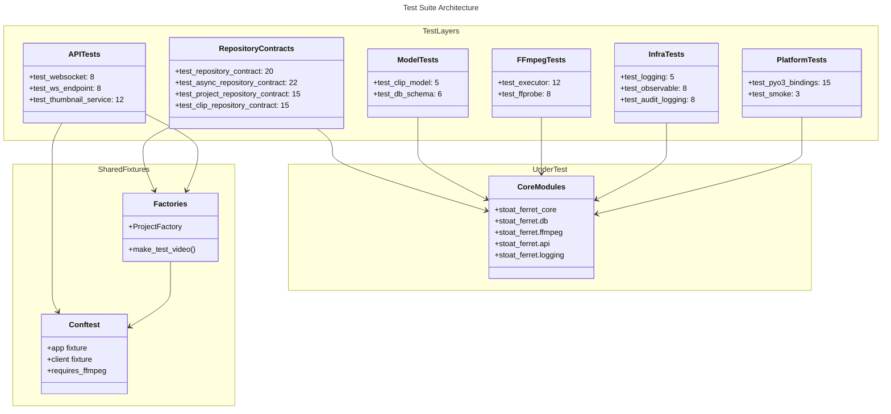

# C4 Code Level: Tests Root

## Overview

- **Name**: Tests Root
- **Description**: Root-level test files covering core infrastructure — repositories, models, FFmpeg integration, WebSocket, logging, and PyO3 bindings
- **Location**: [tests/](../../tests/)
- **Language**: Python (pytest, asyncio)
- **Purpose**: Provides foundational test coverage for database repositories, domain models, FFmpeg execution, observable patterns, WebSocket endpoints, audit logging, and shared test factories

## Code Elements

### Test Inventory (Approximate 150+ tests across 19 files)

| File | Tests | Coverage |
|------|-------|----------|
| conftest.py | 0 (fixtures) | Shared session/function fixtures, FFmpeg detection |
| factories.py | 0 (helpers) | make_test_video(), ProjectFactory |
| test_factories.py | ~8 | Factory functions correctness and builders |
| test_smoke.py | ~3 | Import smoke tests (catch breaking changes) |
| test_pyo3_bindings.py | ~15 | Rust PyO3 binding verification |
| test_db_schema.py | ~6 | Database schema creation and migrations |
| test_repository_contract.py | ~20 | Video repository contract (SQLite + InMemory) |
| test_async_repository_contract.py | ~22 | Async video repository contract patterns |
| test_project_repository_contract.py | ~15 | Project repository CRUD operations |
| test_clip_repository_contract.py | ~15 | Clip repository queries and mutations |
| test_clip_model.py | ~5 | Clip model validation and edge cases |
| test_audit_logging.py | ~8 | Audit log writing and query interface |
| test_ffprobe.py | ~8 | FFprobe metadata extraction and parsing |
| test_executor.py | ~12 | FFmpeg executor (Real, Recording, Fake implementations) |
| test_integration.py | ~10 | Cross-component integration scenarios |
| test_logging.py | ~5 | Structured logging setup and formatters |
| test_observable.py | ~8 | Observable/event pattern and subscriptions |
| test_websocket.py | ~8 | WebSocket protocol and frame handling |
| test_ws_endpoint.py | ~8 | WebSocket API endpoint and broadcast |
| test_thumbnail_service.py | ~12 | ThumbnailService generate and get_path |
| **Total** | **~150+** | **Core infrastructure** |

### Root Test Files

#### conftest.py (Shared Fixtures)
- `requires_ffmpeg` marker — Skips tests when ffmpeg binary not available
- Session-scoped fixtures — Database connections, app initialization
- Function-scoped fixtures — Temporary directories, test client

#### factories.py (Test Data Builders)
- `make_test_video(**kwargs: object) -> Video` (line 21)
  - Creates Video with sensible defaults
  - Accepts kwargs overrides
  - Used across test_*, conftest modules

- `ProjectFactory` (lines 76+)
  - Builder class for creating projects
  - Fluent API: `.with_clip()`, `.with_video()`, `.build()`, `.create_via_api()`
  - Supports both direct construction and HTTP creation

- `_ClipConfig` (lines 54-68)
  - Internal helper for ProjectFactory clip configuration

#### test_factories.py
- Validates make_test_video() produces valid Video instances
- Tests ProjectFactory builder correctness
- Verifies fluent API chains

#### test_smoke.py
- Smoke tests for critical imports
- Catches breaking changes early (before unit test suite runs)
- Tests: stoat_ferret, stoat_ferret_core, fastapi integration

#### test_pyo3_bindings.py
- Validates Rust PyO3 binding functions work from Python
- Tests: escape_filter_text, validate_* functions
- Tests: Error handling for invalid inputs

#### test_db_schema.py
- Database schema creation and validity
- Tests DDL statements execute correctly
- Validates schema version management

#### test_repository_contract.py (295 lines)
- Contract tests parametrized over SQLite and InMemory implementations
- Tests: add, get, get_by_path, list, search, update, delete, count
- Establishes pattern used by async/project/clip repository contracts

#### test_async_repository_contract.py (313 lines)
- Async video repository CRUD patterns
- Tests: async setup, concurrent operations, transaction isolation
- Verifies aiosqlite integration

#### test_project_repository_contract.py
- Project CRUD: add, get, update, delete
- Project queries: list, search by title
- Cascading deletes and clip relationships

#### test_clip_repository_contract.py
- Clip CRUD: add, get, update, delete
- Clip queries: by project, by source video
- Timeline ordering and in_point/out_point validation

#### test_clip_model.py
- Clip dataclass validation
- Duration calculation: out_point - in_point
- Timeline position constraints

#### test_audit_logging.py
- Audit log writing: entry creation with action, actor, timestamp
- Audit log queries: list, filter by action/actor
- Log retention and aging

#### test_ffprobe.py
- FFprobe metadata extraction: duration, codec, dimensions
- JSON parsing and error handling
- Video stream detection

#### test_executor.py (518 lines)
- **RealExecutor**: Executes actual FFmpeg commands (marked requires_ffmpeg)
- **RecordingExecutor**: Records command execution for testing
- **FakeExecutor**: Returns predefined results (no FFmpeg needed)
- Tests: command construction, returncode handling, exception propagation

#### test_integration.py
- Full workflows: scan → extract metadata → store → render
- Cross-module interaction validation
- End-to-end test scenarios

#### test_logging.py
- Structured logging via structlog
- Logger setup and configuration
- JSON output validation

#### test_observable.py
- Observable subscription pattern
- Event emission and listener notification
- Cleanup and memory safety

#### test_websocket.py
- WebSocket frame types (text, binary)
- Protocol compliance
- Message encoding/decoding

#### test_ws_endpoint.py
- WebSocket endpoint at /ws
- Broadcast to multiple connections
- Graceful close handling

#### test_thumbnail_service.py
- ThumbnailService.generate() — FFmpeg integration
- ThumbnailService.get_path() — File storage and retrieval
- Caching and invalidation

## Dependencies

### Internal Dependencies
- `stoat_ferret.db.models` (Video, Clip, Project)
- `stoat_ferret.db.repository`, `async_repository`, `clip_repository`, `project_repository`
- `stoat_ferret.db.schema` (DDL statements)
- `stoat_ferret.ffmpeg.executor` (Real, Recording, Fake implementations)
- `stoat_ferret.ffmpeg.probe` (FFprobe integration)
- `stoat_ferret.api.services.thumbnail` (ThumbnailService)
- `stoat_ferret.api.app` (create_app)
- `stoat_ferret.api.routers.*` (endpoint implementations)
- `stoat_ferret.observable` (event system)
- `stoat_ferret.logging` (structured logging)
- `stoat_ferret_core` (Rust PyO3 bindings)

### External Dependencies
- pytest, pytest-asyncio
- aiosqlite (async SQLite)
- hypothesis (property tests via examples/)
- fastapi (TestClient, WebSocket)
- httpx (async HTTP client)
- unittest.mock (patch, Mock)
- structlog (structured logging)

## Relationships

## Notes

- **Contract Testing Pattern**: Repository contracts parametrized over implementations (SQLite, InMemory) ensure consistent behavior
- **Executor Pattern**: Real/Recording/Fake executors enable testing without FFmpeg binary present (via requires_ffmpeg marker)
- **Async Support**: asyncio_mode="auto" in pytest.ini allows seamless async test discovery
- **DI Testing**: Conftest provides fully-wired FastAPI app for integration testing
- **Factories**: make_test_video and ProjectFactory provide fluent builders for test data
- **Test Structure**: Tests organized by concern (repositories, models, FFmpeg, logging, API) for clarity
