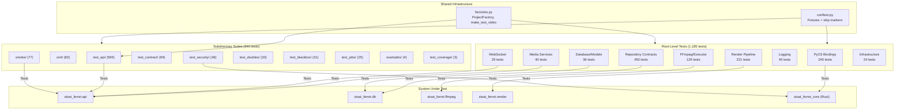

# C4 Code Level: Python Test Suite

## Overview

- **Name**: Python Test Suite
- **Description**: Comprehensive test infrastructure and root-level test modules covering the full stoat-and-ferret video editor backend.
- **Location**: `tests/`
- **Language**: Python
- **Purpose**: Validates all backend functionality including PyO3 bindings, repository contracts, FFmpeg execution, render pipeline, preview system, media services, logging, and WebSocket communication.
- **Parent Component**: [Test Infrastructure](./c4-component-test-infrastructure.md)

## Code Elements

### Shared Infrastructure

#### conftest.py — Root Fixtures

- `_ffmpeg_available() -> bool` — Checks if ffmpeg is in PATH
- `_ffprobe_available() -> bool` — Checks if ffprobe is in PATH
- `requires_ffmpeg` — pytest skip marker when ffmpeg unavailable
- `requires_ffprobe` — pytest skip marker when ffprobe unavailable
- `sample_video_path(tmp_path_factory) -> Path` — Session-scoped: generates 1s 320x240 H.264+AAC test video
- `video_only_path(tmp_path_factory) -> Path` — Session-scoped: generates 1s 320x240 H.264 video (no audio)
- `project_factory() -> ProjectFactory` — Provides fresh ProjectFactory builder instance

#### factories.py — Test Data Builders

- `make_test_video(**kwargs) -> Video` — Creates Video with sensible defaults
- `make_test_track(**kwargs) -> Track` — Creates Track with sensible defaults
- `_ClipConfig` — Internal clip configuration dataclass
- `ProjectFactory` — Builder pattern for test projects:
  - `with_name(name) -> Self`, `with_output(*, width, height, fps) -> Self`, `with_clip(...) -> Self`
  - `build() -> Project`, `build_with_clips() -> tuple[Project, list[Video], list[Clip]]`
  - `create_via_api(client) -> dict` — Create via HTTP API

### Root-Level Test Files by Category

#### PyO3 / Rust Bindings (245 tests)

| File | Tests | Description |
|------|-------|-------------|
| test_pyo3_bindings.py | 138 | Timeline types, FFmpeg commands, filter chains, input sanitization |
| test_audio_builders.py | 61 | VolumeBuilder, AfadeBuilder, AmixBuilder, DuckingPattern parity |
| test_transition_builders.py | 46 | FadeBuilder, XfadeBuilder, TransitionType, AcrossfadeBuilder |

#### Repository Contracts (450 tests)

| File | Tests | Description |
|------|-------|-------------|
| test_render_repository_contract.py | 86 | RenderRepository (SQLite vs InMemory) |
| test_proxy_repository_contract.py | 51 | ProxyRepository parity |
| test_async_repository_contract.py | 50 | Async VideoRepository parity |
| test_preview_repository_contract.py | 49 | PreviewRepository parity |
| test_repository_contract.py | 47 | Sync VideoRepository parity |
| test_timeline_repository_contract.py | 41 | TimelineRepository parity |
| test_batch_repository_contract.py | 37 | BatchRepository parity |
| test_version_repository_contract.py | 34 | VersionRepository parity |
| test_project_repository_contract.py | 30 | ProjectRepository parity |
| test_clip_repository_contract.py | 25 | ClipRepository parity |

#### FFmpeg / Executor (129 tests)

| File | Tests | Description |
|------|-------|-------------|
| test_waveform_service.py | 46 | Waveform generation, JSON parsing, error handling |
| test_executor.py | 28 | FFmpegExecutor: real, recording, fake implementations |
| test_hls_generator.py | 26 | HLS segment generation, manifest contracts |
| test_observable.py | 18 | ObservableFFmpegExecutor logging + metrics |
| test_async_executor.py | 15 | Async FFmpeg executor with progress/cancellation |
| test_ffprobe.py | 14 | ffprobe wrapper: stream parsing, error handling |
| test_ffmpeg_observability.py | 6 | DI wiring for observable executor |

#### Render Pipeline (221 tests)

| File | Tests | Description |
|------|-------|-------------|
| test_thumbnail_strip.py | 34 | Thumbnail strip sprite sheet generation |
| test_render_service.py | 30 | RenderService lifecycle, preflight, retry, cancel |
| test_preview_manager.py | 29 | State machine, concurrent sessions, seek, expiry |
| test_preview_cache.py | 27 | LRU eviction, TTL expiry, size tracking |
| test_render_checkpoints.py | 24 | Checkpoint write/read, recovery, stale cleanup |
| test_render_executor.py | 22 | Render executor with FFmpeg process management |
| test_render_metrics.py | 21 | Prometheus metrics: counters, histograms, gauges |
| test_render_logging.py | 20 | 7 lifecycle events, job_id correlation |
| test_render_queue.py | 18 | Concurrency control, persistence, priority |
| test_render_shutdown.py | 15 | Graceful shutdown, stdin 'q', SIGKILL escalation |

#### Media Services (40 tests)

| File | Tests | Description |
|------|-------|-------------|
| test_proxy_service.py | 20 | Proxy generation, quality selection, cleanup |
| test_thumbnail_service.py | 11 | Thumbnail generation, caching, error handling |
| test_proxy_scan_integration.py | 9 | Proxy auto-generation in scan workflow |

#### Database & Models (36 tests)

| File | Tests | Description |
|------|-------|-------------|
| test_clip_model.py | 18 | Clip validation: ranges, timeline positions |
| test_db_schema.py | 14 | Schema creation, table structures, indexes |
| test_database_startup.py | 4 | Database initialization at app startup |

#### Logging & Observability (45 tests)

| File | Tests | Description |
|------|-------|-------------|
| test_logging_startup.py | 24 | Logging startup integration, structlog config |
| test_audit_logging.py | 17 | Audit log events for mutations |
| test_logging.py | 4 | Logging configuration module |

#### WebSocket (29 tests)

| File | Tests | Description |
|------|-------|-------------|
| test_websocket.py | 19 | ConnectionManager, event types, broadcast |
| test_ws_endpoint.py | 10 | /ws endpoint integration, reconnect |

#### Infrastructure (24 tests)

| File | Tests | Description |
|------|-------|-------------|
| test_factories.py | 13 | ProjectFactory builder correctness |
| test_orphaned_settings.py | 6 | Settings wiring: debug, ws_heartbeat_interval |
| test_smoke.py | 4 | Pytest configuration smoke check |
| test_event_loop_responsiveness.py | 1 | Event loop not blocked during scan |

## Test Inventory

- **Total Tests**: 2,125 (verified by `pytest --co -q`)
- **Root-Level Tests**: 1,185 (44 test files)
- **Subdirectory Tests**: 940 (10 subdirectories)

### Subdirectory Summary

| Subdirectory | Tests | Focus |
|-------------|-------|-------|
| tests/test_api | 569 | FastAPI endpoint integration tests |
| tests/unit | 83 | Isolated unit tests (shutdown, health, preview, WebSocket) |
| tests/smoke | 77 | End-to-end HTTP API smoke tests with real FFmpeg |
| tests/test_contract | 69 | FFmpeg executor and repository contract parity |
| tests/test_security | 46 | Input sanitization, path traversal, injection |
| tests/test_doubles | 33 | In-memory test double validation |
| tests/test_blackbox | 31 | Black-box REST API workflow tests |
| tests/test_jobs | 25 | AsyncioJobQueue and worker lifecycle |
| tests/examples | 4 | Property-based tests with Hypothesis |
| tests/test_coverage | 3 | Import fallback path for native extension |

## Dependencies

### Internal Dependencies

- `stoat_ferret.api` — App factory, routers, middleware, WebSocket
- `stoat_ferret.db` — Models, repositories (SQLite + InMemory), schema
- `stoat_ferret.ffmpeg` — Executor implementations, ffprobe, HLS
- `stoat_ferret.render` — RenderService, queue, checkpoints, metrics
- `stoat_ferret.effects` — Effect registry, filter builders
- `stoat_ferret.jobs` — AsyncioJobQueue, Worker
- `stoat_ferret_core` — PyO3 Rust bindings (FrameRate, Position, Duration, etc.)
- `tests.factories` — Shared test data builders

### External Dependencies

- `pytest` — Test framework with asyncio_mode="auto"
- `hypothesis` — Property-based testing (examples/)
- `httpx` — Async HTTP client (smoke tests)
- `fastapi.testclient` — Sync HTTP client (API tests)
- `unittest.mock` — AsyncMock, MagicMock, patch
- `structlog` — Structured logging verification

## Relationships

```mermaid
flowchart TB
    subgraph Infrastructure["Shared Infrastructure"]
        conftest["conftest.py<br/>Fixtures + skip markers"]
        factories["factories.py<br/>ProjectFactory, make_test_video"]
    end

    subgraph RootTests["Root-Level Tests (1,185 tests)"]
        pyo3["PyO3 Bindings<br/>245 tests"]
        contracts["Repository Contracts<br/>450 tests"]
        ffmpeg["FFmpeg/Executor<br/>129 tests"]
        render["Render Pipeline<br/>221 tests"]
        media["Media Services<br/>40 tests"]
        db_tests["Database/Models<br/>36 tests"]
        logging["Logging<br/>45 tests"]
        ws["WebSocket<br/>29 tests"]
        infra_tests["Infrastructure<br/>24 tests"]
    end

    subgraph Subdirs["Subdirectory Suites (940 tests)"]
        test_api["test_api/ (569)"]
        unit["unit/ (83)"]
        smoke["smoke/ (77)"]
        test_contract["test_contract/ (69)"]
        security["test_security/ (46)"]
        doubles["test_doubles/ (33)"]
        blackbox["test_blackbox/ (31)"]
        jobs["test_jobs/ (25)"]
        examples["examples/ (4)"]
        coverage["test_coverage/ (3)"]
    end

    subgraph SUT["System Under Test"]
        api_layer["stoat_ferret.api"]
        db_layer["stoat_ferret.db"]
        ffmpeg_layer["stoat_ferret.ffmpeg"]
        render_layer["stoat_ferret.render"]
        rust_core["stoat_ferret_core (Rust)"]
    end

    conftest --> RootTests
    conftest --> Subdirs
    factories --> RootTests
    factories --> test_api

    pyo3 -->|Tests| rust_core
    contracts -->|Tests| db_layer
    ffmpeg -->|Tests| ffmpeg_layer
    render -->|Tests| render_layer
    media -->|Tests| api_layer
    db_tests -->|Tests| db_layer
    ws -->|Tests| api_layer

    test_api -->|Tests| api_layer
    smoke -->|Tests| api_layer
    security -->|Tests| rust_core
```
