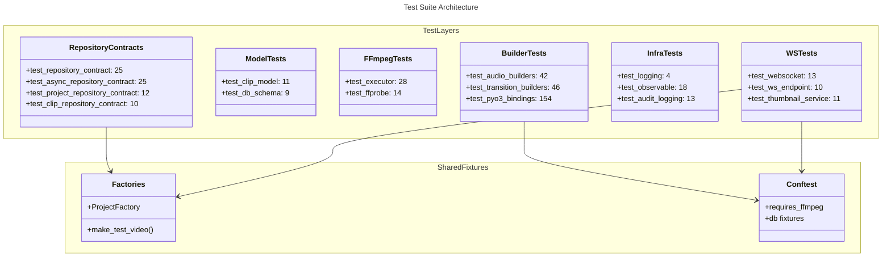

# C4 Code Level: Tests Root

## Overview

- **Name**: Tests Root
- **Description**: Root-level test files covering core infrastructure -- repositories, models, FFmpeg integration, WebSocket, logging, PyO3 bindings, audio builders, and transition builders
- **Location**: `tests/`
- **Language**: Python (pytest, asyncio)
- **Purpose**: Provides foundational test coverage for database repositories, domain models, FFmpeg execution, observable patterns, WebSocket endpoints, audit logging, Rust binding parity, and shared test factories
- **Parent Component**: [Test Infrastructure](./c4-component-test-infrastructure.md)

## Code Elements

### Test Inventory (~532 tests across 23 test files)

| File | Tests | Coverage |
|------|-------|----------|
| conftest.py | 0 (fixtures) | Shared session/function fixtures, FFmpeg detection |
| factories.py | 0 (helpers) | make_test_video(), ProjectFactory |
| test_factories.py | ~13 | Factory functions correctness and builders |
| test_smoke.py | ~4 | Import smoke tests (catch breaking changes) |
| test_pyo3_bindings.py | ~154 | Rust PyO3 binding verification (all types and functions) |
| test_db_schema.py | ~9 | Database schema creation and migrations |
| test_database_startup.py | ~4 | Database initialization during application lifespan (NEW) |
| test_repository_contract.py | ~25 | Video repository contract (SQLite + InMemory) |
| test_async_repository_contract.py | ~25 | Async video repository contract patterns |
| test_project_repository_contract.py | ~12 | Project repository CRUD operations |
| test_clip_repository_contract.py | ~10 | Clip repository queries and mutations |
| test_clip_model.py | ~11 | Clip model validation and edge cases |
| test_audit_logging.py | ~13 | Audit log writing and query interface |
| test_ffprobe.py | ~14 | FFprobe metadata extraction and parsing |
| test_executor.py | ~28 | FFmpeg executor (Real, Recording, Fake implementations) |
| test_integration.py | ~13 | Cross-component integration scenarios |
| test_logging.py | ~4 | Structured logging setup and formatters |
| test_logging_startup.py | ~11 | Structured logging configuration during application startup (NEW) |
| test_observable.py | ~18 | Observable/event pattern and subscriptions |
| test_websocket.py | ~13 | WebSocket protocol and frame handling |
| test_ws_endpoint.py | ~10 | WebSocket API endpoint and broadcast |
| test_thumbnail_service.py | ~11 | ThumbnailService generate and get_path |
| test_audio_builders.py | ~42 | VolumeBuilder, AfadeBuilder, AmixBuilder, DuckingPattern parity |
| test_transition_builders.py | ~46 | FadeBuilder, XfadeBuilder, TransitionType, AcrossfadeBuilder |
| test_orphaned_settings.py | ~6 | Wired orphaned settings (debug, ws_heartbeat_interval) to consumers (NEW) |

### Root Test Files

#### conftest.py (Shared Fixtures)
- `requires_ffmpeg` marker -- Skips tests when ffmpeg binary not available
- Session-scoped fixtures -- Database connections, app initialization
- Function-scoped fixtures -- Temporary directories, test client

#### factories.py (Test Data Builders)
- `make_test_video(**kwargs: object) -> Video` (line 21) -- Creates Video with sensible defaults, accepts kwargs overrides
- `ProjectFactory` (lines 76+) -- Builder class for creating projects; fluent API: `.with_clip()`, `.with_video()`, `.build()`, `.create_via_api()`
- `_ClipConfig` (lines 54-68) -- Internal helper for ProjectFactory clip configuration

#### test_pyo3_bindings.py (~154 tests)
- Validates all Rust PyO3 binding functions and types from Python
- Tests: Clip, Position, Duration, TimeRange, FrameRate, FFmpegCommand, Filter, FilterChain, FilterGraph
- Tests: escape_filter_text, validate_* functions, DrawtextBuilder, SpeedControl, Expr
- Tests: Error handling for invalid inputs, edge cases

#### test_audio_builders.py (~42 tests)
- `TestVolumeBuilderParity` -- VolumeBuilder linear and dB mode parity
- `TestAfadeBuilderParity` -- Audio fade in/out with curves
- `TestAmixBuilderParity` -- Audio mixing with duration modes and weights
- `TestDuckingPatternParity` -- Sidechain compression filter generation

#### test_transition_builders.py (~46 tests)
- `TestTransitionType` -- Enum parsing for all 59 xfade transition types
- `TestFadeBuilder` -- Video fade with color and alpha support
- `TestXfadeBuilder` -- Video crossfade generation
- `TestAcrossfadeBuilder` -- Audio crossfade with curve types

#### test_repository_contract.py (~25 tests)
- Contract tests parametrized over SQLite and InMemory implementations
- Tests: add, get, get_by_path, list, search, update, delete, count

#### test_executor.py (~28 tests)
- **RealExecutor**: Actual FFmpeg commands (requires_ffmpeg)
- **RecordingExecutor**: Records command execution for testing
- **FakeExecutor**: Returns predefined results (no FFmpeg needed)

## Dependencies

### Internal Dependencies
- `stoat_ferret.db.models` (Video, Clip, Project)
- `stoat_ferret.db.repository`, `async_repository`, `clip_repository`, `project_repository`
- `stoat_ferret.db.schema` (DDL statements)
- `stoat_ferret.ffmpeg.executor` (Real, Recording, Fake implementations)
- `stoat_ferret.ffmpeg.probe` (FFprobe integration)
- `stoat_ferret.api.services.thumbnail` (ThumbnailService)
- `stoat_ferret.api.app` (create_app)
- `stoat_ferret.observable` (event system)
- `stoat_ferret.logging` (structured logging)
- `stoat_ferret_core` (all Rust PyO3 bindings including audio/transition builders)

### External Dependencies
- pytest, pytest-asyncio
- aiosqlite (async SQLite)
- fastapi (TestClient, WebSocket)
- httpx (async HTTP client)
- unittest.mock (patch, Mock)
- structlog (structured logging)

## Relationships

## Notes

- **Contract Testing Pattern**: Repository contracts parametrized over implementations (SQLite, InMemory) ensure consistent behavior
- **Executor Pattern**: Real/Recording/Fake executors enable testing without FFmpeg binary present
- **Async Support**: asyncio_mode="auto" in pytest.ini allows seamless async test discovery
- **DI Testing**: Conftest provides fully-wired FastAPI app for integration testing
- **Builder Parity**: test_audio_builders.py and test_transition_builders.py verify Rust-Python binding correctness
- **Test Structure**: Tests organized by concern (repositories, models, FFmpeg, builders, logging, API)
