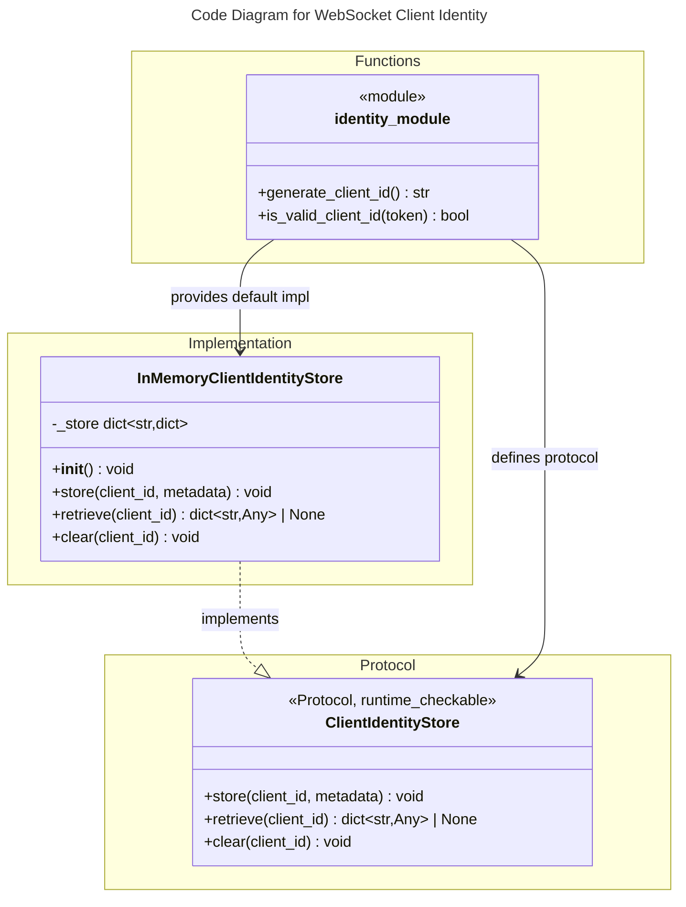

# C4 Code Level: WebSocket Client Identity

## Overview

- **Name**: WebSocket Client Identity
- **Description**: Client identity primitives for WebSocket connections — token generation, validation, and in-memory identity storage.
- **Location**: `src/stoat_ferret/api/websocket/`
- **Language**: Python
- **Purpose**: Provide cryptographically random client IDs for WebSocket connections, validate token format, and store/retrieve/clear identity entries per-connection lifecycle. Enables the identity store DI pattern in ConnectionManager and create_app() (BL-315).
- **Parent Component**: [API Gateway](./c4-component-api-gateway.md)

## Code Elements

### Functions/Methods

#### identity.py

- `generate_client_id() -> str`
  - Description: Generate a cryptographically random 32-char lowercase hex client ID using `secrets.token_hex(16)`.
  - Location: `src/stoat_ferret/api/websocket/identity.py:14`
  - Returns: A 32-character lowercase hex string suitable for use as a client identity token.
  - Dependencies: `secrets.token_hex`

- `is_valid_client_id(token: Any) -> bool`
  - Description: Return True if token is a non-empty string of exactly 32 lowercase hex characters. Rejects non-string inputs, wrong lengths, and uppercase or non-hex characters.
  - Location: `src/stoat_ferret/api/websocket/identity.py:23`
  - Returns: True if token passes all three checks: `isinstance(token, str)`, `len(token) == 32`, and all chars in `"0123456789abcdef"`.
  - Dependencies: None

### Classes/Modules

#### ClientIdentityStore (identity.py:39)

`@runtime_checkable` Protocol defining the storage backend interface. All methods are synchronous — asyncio's single-threaded execution model guarantees atomicity between yield points, so no asyncio.Lock is required (FG-001).

**Methods:**

- `store(client_id: str, metadata: dict[str, Any] | None = None) -> None`
  - Store a client identity entry. Raises `ValueError` if client_id is not valid 32-char hex. Raises `TypeError` if metadata is not a dict or None.
  - Location: `src/stoat_ferret/api/websocket/identity.py:48`

- `retrieve(client_id: str) -> dict[str, Any] | None`
  - Retrieve a stored identity entry, touching last_seen. Returns the entry dict `(client_id, metadata, created_at, last_seen)` or None if not found or client_id is invalid.
  - Location: `src/stoat_ferret/api/websocket/identity.py:61`

- `clear(client_id: str) -> None`
  - Remove a stored identity entry. No-op if client_id is invalid or not found; never raises.
  - Location: `src/stoat_ferret/api/websocket/identity.py:73`

#### InMemoryClientIdentityStore (identity.py:84)

In-memory implementation of `ClientIdentityStore` backed by a plain dict (`_store: dict[str, dict[str, Any]]`). Suitable for single-process deployments (v056). Thread-safety is provided by asyncio's single-threaded execution model; no lock is required (FG-001).

**Constructor:**

- `__init__(self) -> None`
  - Initialize an empty identity store (`self._store = {}`).
  - Location: `src/stoat_ferret/api/websocket/identity.py:91`

**Methods:**

- `store(client_id: str, metadata: dict[str, Any] | None = None) -> None`
  - Store entry with `created_at` and `last_seen` UTC timestamps. If client_id already exists, metadata is updated and `created_at` is preserved.
  - Location: `src/stoat_ferret/api/websocket/identity.py:95`

- `retrieve(client_id: str) -> dict[str, Any] | None`
  - Retrieve stored entry and update `last_seen` to current UTC time. Returns None if not found or client_id is invalid.
  - Location: `src/stoat_ferret/api/websocket/identity.py:129`

- `clear(client_id: str) -> None`
  - Remove entry via `dict.pop(client_id, None)`. No-op if invalid or not found.
  - Location: `src/stoat_ferret/api/websocket/identity.py:146`

## Dependencies

### Internal Dependencies

None — identity module is a standalone primitive with no imports from other `stoat_ferret` modules.

### External Dependencies

| Package | Purpose |
|---------|---------|
| `secrets` | `token_hex(16)` for cryptographically random ID generation |
| `datetime` | UTC timestamps for `created_at` / `last_seen` fields |
| `typing` | `Any`, `Protocol`, `runtime_checkable` |

## Relationships

## Notes

- **Token format**: 32-char lowercase hex (16 bytes from `secrets.token_hex`). Transport: WebSocket query parameter `?client_id=<token>`. Validated on every store/retrieve/clear call.
- **DI pattern**: `ClientIdentityStore` Protocol enables testing with fakes; `InMemoryClientIdentityStore` is the production default, instantiated in `create_app()` when no override is provided (see [c4-code-stoat-ferret-api.md](./c4-code-stoat-ferret-api.md)).
- **Lifecycle**: Identity entry created on WebSocket connect, cleared on disconnect (managed by ConnectionManager — see [c4-code-stoat-ferret-api-websocket.md](./c4-code-stoat-ferret-api-websocket.md)).
- **Thread safety**: All methods are synchronous; asyncio single-threaded model provides atomicity without a lock (FG-001).
- **runtime_checkable**: `ClientIdentityStore` uses `@runtime_checkable` so `isinstance(obj, ClientIdentityStore)` works for protocol verification in tests.
